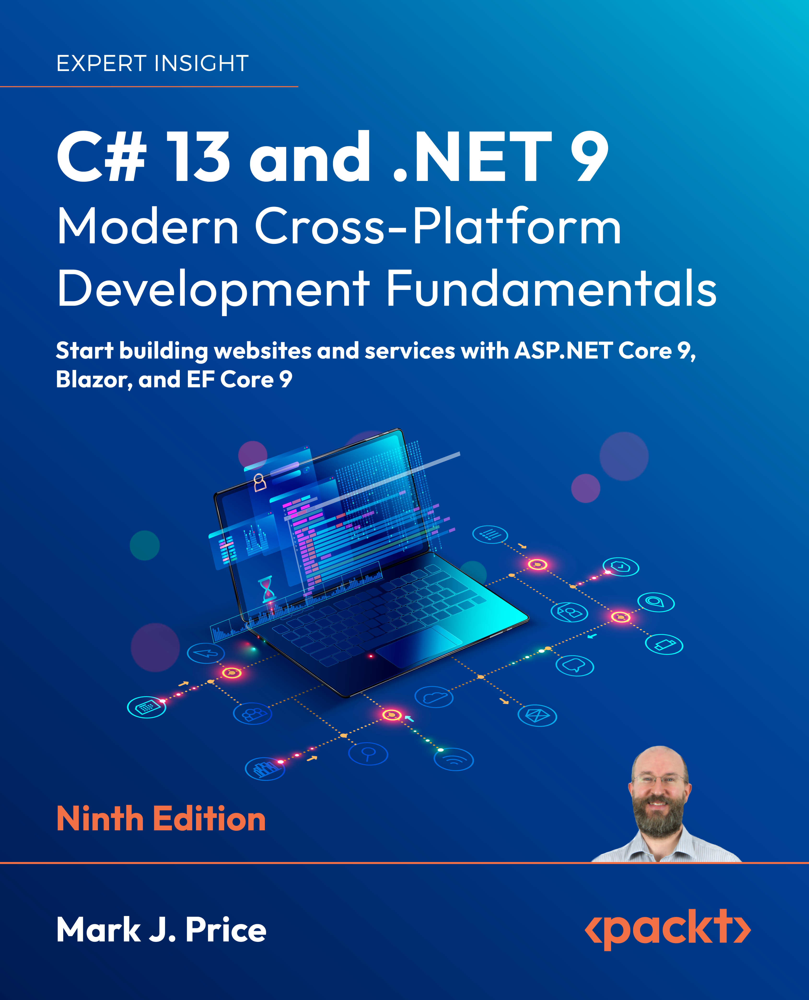

> **IMPORTANT!** [Common Mistakes, Improvements, and Errata aka list of corrections](docs/errata/README.md)

# C# 13 and .NET 9 - Modern Cross-Platform Development Fundamentals, Ninth Edition

Repository for the Packt Publishing book titled "C# 13 and .NET 9 - Modern Cross-Platform Development Fundamentals" by Mark J. Price

> **[FAQs](https://github.com/markjprice/markjprice/blob/main/FAQs.md)**

> **What's new in this edition?** You can read a [detailed list of changes](docs/whats-new-in-book.md) between the 8th and 9th editions.

- [C# 13 and .NET 9 - Modern Cross-Platform Development Fundamentals, Ninth Edition](#c-13-and-net-9---modern-cross-platform-development-fundamentals-ninth-edition)
- [Free PDF of the book and how to contact the publisher Packt](#free-pdf-of-the-book-and-how-to-contact-the-publisher-packt)
- [Author's books](#authors-books)
- [Chapters and code solutions](#chapters-and-code-solutions)
- [Code solutions for Visual Studio and Visual Studio Code](#code-solutions-for-visual-studio-and-visual-studio-code)
- [Important](#important)
- [Miscellaneous](#miscellaneous)
  - [Microsoft Certifications](#microsoft-certifications)
  - [Microsoft .NET community support](#microsoft-net-community-support)
  - [Interviews with me](#interviews-with-me)
  - [Book Cover](#book-cover)

# Free PDF of the book and how to contact the publisher Packt

If you have purchased the paperback or Kindle edition, then you can request a free PDF copy and its supplementary content (like Appendix - Answers to the Test Your Knowledge Questions and Graphics Bundle PDF) at the following link: https://packt.link/supplementary-content-9781835881224. 

For questions about book pricing, distribution, and so on, please contact the publisher Packt at the following email address: customercare@packt.com

# Author's books

My author page on Amazon: https://www.amazon.com/Mark-J-Price/e/B071DW3QGN/ 

All of my books on Packt's website: https://subscription.packtpub.com/search?query=mark+j.+price

My author page on Goodreads: https://www.goodreads.com/author/show/14224500.Mark_J_Price

# Chapters and code solutions

**Introduction**
- Chapter 1 Hello C#, Welcome .NET! [code/Chapter01](code/Chapter01)

**Language**
- Chapter 2 Speaking C#: [code/Chapter02](code/Chapter02)
- Chapter 3 Controlling Flow, Converting Types, and Handling Exceptions: [code/Chapter03](code/Chapter03)
- Chapter 4 Writing, Debugging, and Testing Functions: [code/Chapter04](code/Chapter04)
- Chapter 5 Building Your Own Types with Object-Oriented Programming: [code/Chapter05](code/Chapter05)
- Chapter 6 Implementing Interfaces and Inheriting Classes: [code/Chapter06](code/Chapter06)

**Libraries**
- Chapter 7 Packaging and Distributing .NET Types: [code/Chapter07](code/Chapter07)
- Chapter 8 Working with Common .NET Types: [code/Chapter08](code/Chapter08)
- Chapter 9 Working with Files, Streams, and Serialization: [code/Chapter09](code/Chapter09)
- Chapter 10 Working with Data Using Entity Framework Core: [code/Chapter10](code/Chapter10)
- Chapter 11 Querying and Manipulating Data Using LINQ: [code/Chapter11](code/Chapter11)

**Modern Web Development**
- Chapter 12 Introducing Modern Web Development Using .NET: [code/ModernWeb](code/ModernWeb)
- Chapter 13 Building Websites Using ASP.NET Core: [code/ModernWeb/Northwind.Web](code/ModernWeb/Northwind.Web)
- Chapter 14 Building Interactive Web Components Using Blazor: [code/ModernWeb/Northwind.Blazor](code/ModernWeb/Northwind.Blazor)
- Chapter 15 Building and Consuming Web Services: [code/ModernWeb/Northwind.MinimalApi](code/ModernWeb/Northwind.MinimalApi)

**Appendix and online chapter**
- [Appendix, Answers to the Test Your Knowledge Questions](docs/B22322_Appendix.pdf).

# Code solutions for Visual Studio and Visual Studio Code

[Figures for all of the code solution folders](docs/ch01-solution-folders.md).

Visual Studio Code now has an extension named **C# Dev Kit** that includes a solution explorer so it can better work with Visual Studio solution files. Visual Studio for Windows, Visual Studio for Mac, and Visual Studio Code + C# Dev Kit can now use the same code solution files and projects for each chapter, found here: [/code](/code). 

> **For Visual Studio Code:** To use the chapter solution files with Visual Studio Code, install the **C# Dev Kit** extension. Then in Visual Studio Code, open the `ChapterNN` folder that contains a `ChapterNN.sln` solution file and wait for the **SOLUTION EXPLORER** pane to appear at the bottom of the **EXPLORER**. You can drag and drop to reorder the panes to put **SOLUTION EXPLORER** at the top. Learn more about C# Dev Kit at the following link: https://devblogs.microsoft.com/visualstudio/announcing-csharp-dev-kit-for-visual-studio-code/

> **Warning!** If you use both Visual Studio and Visual Studio Code to open these solutions, be aware that the build process can conflict. This is because Visual Studio has its own non-standard build server that is different from the standard build server used by .NET SDK CLI. My recommendation is to only have a solution open in one code editor at any time. You should also clean the solutions between opening in different code editors. For example, after closing the solution in one code editor, I delete the `bin` and `obj` folders before then opening in a different code editor.

# Important

Corrections for typos and other mistakes and improvements like refactoring code. Useful links to other related material. 

- [Command-Lines](docs/command-lines.md) page lists all commands as a single line that can be copied and pasted to make it easier to enter commands at the prompt.
- [Book Links](docs/book-links.md)
- [Common Mistakes, Improvements, and Errata aka list of corrections](docs/errata/README.md)
- [Ninth edition's support for .NET 10](docs/dotnet10.md)

# Miscellaneous

## Microsoft Certifications

Announcing the New Foundational C# Certification with freeCodeCamp:
https://devblogs.microsoft.com/dotnet/announcing-foundational-csharp-certification/

Microsoft used to have professional exams and certifications for developers that covered skills like C# and ASP.NET. Sadly, they have retired them all. These days, the only developer-adjacent exams and certifications are for Azure or Power Platform, as you can see from the certification poster: https://aka.ms/traincertposter

## Microsoft .NET community support

- [.NET Developer Community](https://dotnet.microsoft.com/platform/community)
- [.NET Tech Community Forums for topic discussions](https://techcommunity.microsoft.com/t5/net/ct-p/dotnet)
- [Q&A for .NET to get your questions answered](https://learn.microsoft.com/en-us/answers/products/dotnet)
- [Technical questions about the C# programming language](https://learn.microsoft.com/en-us/answers/topics/dotnet-csharp.html)
- [If you'd like to apply to be a reviewer](https://authors.packtpub.com/reviewers/)

## Interviews with me

Podcast interviews with me:

- [The Modern .NET Show Podcast - January 26, 2024](https://dotnetcore.show/season-6/the-net-trilogy-and-learning-net-with-mark-j-price/)
- [The .NET Core Podcast - March 3, 2023](https://dotnetcore.show/episode-117-our-perspectives-on-the-future-of-net-with-mark-j-price/)
- [Yet Another Podcast with Jesse Liberty - December 2022](https://jesseliberty.com/2022/12/10/mark-price-on-c-11-fixed/)
- [The .NET Core Podcast - February 4, 2022](https://dotnetcore.show/episode-91-c-sharp-10-and-dotnet-6-with-mark-j-price/)
- [Yet Another Podcast with Jesse Liberty - May 2021](http://jesseliberty.com/2021/05/16/mark-price-on-c9-and-net-6/)
- [The .NET Core Podcast - February 7, 2020](https://dotnetcore.show/episode-44-learning-net-core-with-mark-j-price/)
- [Yet Another Podcast with Jesse Liberty - February 2020](http://jesseliberty.com/2020/02/23/mark-price-c-net-core/)
- [Packt Podcasts](https://soundcloud.com/packt-podcasts/csharp-8-dotnet-core-3-the-evolution-of-the-microsoft-ecosystem)

Written interviews with me:
- [C# 9 and .NET 5: Book Review and Q&A](https://www.infoq.com/articles/book-interview-mark-price/?itm_source=infoq&itm_campaign=user_page&itm_medium=link)
- [Q&A with Episerver's Mark J. Price, author of C# 9 and .NET 5 - Modern Cross-Platform Development](https://www.episerver.com/articles/q-and-a-with-mark-price)

## Book Cover

