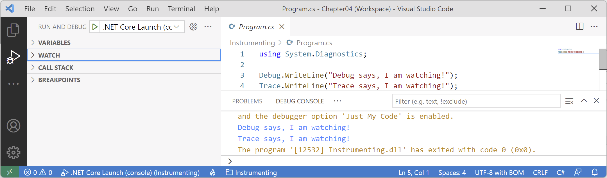
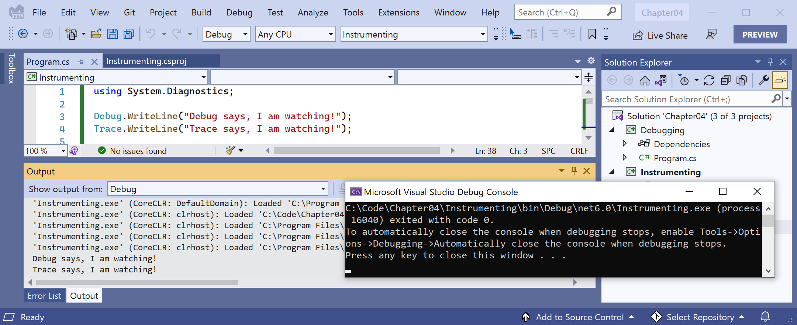
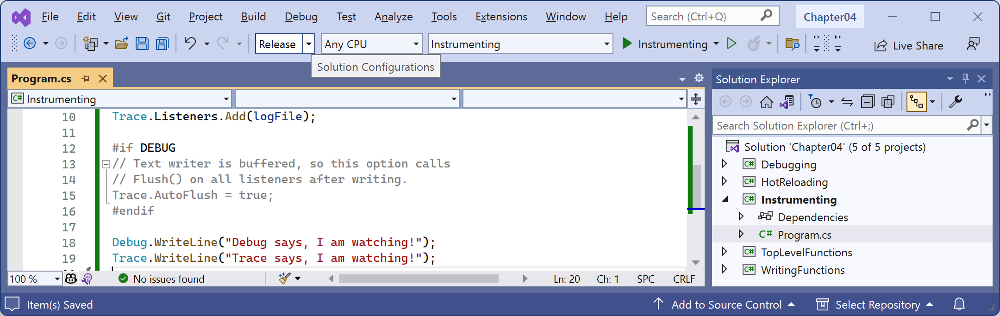
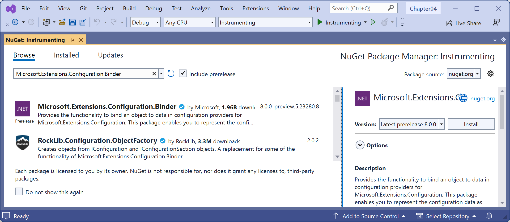
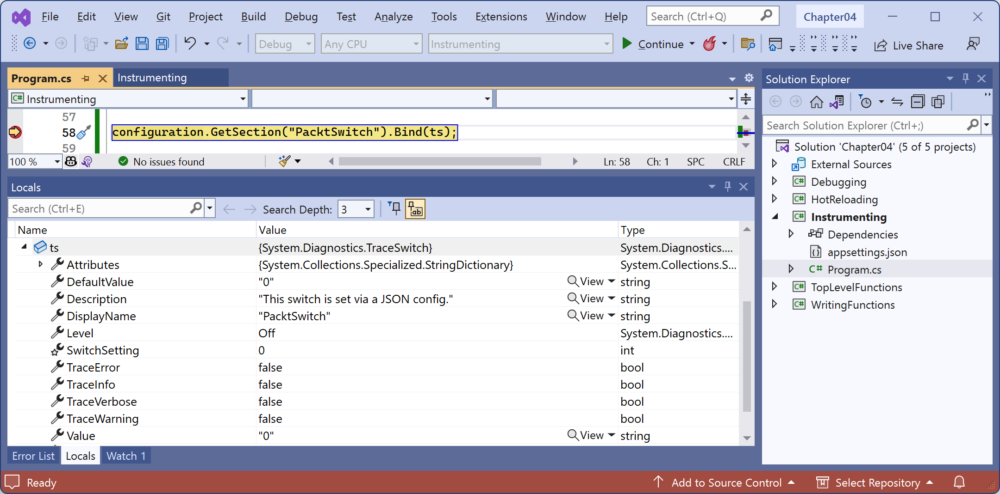
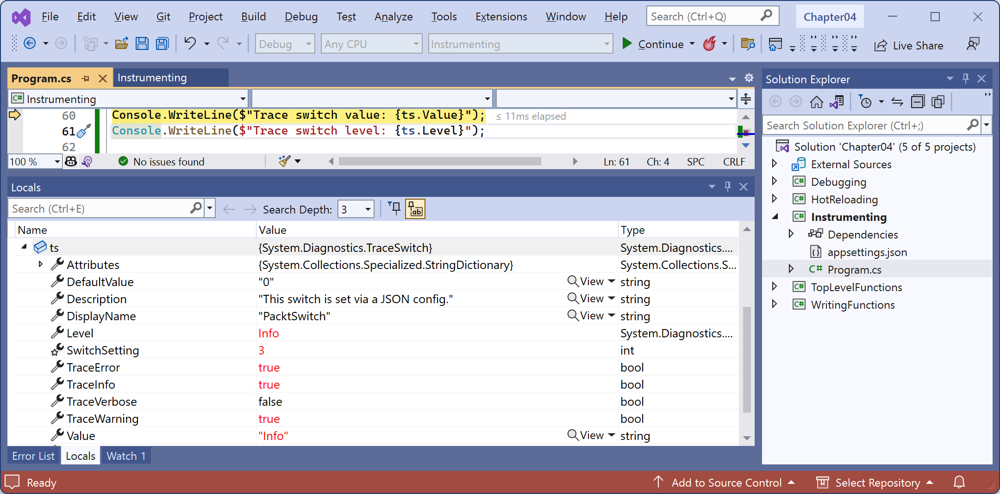

**Logging during development and runtime**

- [Understanding logging options](#understanding-logging-options)
- [Instrumenting with Debug and Trace](#instrumenting-with-debug-and-trace)
  - [Understanding trace listeners](#understanding-trace-listeners)
- [Writing to the default trace listener](#writing-to-the-default-trace-listener)
- [Configuring trace listeners](#configuring-trace-listeners)
- [Switching trace levels](#switching-trace-levels)
- [Adding packages to a project in Visual Studio](#adding-packages-to-a-project-in-visual-studio)
- [Adding packages to a project in VS Code](#adding-packages-to-a-project-in-vs-code)
- [Reviewing project packages for working with configuration](#reviewing-project-packages-for-working-with-configuration)
- [Logging information about your source code](#logging-information-about-your-source-code)


Once you believe that all the bugs have been removed from your code, you would then compile a release version and deploy the application, so that people can use it. But no code is ever bug-free, and during runtime, unexpected errors can occur.

End users are notoriously bad at remembering, admitting to, and then accurately describing what they were doing when an error occurred. You should not rely on them providing useful information to reproduce the problem so that you can understand what caused the problem and then fix it. Instead, you can *instrument your code*, which means logging events of interest and other data like timings.

> **Good Practice**: Add code throughout your application to log what is happening, especially when exceptions occur, so that you can review the logs and use them to trace the issue and fix the problem. Although we will see logging again in *Chapter 10, Working with Data Using Entity Framework Core*, logging is a huge topic, so we can only cover the basics in this book.

# Understanding logging options

.NET includes some built-in ways to instrument your code by adding logging capabilities. We will cover the basics in this book. But logging is an area where third parties have created a rich ecosystem of powerful solutions that extend what Microsoft provides. I cannot make specific recommendations because the best logging framework depends on your needs. But I include some common ones in the following list:
- Apache log4net
- NLog
- Serilog

> I introduce structured logging using the third-party logging system Serilog in my companion book, Apps and Services with .NET 8, because the Serilog packages have the most downloads on https://www.nuget.org.

> **Good Practice**: When interviewing for a developer position, the logging system used by an organization is a good thing to ask about to show that you understand the importance of logging and you know that the specifics of the implementation are likely to be different depending on the organization.

# Instrumenting with Debug and Trace

You have seen the use of the `Console` type and its `WriteLine` method writing out to the console window. There is also a pair of types named `Debug` and `Trace` that have more flexibility in where they write out to:
- The `Debug` class is used to add logging that gets written only during development.
- The `Trace` class is used to add logging that gets written during both development and runtime.

## Understanding trace listeners

The `Debug` and `Trace` classes write to any *trace listener*. A trace listener is a type that can be configured to write output anywhere you like when the `WriteLine` method is called. 

There are several trace listeners provided by .NET, including one that outputs to the console, and you can even make your own by inheriting from the `TraceListener` type so you can write to anywhere you want.

# Writing to the default trace listener

One trace listener, the `DefaultTraceListener` class, is configured automatically and writes to Code's **DEBUG CONSOLE** window or Visual Studio's **Debug** window. You can configure other trace listeners using code.

Let's see trace listeners in action:

1.	Use your preferred code editor to add a new **Console App** / `console` project named `Instrumenting` to the `Chapter04` solution.
2.	In `Program.cs`, delete the existing statements and then import the `System.Diagnostics` namespace, as shown in the following code:
```cs
using System.Diagnostics; // To use Debug and Trace.
```
3.	In `Program.cs`, write messages from the two classes, as shown in the following code:
```cs
Debug.WriteLine("Debug says, I am watching!");
Trace.WriteLine("Trace says, I am watching!");
```
4.	If you are using Visual Studio, navigate to **View** | **Output** and make sure **Show output from: Debug** is selected.
5.	Start the `Instrumenting` project with debugging, and note that **DEBUG CONSOLE** in Code or the **Output** window in Visual Studio shows the two messages, mixed with other debugging information, such as loaded assembly DLLs, as shown in *Figures 4.16* and *4.17*:


*Figure 4.16: Code DEBUG CONSOLE shows the two messages in blue*


*Figure 4.17: Visual Studio Output window shows Debug output including the two messages*

# Configuring trace listeners

Now, we will configure another trace listener that will write to a text file:
1.	Before the `Debug` and `Trace` calls to `WriteLine`, add statements to create a new text file on the desktop and pass it into a new trace listener that knows how to write to a text file, and enable automatic flushing for its buffer during development, as shown in the following code:
```cs
string logPath = Path.Combine(Environment.GetFolderPath(
  Environment.SpecialFolder.DesktopDirectory), "log.txt");

Console.WriteLine($"Writing to: {logPath}");

TextWriterTraceListener logFile = new(File.CreateText(logPath));

Trace.Listeners.Add(logFile);

#if DEBUG
// Text writer is buffered, so this option calls
// Flush() on all listeners after writing.
Trace.AutoFlush = true;
#endif
```

> **Good Practice**: Any type that represents a file usually implements a buffer to improve performance. Instead of writing immediately to the file, data is written to an in-memory buffer, and only once the buffer is full will it be written in one chunk to the file. This behavior can be confusing while debugging because we do not immediately see the results! Enabling `AutoFlush` means the `Flush` method is called automatically after every write. This reduces performance, so you should only set it on during debugging and not in production.

2.	At the bottom of `Program.cs`, add statements to flush and close any buffered trace listeners for `Debug` and `Trace`, as shown in the following code:
```cs
// Close the text file (also flushes) and release resources.
Debug.Close();
Trace.Close();
```

3.	Run the release configuration of the console app:
    - In VS Code, enter the following command in the **TERMINAL** window for the `Instrumenting` project and note that nothing will appear to have happened: `dotnet run --configuration Release`
    - In Visual Studio, in the standard toolbar, select **Release** in the **Solution Configurations** drop-down list, note that any statements in a `#if DEBUG` region are grayed out to indicate they are not compiled, as shown in *Figure 4.18*, and then navigate to **Debug** | **Start Without Debugging**.


*Figure 4.18: Selecting the Release configuration in Visual Studio*

4.	On your desktop, open the file named `log.txt` and note that it contains the message `Trace says, I am watching!`.

> **Warning!** In Steps 3 to 6, you run a console app project twice, and each time a file named `log.txt` is written to. If you get a security exception thrown (`System.UnauthorizedAccessException: Access to the path 'C:\Users\<username>\Desktop\log.txt' is denied.`) the second time the app tries to write to the log file, then it could be due to anti-virus software. For example, Avast has a monitor that activates as soon as a new file is created and scans it for viruses. This can temporarily lock the file.

5.	Run the debug configuration of the console app:
    - In VS Code, enter the following command in the TERMINAL window for the Instrumenting project: `dotnet run --configuration Debug`
    - In Visual Studio, in the standard toolbar, select **Debug** in the **Solution Configurations** drop-down list and then navigate to **Debug** | **Start Debugging**.
6.	On your desktop, open the file named `log.txt` and note that it contains both the message `Debug says, I am watching!` and also the message `Trace says, I am watching!`.

> **Good Practice**: When running with the `Debug` configuration, both `Debug` and `Trace` are active and will write to any trace listeners. When running with the `Release` configuration, only `Trace` will write to any trace listeners. You can therefore use `Debug.WriteLine` calls liberally throughout your code, knowing they will be stripped out automatically when you build the release version of your application and will therefore not affect performance.

# Switching trace levels

The `Trace.WriteLine` calls are left in your code, even after release. So, it would be great to have fine control over when they are output. This is something we can do with a *trace switch*.

The value of a trace switch can be set using a number or a word. For example, the number `3` can be replaced with the word `Info`, as shown in *Table 4.1*:

Number|Word|Description
---|---|---
`0`|`Off`|This will output nothing.
`1`|`Error`|This will output only errors.
`2`|`Warning`|This will output errors and warnings.
`3`|`Info`|This will output errors, warnings, and information.
`4`|`Verbose`|This will output all levels.

*Table 4.1: Trace levels*

Let's explore using trace switches. First, we will add some NuGet packages to our project to enable loading configuration settings from a JSON appsettings file.

# Adding packages to a project in Visual Studio

Visual Studio has a graphical user interface for adding packages:
1.	In **Solution Explorer**, right-click the `Instrumenting` project and select **Manage NuGet Packages**.
2.	Select the **Browse** tab.
3.	Search for each of these NuGet packages and click the **Install** button, as shown in *Figure 4.19*:
- `Microsoft.Extensions.Configuration.Binder`
- `Microsoft.Extensions.Configuration.Json`

 
*Figure 4.19: Installing NuGet packages using Visual Studio*

> **Good Practice**: To use preview packages, for example, during most of 2024 for .NET 9 packages, you must select the **Include prerelease** checkbox as shown in *Figure 4.19*. There are also packages for loading configuration from XML files, INI files, environment variables, and the command line. Use the most appropriate technique for setting configuration in your projects.

# Adding packages to a project in VS Code

Code does not have a mechanism to add NuGet packages to a project, so we will use the command-line tool:
1.	Navigate to the **TERMINAL** window for the `Instrumenting` project.
2.	Enter the following command: `dotnet add package Microsoft.Extensions.Configuration.Binder`
3.	Enter the following command: `dotnet add package Microsoft.Extensions.Configuration.Json`

`dotnet add package` adds a reference to a NuGet package to your project file. It will be downloaded during the build process. 

`dotnet add reference` adds a project-to-project reference to your project file. The referenced project will be compiled if needed during the build process.

# Reviewing project packages for working with configuration

After adding the NuGet packages, we can see the references in the project file. Package references are case-insensitive, so you do not need to worry if they are not an exact case match. Let's review the package references:
1.	Open `Instrumenting.csproj` and note the `<ItemGroup>` section with the added NuGet packages, as shown highlighted in the following markup:
```xml
<Project Sdk="Microsoft.NET.Sdk">

  <PropertyGroup>
    <OutputType>Exe</OutputType>
    <TargetFramework>net9.0</TargetFramework>
    <Nullable>enable</Nullable>
    <ImplicitUsings>enable</ImplicitUsings>
  </PropertyGroup>

  <ItemGroup>
    <PackageReference Include="Microsoft.Extensions.Configuration.Binder" Version="9.0.0" />
    <PackageReference Include="Microsoft.Extensions.Configuration.Json" Version="9.0.0" />
  </ItemGroup>

</Project>
```

> **Warning!** After the final release of .NET 7, Microsoft fixed a bug in `Microsoft.Extensions.Configuration.Binder` package version `7.0.3`. This caused an exception to be thrown due to the way the previous edition read a setting. This is known as a bug-fix regression. Good unit tests should detect fixes that then cascade to cause other problems. It is also an example of unexpected issues with future package versions. If you have unexpected issues with a package, try an earlier version.

2.	Add a file named `appsettings.json` to the `Instrumenting` project folder.
3.	In `appsettings.json`, define a setting named `PacktSwitch` with a Value of `Info`, as shown in the following code:
```json
{
  "PacktSwitch": {
    "Value": "Info"
  }
}
```

Until `Microsoft.Extensions.Configuration.Binder` package version `7.0.3`, you could set the `Level` property instead of the `Value` property. For example: `"Level": "Info"`. After the bug fix, this now causes an exception to be thrown. Instead, we must set the `Value` property, or both. This is due to an internal class needing the `Value` to be set, as explained at the following link: https://github.com/dotnet/runtime/issues/82998.

4.	In Visual Studio and Rider, in **Solution Explorer**, right-click `appsettings.json`, select **Properties**, and then in the **Properties** window, change **Copy to Output Directory** to **Copy always**. This is necessary because unlike Code, which runs the console app in the project folder, Visual Studio and Rider run the console app in `Instrumenting\bin\Debug\net9.0` or `Instrumenting\bin\Release\net9.0`. To confirm this is done correctly, review the element that was added to the project file, as shown in the following markup:
```xml
<ItemGroup>
  <None Update="appsettings.json">
    <CopyToOutputDirectory>Always</CopyToOutputDirectory>
  </None>
</ItemGroup>
```

> **Warning!** The **Copy to Output Directory** property can be unreliable. In our code, we will read and output this file so we can see exactly what is being processed to catch any issues with changes not being copied correctly.

5.	At the top of `Program.cs`, import the `Microsoft.Extensions.Configuration` namespace, as shown in the following code:
```cs
using Microsoft.Extensions.Configuration; // To use ConfigurationBuilder.
```
6.	Before the statements that close `Debug` and `Trace`, add some statements to create a configuration builder that looks in the current folder for a file named `appsettings.json`, build the configuration, create a trace switch, set its level by binding to the configuration, and then output the four trace switch levels, as shown in the following code:
```cs
string settingsFile = "appsettings.json";

string settingsPath = Path.Combine(
  Directory.GetCurrentDirectory(), settingsFile);

Console.WriteLine("Processing: {0}", settingsPath);

Console.WriteLine("--{0} contents--", settingsFile);
Console.WriteLine(File.ReadAllText(settingsPath));
Console.WriteLine("----");

ConfigurationBuilder builder = new();

builder.SetBasePath(Directory.GetCurrentDirectory());

// Add the settings file to the processed configuration and make it
// mandatory so an exception will be thrown if the file is not found.
builder.AddJsonFile(settingsFile,
  optional: false, reloadOnChange: true);

IConfigurationRoot configuration = builder.Build();

TraceSwitch ts = new(
  displayName: "PacktSwitch",
  description: "This switch is set via a JSON config.");

configuration.GetSection("PacktSwitch").Bind(ts);

Console.WriteLine($"Trace switch value: {ts.Value}");
Console.WriteLine($"Trace switch level: {ts.Level}");

Trace.WriteLineIf(ts.TraceError, "Trace error");
Trace.WriteLineIf(ts.TraceWarning, "Trace warning");
Trace.WriteLineIf(ts.TraceInfo, "Trace information");
Trace.WriteLineIf(ts.TraceVerbose, "Trace verbose");
```

If the `appsettings.json` file is not found, then the following exception will be thrown: `System.IO.FileNotFoundException: The configuration file 'appsettings.json' was not found and is not optional. The expected physical path was 'C:\cs13net9\Chapter04\Instrumenting\bin\Debug\net9.0\appsettings.json'`.

7.	After the statements that close `Debug` and `Trace`, add some statements to prompt the user to press Enter to exit the console app, as shown in the following code:
```cs
// Close the text file (also flushes) and release resources.
Debug.Close();
Trace.Close();

Console.WriteLine("Press enter to exit.");
Console.ReadLine();
```

> **Good Practice**: Be careful not to close `Debug` or `Trace` before you are done using them. If you close them and then write to them, nothing will happen!

8.	Set a breakpoint on the `Bind` statement.
9.	Start debugging the `Instrumenting` console app project.
10.	In the **VARIABLES** or **Locals** window, expand the `ts` variable expression, and note that its `Level` is `Off` and its `TraceError`, `TraceWarning`, and so on are all `false`, as shown in *Figure 4.20*:

 
*Figure 4.20: Watching the trace switch variable properties in Visual Studio*

11.	Step into the call to the `Bind` method by clicking the **Step Into** or **Step Over** buttons or pressing *F11* or *F10*, and note the `ts` variable watch expression `SwitchSetting`, `Value`, and `Level` properties update to the `Info` level (`3`), and three of the four `TraceX` properties change to `true`, as shown in *Figure 4.21*:

 
*Figure 4.21: Info trace level enables all but TraceVerbose*

12.	Step into or over the four calls to `Trace.WriteLineIf` and note that all levels up to `Info` are written to the **DEBUG CONSOLE** or **Output - Debug** window, but not `Verbose`.
13.	Stop debugging.
14.	Modify `appsettings.json` to set a level value of `2`, which is the equivalent of `Warning`, as shown in the following JSON file:
```json
{
  "PacktSwitch": {
    "Value": "2"
  }
}
```
15.	Save the changes.
16.	In Code, run the console application by entering the following command: `dotnet run --configuration Release`
17.	In Visual Studio, in the standard toolbar, select **Release** in the **Solution Configurations** drop-down list and then run the console app by navigating to **Debug** | **Start Without Debugging**.
18.	Open the file named `log.txt` and note that, this time, only trace error and warning levels are the output of the four potential trace levels, as shown in the following text file:
```
Trace says, I am watching!
Trace error
Trace warning
```

If no `--configuration` argument is passed, the default trace switch level is `Off` (`0`), so none of the switch levels are output.

# Logging information about your source code

When you write to a log, you will often want to include the name of the source code file, the name of the method, and the line number. In C# 10 and later, you can even get any expressions passed as an argument to a function as a string value so you can log them.

You can get all this information from the compiler by decorating function parameters with special attributes, as shown in *Table 4.2*:

Parameter example|Description
---|---
`[CallerMemberName] string member = ""`|Sets the `string` parameter named `member` to the name of the method or property that is executing the method that defines this parameter.
`[CallerFilePath] string filepath = ""`|Sets the `string` parameter named `filepath` to the name of the source code file that contains the statement that is executing the method that defines this parameter.
`[CallerLineNumber] int line = 0`|Sets the `int` parameter named `line` to the line number in the source code file of the statement that is executing the method that defines this parameter.
`[CallerArgumentExpression(nameof(argumentExpression))] string expression = ""`|Sets the `string` parameter named `expression` to the expression that has been passed to the parameter named argumentExpression.

*Table 4.2: Attributes to get information about the method caller*

You must make these parameters optional by assigning default values to them.

Let's see some code in action:
1.	In the `Instrumenting` project, add a class file named `Program.Functions.cs`.
2.	Delete any existing statements and then add statements to define a function named `LogSourceDetails` that uses the four special attributes to log information about the calling code, as shown in the following code:
```cs
using System.Diagnostics; // To use Trace.
using System.Runtime.CompilerServices; // To use [CallerX] attributes

partial class Program
{
  static void LogSourceDetails(
    bool condition,
    [CallerMemberName] string member = "",
    [CallerFilePath] string filepath = "",
    [CallerLineNumber] int line = 0,
    [CallerArgumentExpression(nameof(condition))] string expression = "")
  {
    Trace.WriteLine(string.Format(
      "[{0}]\n  {1} on line {2}. Expression: {3}",
      filepath, member, line, expression));
  }
}
```

> There is no performance overhead to using the `[Caller...]` attributes because the compiler replaces the parameters with constants at compile-time.

3.	In `Program.cs`, at the bottom of the file, before the calls to close `Debug` and `Trace`, add statements to declare and set a variable that will be used in an expression that is passed to the function named `LogSourceDetails`, as shown highlighted in the following code:
```cs
int unitsInStock = 12;
LogSourceDetails(unitsInStock > 10);

// Close the text file (also flushes) and release resources.
Debug.Close();
Trace.Close();
```

> We are just making up an expression in this scenario. In a real project, this might be an expression that is dynamically generated by the user making user interface selections to query a database or so on.

4.	Run the console app without debugging, press *Enter* and close the console app, and then open the `log.txt` file and note the result, as shown in the following output:
```
[C:\cs13net9\Chapter04\Instrumenting\Program.cs]
  <Main>$ on line 44. Expression: unitsInStock > 10
```
