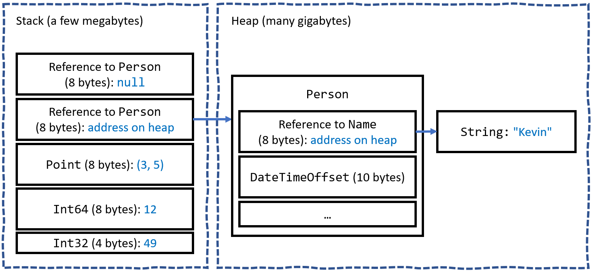

**Managing memory with reference and value types**

- [Understanding stack and heap memory](#understanding-stack-and-heap-memory)
- [Defining reference and value types](#defining-reference-and-value-types)
- [How reference and value types are stored in memory](#how-reference-and-value-types-are-stored-in-memory)
- [Understanding boxing](#understanding-boxing)
- [Defining struct types](#defining-struct-types)
- [Defining record struct types](#defining-record-struct-types)
- [Releasing unmanaged resources](#releasing-unmanaged-resources)
- [Ensuring that Dispose is called](#ensuring-that-dispose-is-called)


I have mentioned reference types a couple of times in this book. Let's look at them in more detail.

# Understanding stack and heap memory

There are two categories of memory: **stack** memory and **heap** memory. With modern operating systems, the stack and heap can be anywhere in physical or virtual memory.

Stack memory is faster to work with but limited in size. It is fast because it is managed directly by the CPU and it uses a last-in, first-out mechanism, so it is more likely to have data in its L1 or L2 cache. Heap memory is slower but much more plentiful.

On Windows, for ARM64, x86, and x64 machines, the default stack size is 1 MB. It is 8 MB on a typical modern Linux-based operating system. For example, in a macOS or Linux terminal, I can enter the command ulimit -a to discover that the stack size is limited to 8,192 KB and that other memory is "unlimited." This limited amount of stack memory is why it is so easy to fill it up and get a "stack overflow."

# Defining reference and value types

There are three C# keywords that you can use to define object types: `class`, `record`, and `struct`. All can have the same members, such as fields and methods. One difference between them is how memory is allocated:
- When you define a type using `record` or `class`, you define a reference type. This means that the memory for the object itself is allocated on the heap, and only the memory address of the object (and a little overhead) is stored on the stack. Reference types always use a little stack memory.
- When you define a type using `record struct` or `struct`, you define a value type. This means that the memory for the object itself is allocated to the stack.

If a `struct` uses field types that are not of the `struct` type, then those fields will be stored on the heap, meaning the data for that object is stored in both the stack and the heap.

These are the most common struct types:
- Number `System` types: `byte`, `sbyte`, `short`, `ushort`, `int`, `uint`, `long`, `ulong`, `float`, `double`, and `decimal`.
- Other `System` types: `char`, `DateTime`, `DateOnly`, `TimeOnly`, and `bool`.
- `System.Drawing` types: `Color`, `Point`, `PointF`, `Size`, `SizeF`, `Rectangle`, and `RectangleF`.

Almost all the other types are class types, including `string` aka `System.String` and `object` aka `System.Object`.

Apart from the difference in terms of where in memory the data for a type is stored, the other major differences are that you cannot inherit from a `struct`, and `struct` objects are compared for equality using values instead of memory addresses.

# How reference and value types are stored in memory

Imagine that you have a console app that calls some method that uses some reference and value type variables, as shown in the following code:
```cs
void SomeMethod()
{
  int number1 = 49;
  long number2 = 12;
  System.Drawing.Point location = new(x: 3, y: 5);

  Person kevin = new() { Name = "Kevin",
    Born = new(1988, 9, 23, 0, 0, 0, TimeSpan.Zero) };

  Person sally;
}
```

Let's review what memory is allocated on the stack and heap when this method is executed, as shown in *Figure 6.1* and as described in the following list:
- The `number1` variable is a value type (defined using `struct`), so it is allocated on the stack, and it uses 4 bytes of memory since it is a 32-bit integer. Its value, `49`, is stored directly in the variable.
- The `number2` variable is also a value type, so it is also allocated on the stack, and it uses 8 bytes since it is a 64-bit integer.
- The `location` variable is also a value type, so it is allocated on the stack, and it uses 8 bytes since it is made up of two 32-bit integers, `x` and `y`.
- The `kevin` variable is a reference type (defined using `class`), so 8 bytes for a 64-bit memory address (assuming a 64-bit operating system) are allocated on the stack, and enough bytes are allocated on the heap to store an instance of a `Person`.
- The `sally` variable is a reference type, so 8 bytes for a 64-bit memory address are allocated on the stack. It is currently unassigned (`null`), meaning no memory has yet been allocated for it on the heap. If we were to later assign `kevin` to `sally`, then the memory address of the `Person` on the heap would be copied into `sally`, as shown in the following code:
```cs
sally = kevin; // Both variables point at the same Person on heap.
```


*Figure 6.6: How value and reference types are allocated in the stack and heap*

All the allocated memory for a reference type is stored on the heap except for its memory address on the stack. If a value type such as `DateTimeOffset` is used for a field of a reference type like `Person`, then the `DateTimeOffset` value is stored on the heap, as shown in *Figure 6.1*.

If a value type has a field that is a reference type, then that part of the value type is stored on the heap. `Point` is a value type that consists of two fields, both of which are themselves value types, so the entire object can be allocated on the stack. If the `Point` value type had a field that was a reference type, like `string`, then the `string` bytes would be stored on the heap.

When the method completes, all the stack memory is automatically released from the top of the stack. However, heap memory could still be allocated after a method returns. It is the .NET runtime garbage collector's responsibility to release this memory at a future date. Heap memory is not immediately released to improve performance. We will learn about the garbage collector later in this section.

The console app might then call another method that needs some more stack memory to be allocated to it, and so on. Stack memory is literally a stack: memory is allocated at the top of the stack and removed from there when it is no longer needed.

C# developers do not have control over the allocation or release of memory. Memory is automatically allocated when methods are called, and that memory is automatically released when the method returns. This is known as verifiably safe code.

C# developers can allocate and access raw memory using **unsafe** code. The `stackalloc` keyword is used to allocate a block of memory on the stack. Memory allocated is released automatically when the method that allocated it returns. This is an advanced feature not covered in this book. You can read about unsafe code and `stackalloc` at the following links: https://learn.microsoft.com/en-us/dotnet/csharp/language-reference/unsafe-code and https://learn.microsoft.com/en-us/dotnet/csharp/language-reference/operators/stackalloc.

# Understanding boxing

Boxing is nothing to do with being punched in the face, although for Unity game developers struggling to manage limited memory it can sometimes feel like it.

Boxing in C# is when a value type is moved to heap memory and wrapped inside a `System.Object` instance. Unboxing is when that value is moved back onto the stack. Unboxing happens explicitly. Boxing happens implicitly, so it can happen without the developer realizing. Boxing can take up to 20 times longer than without boxing.

For example, an `int` value can be boxed and then unboxed, as shown in the following code:
```cs
int n = 3;
object o = n; // Boxing happens implicitly.
n = (int)o; // Unboxing only happens explicitly using casting.
```

A common scenario is passing value types to formatted strings, as shown in the following code:
```cs
string name = "Hilda";
DateTime hired = new(2024, 2, 21);
int days = 5;

// hired and days are value types that will be boxed.
Console.WriteLine("{0} hired on {1} for {2} days.", name, hired, days);
```

The `name` variable is not boxed because `string` is a reference type and is therefore already on the heap.

Boxing and unboxing operations have a negative impact on performance. Although it can be useful for a .NET developer to be aware of and to avoid boxing, for most .NET project types and for many scenarios, boxing is not worth worrying too much about because the overhead is dwarfed by other factors like making a network call or updating the user interface.

But for games developed for the Unity platform, its garbage collector does not release boxed values as quickly or automatically and therefore it is more critical to avoid boxing as much as possible. For this reason, Rider with its Unity Support plugin will complain about boxing operations whenever they occur in your code. Unfortunately, it does not differentiate between Unity and other project types.

> **More Information**: You can learn more about boxing at the following link: https://learn.microsoft.com/en-us/dotnet/csharp/programming-guide/types/boxing-and-unboxing.

# Defining struct types

Let's explore defining your own value types:
1.	In the `PacktLibrary` project, add a file named `DisplacementVector.cs`.
2.	Modify the file, as shown in the following code, and note the following:
     - The type is declared using `struct` instead of `class`.
     - It has two `int` properties, named `X` and `Y`, that will auto-generate two private fields with the same data type, which will be allocated on the stack.
     - It has a constructor to set initial values for `X` and `Y`.
     - It has an operator to add two instances together that returns a new instance of the type, with `X` added to `X`, and `Y` added to `Y`:
```cs
namespace Packt.Shared;

public struct DisplacementVector
{
  public int X { get; set; }
  public int Y { get; set; }

  public DisplacementVector(int initialX, int initialY)
  {
    X = initialX;
    Y = initialY;
  }

  public static DisplacementVector operator +(
    DisplacementVector vector1,
    DisplacementVector vector2)
  {
    return new(
      vector1.X + vector2.X,
      vector1.Y + vector2.Y);
  }
}
```

> **Important**: The preceding code does not explicitly define a default constructor (a constructor without parameters) but `struct` types always have a default constructor so one will be generated for you because they go on the stack and *must* be initialized.

> **Good Practice**: If the total memory used by all the fields in your type is 16 bytes or less, your type only uses value types for its fields, and you will never want to derive from your type, then Microsoft recommends that you use `struct`. If your type uses more than 16 bytes of stack memory, it uses reference types for its fields, or you might want to inherit from it, then use `class`.

3.	In `Program.cs`, add statements to create two new instances of `DisplacementVector`, add them together, and output the result, as shown in the following code:
```cs
DisplacementVector dv1 = new(3, 5);
DisplacementVector dv2 = new(-2, 7);
DisplacementVector dv3 = dv1 + dv2;

WriteLine($"({dv1.X}, {dv1.Y}) + ({dv2.X}, {dv2.Y}) = ({dv3.X}, {dv3.Y})");
```

4.	Run the `PeopleApp` project and view the result, as shown in the following output:
```
(3, 5) + (-2, 7) = (1, 12)
```

> Value types always have a default constructor even if an explicit one is not defined because the values on the stack must be initialized, even if they are initialized to default values. For the two integer fields in `DisplacementVector`, they will be initialized to `0`.

5.	In `Program.cs`, add statements to create a new instance of `DisplacementVector`, and output the object's properties, as shown in the following code:
```cs
DisplacementVector dv4 = new();
WriteLine($"({dv4.X}, {dv4.Y})");
```

6.	Run the `PeopleApp` project and view the result, as shown in the following output:
```
(0, 0)
```

7.	In `Program.cs`, add statements to create a new instance of `DisplacementVector`, and compare it to `dv1`, as shown in the following code:
```cs
DisplacementVector dv5 = new(3, 5);
WriteLine($"dv1.Equals(dv5): {dv1.Equals(dv5)}");
WriteLine($"dv1 == dv5: {dv1 == dv5}");
```

Note that you cannot compare `struct` variables using `==`, but you can call the `Equals` method, which has a default implementation that compares all fields within the struct for equality. We could now make our `struct` overload the `==` operator ourselves, but an easier way is to use a feature introduced with C# 10: `record struct` types.

# Defining record struct types

C# 10 introduced the ability to use the `record` keyword with `struct` types as well as `class` types. Let's see an example:

1.	In the `DisplacementVector` type, add the `record` keyword, as in the following code:
```cs
public record struct DisplacementVector
```
2.	In `Program.cs`, note that `==` now does not have a compiler error.
3.	Run the `PeopleApp` project and view the result, as shown in the following output:
```
dv1.Equals(dv5): True
dv1 == dv5: True
```

A `record struct` has all the same benefits over a `record` class that a `struct` has over a `class`. One difference between `record struct` and `record class` declared using primary constructor syntax is that `record struct` is not immutable, unless you also apply the `readonly` keyword to the `record struct` declaration. A `struct` does not implement the `==` and `!=` operators, but they are automatically implemented with a `record struct`.

> **Good Practice**: With this change, Microsoft recommends explicitly specifying `class` if you want to define a `record class`, even though the `class` keyword is optional, as shown in the following code: `public record class ImmutableAnimal(string Name);`.

# Releasing unmanaged resources

In the previous chapter, we saw that constructors can be used to initialize fields and that a type may have multiple constructors. Imagine that a constructor allocates an unmanaged resource, that is, anything that is not controlled by .NET, such as a file or mutex under the control of the operating system. The unmanaged resource must be manually released because .NET cannot do it for us using its automatic garbage collection feature.

Garbage collection is an advanced topic, so for this topic, I will show some code examples, but you do not need to write the code yourself.

Each type can have a single **finalizer** that will be called by the .NET runtime when the resources need to be released. A finalizer has the same name as a constructor, that is, the name of the type, but it is prefixed with a tilde, `~`, as shown in the following code:
```cs
public class ObjectWithUnmanagedResources
{
  public ObjectWithUnmanagedResources() // Constructor.
  {
    // Allocate any unmanaged resources.
  }

  ~ObjectWithUnmanagedResources() // Finalizer aka destructor.
  {
    // Deallocate any unmanaged resources.
  }
}
```

Do not confuse a *finalizer* (also known as a *destructor*) with a `Deconstruct` method. A destructor releases resources; in other words, it destroys an object in memory. A `Deconstruct` method returns an object split up into its constituent parts and uses the C# deconstruction syntax, for example, when working with tuples. See *Chapter 5, Building Your Own Types with Object-Oriented Programming*, for details of `Deconstruct` methods.

The preceding code example is the minimum you should do when working with unmanaged resources. However, the problem with only providing a finalizer is that the .NET garbage collector requires two garbage collections to completely release the allocated resources for this type.

Though optional, it is recommended to also provide a method to allow a developer who uses your type to explicitly release resources. This would allow the garbage collector to release managed parts of an unmanaged resource, such as a file, immediately and deterministically. This would mean it releases the managed memory part of the object in a single garbage collection instead of two rounds of garbage collection.

There is a standard mechanism to do this by implementing the `IDisposable` interface, as shown in the following example:
```cs
public class ObjectWithUnmanagedResources : IDisposable
{
  public ObjectWithUnmanagedResources()
  {
    // Allocate unmanaged resource.
  }

  ~ObjectWithUnmanagedResources() // Finalizer.
  {
    Dispose(false);
  }

  bool disposed = false; // Indicates if resources have been released.

  public void Dispose()
  {
    Dispose(true);

    // Tell garbage collector it does not need to call the finalizer.
    GC.SuppressFinalize(this);
  }

  protected virtual void Dispose(bool disposing)
  {
    if (disposed) return;

    // Deallocate the *unmanaged* resource.
    // ...

    if (disposing)
    {
      // Deallocate any other *managed* resources.
      // ...
    }
    disposed = true;
  }
}
```

There are two `Dispose` methods, one public and one protected:
- The `public void Dispose` method will be called by a developer using your type. When called, both unmanaged and managed resources need to be deallocated.
- The `protected virtual void Dispose` method with a `bool` parameter is used internally to implement the deallocation of resources. It needs to check the `disposing` parameter and `disposed` field because if the finalizer thread has already run and called the `~ObjectWithUnmanagedResources` finalizer method, then only managed resources need to be deallocated by the garbage collector.
- The call to `GC.SuppressFinalize(this)` is what notifies the garbage collector that it no longer needs to run the finalizer, removing the need for a second garbage collection.

# Ensuring that Dispose is called

When someone uses a type that implements `IDisposable`, they can ensure that the public `Dispose` method is called with the `using` statement, as shown in the following code:
```cs
using (ObjectWithUnmanagedResources thing = new())
{
  // Code that uses thing.
}
```

The compiler converts your code into something like the following, which guarantees that even if an exception occurs, the `Dispose` method will still be called:
```cs
ObjectWithUnmanagedResources thing = new();
try
{
  // Code that uses thing.
}
finally
{
  if (thing != null) thing.Dispose();
}
```

When someone uses a type that implements `IAsyncDisposable`, they can ensure that the public `Dispose` method is called with the `await using` statement, as shown in the following code:
```cs
await using (ObjectWithUnmanagedResources thing = new())
{
  // Code that uses async thing.
}
```

You will see practical examples of releasing unmanaged resources with `IDisposable`, `using` statements, and `try...finally` blocks in *Chapter 9, Working with Files, Streams, and Serialization*.
