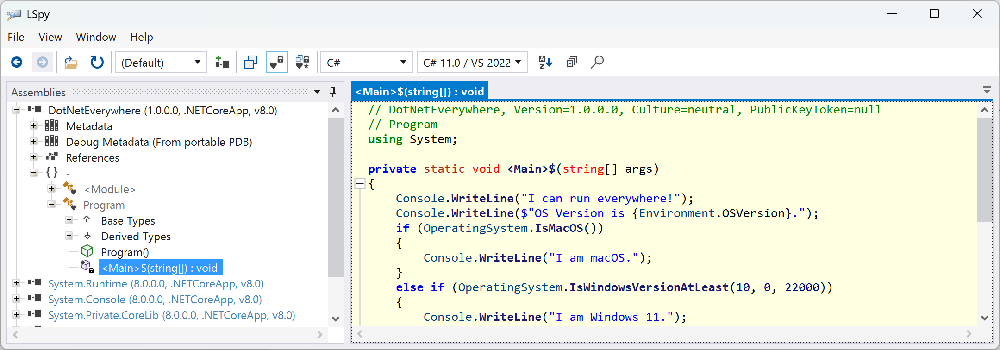
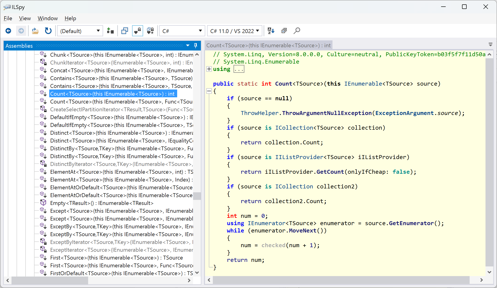
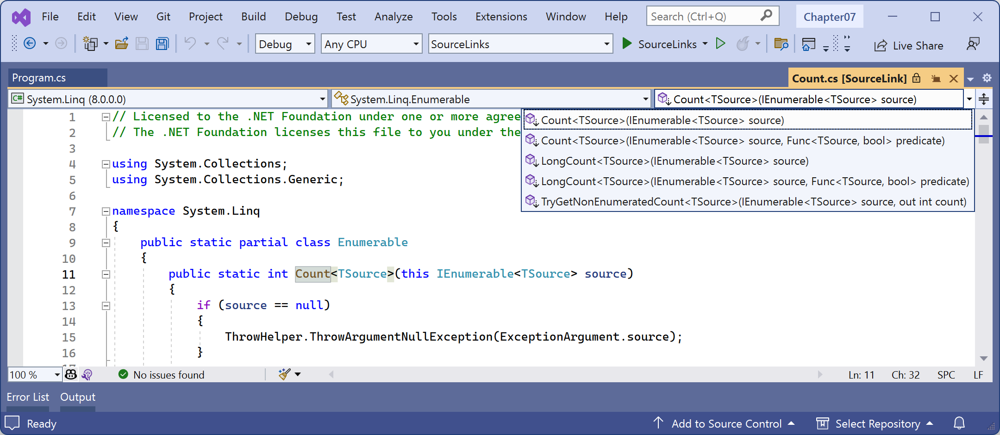

**Decompiling .NET assemblies**

- [Decompiling using the ILSpy extension for Visual Studio](#decompiling-using-the-ilspy-extension-for-visual-studio)
- [Viewing source links with Visual Studio](#viewing-source-links-with-visual-studio)
- [No, you cannot technically prevent decompilation](#no-you-cannot-technically-prevent-decompilation)


One of the best ways to learn how to code for .NET is to see how professionals do it. Most code editors have an extension for decompiling .NET assemblies. Visual Studio 2022 and Visual Studio Code can use the ILSpy extension. JetBrains Rider has a built-in IL Viewer tool.

> **Good Practice**: You could decompile someone else's assemblies for non-learning purposes, like copying their code for use in your own production library or application, but remember that you are viewing their intellectual property, so please respect that.

# Decompiling using the ILSpy extension for Visual Studio

For learning purposes, you can decompile any .NET assembly with a tool like ILSpy:
1.	In Visual Studio, navigate to **Extensions** | **Manage Extensions**.
2.	In the search box, enter `ilspy`.
3.	For the **ILSpy 2022** extension, click **Download**.
4.	Click **Close**.
5.	Close Visual Studio to allow the extension to be installed.
6.	Restart Visual Studio and reopen the `Chapter07` solution.
7.	In **Solution Explorer**, right-click the `DotNetEverywhere` project and select **Open output in ILSpy**.
8.	In ILSpy, in the toolbar, make sure that **C#** is selected in the drop-down list of languages to decompile into.
9.	In ILSpy, in the **Assemblies** navigation tree on the left, expand **DotNetEverywhere (1.0.0.0, .NETCoreApp, v9.0)**.
10.	In ILSpy, in the **Assemblies** navigation tree on the left, expand **{ }** and then expand **Program**.
11.	Select `<Main>$(string[]) : void` to show the statements in the compiler-generated `Program` class and its `<Main>$` method, as shown in *Figure 7.4*:


*Figure 7.4: Revealing the `<Main>$` method using ILSpy*

12.	In ILSpy, navigate to **File** | **Open…**.
13.	Navigate to the following folder:
`cs13net9/Chapter07/DotNetEverywhere/bin/Release/net9.0/linux-x64`
14.	Select the `System.Linq.dll` assembly and click **Open**.
15.	In the **Assemblies** tree, expand the **System.Linq (9.0.0.0, .NETCoreApp, v9.0)** assembly, expand the **System.Linq** namespace, expand the **Enumerable** class, and then click the **Count<TSource>(this IEnumerable<TSource>) : int** method.
16.	In the `Count` method, note the good practice of checking the source parameter and throwing an `ArgumentNullException` if it is `null`, checking for interfaces that the source might implement with their own `Count` properties that would be more efficient to read, and finally, the last resort of enumerating through all the items in the source and incrementing a counter, which would be the least efficient implementation, as shown in *Figure 7.5*:
 

*Figure 7.5: Decompiled Count method of the Enumerable class*

> Note that different decompiler tools are likely to produce slightly different code, for example, variable names, but the functionality will be the same.

17.	Review the C# source code for the `Count` method, as shown in the following code, in preparation for reviewing the same code in IL:
```cs
public static int Count<TSource>(this IEnumerable<TSource> source)
{
  if (source == null)
  {
    ThrowHelper.ThrowArgumentNullException(ExceptionArgument.source);
  }
  if (source is ICollection<TSource> collection)
  {
    return collection.Count;
  }
  if (source is IIListProvider<TSource> iIListProvider)
  {
    return iIListProvider.GetCount(onlyIfCheap: false);
  }
  if (source is ICollection collection2)
  {
    return collection2.Count;
  }
  int num = 0;
  using IEnumerator<TSource> enumerator = source.GetEnumerator();
  while (enumerator.MoveNext())
  {
    num = checked(num + 1);
  }
  return num;
}
```

> **Good Practice**: You will often see LinkedIn posts and blog articles warning you to always use the `Count` property of a sequence instead of calling the LINQ `Count()` extension method. As you can see above, this advice is unnecessary because the `Count()` method always checks if the sequence implements `ICollection<T>` or `ICollection` and then uses the `Count` property anyway. Also note that the `System.Array` class implements `IList` (a superset of `ICollection`), and its `Count` property implementation returns the `Length`.

The final part of the `Count` method implementation shows how the `foreach` statement works internally. It calls the `GetEnumerator` method and then calls the `MoveNext` method in a `while` loop. To calculate the count, the loop increments an `int` value. It does all this in a `checked` statement so that an exception will be thrown in the case of an overflow. The `Count` method can, therefore, only count sequences with up to about 2 billion items.

18.	In the ILSpy toolbar, click the **Select language to decompile** dropdown and select **IL**, and then review the IL source code of the `Count` method.
```il

```

> **Good Practice**: The IL code is not especially useful unless you get very advanced with C# and .NET development, when knowing how the C# compiler translates your source code into IL code can be important. The much more useful edit windows contain the equivalent C# source code written by Microsoft experts. You can learn a lot of good practices from seeing how professionals implement types. For example, the `Count` method shows how to check arguments for `null`.

19.	Close ILSpy.

You can learn how to use the ILSpy extension for Code at the following link: https://github.com/markjprice/cs12dotnet8/blob/main/docs/code-editors/vscode.md#decompiling-using-the-ilspy-extension-for-visual-studio-codehttps://github.com/markjprice/cs13net9/blob/main/docs/code-editors/vscode.md#decompiling-using-the-ilspy-extension-for-visual-studio-code.

# Viewing source links with Visual Studio
Instead of decompiling, Visual Studio has a feature that allows you to view the original source code using source links. This feature is not available in Code.

Let's see how it works:
1.	In Visual Studio, enable **Source Link**:
     - Navigate to **Tools** | **Options**.
     - In the search box, enter `navigation to source`.
     - Select **Text Editor** | **C#** | **Advanced**.
     - Select the **Enable navigation to Source Link and Embedded sources** check box, and then click **OK**.
2.	In Visual Studio, add a new **Console App** / `console` project to the `Chapter07` solution named `SourceLinks`.
3.	In `Program.cs`, delete the existing statements,and then add statements to declare a `string` variable and then output its value and the number of characters it has, as shown in the following code:
```cs
string name = "Timothée Chalamet";
int length = name.Count();
Console.WriteLine($"{name} has {length} characters.");
```

4.	Right-click in the `Count()` method and select **Go To Implementation**.
5.	Note the source code file is named `Count.cs` and it defines a `partial Enumerable` class with implementations of five count-related methods, as shown in *Figure 7.6*:


*Figure 7.6: Viewing the original source file for LINQ's Count method implementation*

You can learn more from viewing source links than decompiling because they show best practices for situations like how to divide up a class into partial classes for easier management. When we used the ILSpy compiler, all it could do was show all the hundreds of methods of the `Enumerable` class.
You can learn more about how a source link works and how any NuGet package can support it at the following link: https://learn.microsoft.com/en-us/dotnet/standard/library-guidance/sourcelink.

6.	If you prefer decompiling rather than viewing source links, then you can disable the source link feature now.

# No, you cannot technically prevent decompilation

I sometimes get asked if there is a way to protect compiled code to prevent decompilation. The quick answer is no, and if you think about it, you'll see why this must be the case. You can make it harder using obfuscation tools like Dotfuscator, but ultimately, you cannot completely prevent it.

All compiled applications contain instructions for the platform, operating system, and hardware on which it runs. Those instructions must be functionally the same as the original source code but are harder for a human to read. Those instructions must be readable to execute your code; therefore, they must be readable to be decompiled. If you were to protect your code from decompilation using some custom technique, then you would also prevent your code from running!

Virtual machines simulate hardware and so can capture all interaction between your running application and the software and hardware that it thinks it is running on.

If you could protect your code, then you would also prevent attaching to it with a debugger and stepping through it. If the compiled application has a `.pdb` file, then you can attach a debugger and step through the statements line by line. Even without the `.pdb` file, you can still attach a debugger and get some idea of how the code works.

This is true for all programming languages. Not just .NET languages like C#, Visual Basic, and F#, but also C, C++, Delphi, and assembly language: all can be attached to for debugging or to be disassembled or decompiled. Some tools used by professionals are shown in *Table 7.7*:

Type|Product|Description
---|---|---
Virtual Machine|VMware|Professionals like malware analysts always run software inside a VM.
Debugger|SoftICE|Runs underneath the operating system, usually in a VM.
Debugger|WinDbg|Useful for understanding Windows internals because it knows more about Windows data structures than other debuggers.
Disassembler|IDA Pro|Used by professional malware analysts.
Decompiler|HexRays|Decompiles C apps. Plugin for IDA Pro.
Decompiler|DeDe|Decompiles Delphi apps.
Decompiler|dotPeek|.NET decompiler from JetBrains.

*Table 7.7: Professional debugger, decompiler, and disassembler tools*

> **Good Practice**: Debugging, disassembling, and decompiling someone else's software is likely against its license agreement and illegal in many jurisdictions. Instead of trying to protect your intellectual property with a technical solution, the law is sometimes your only recourse.
