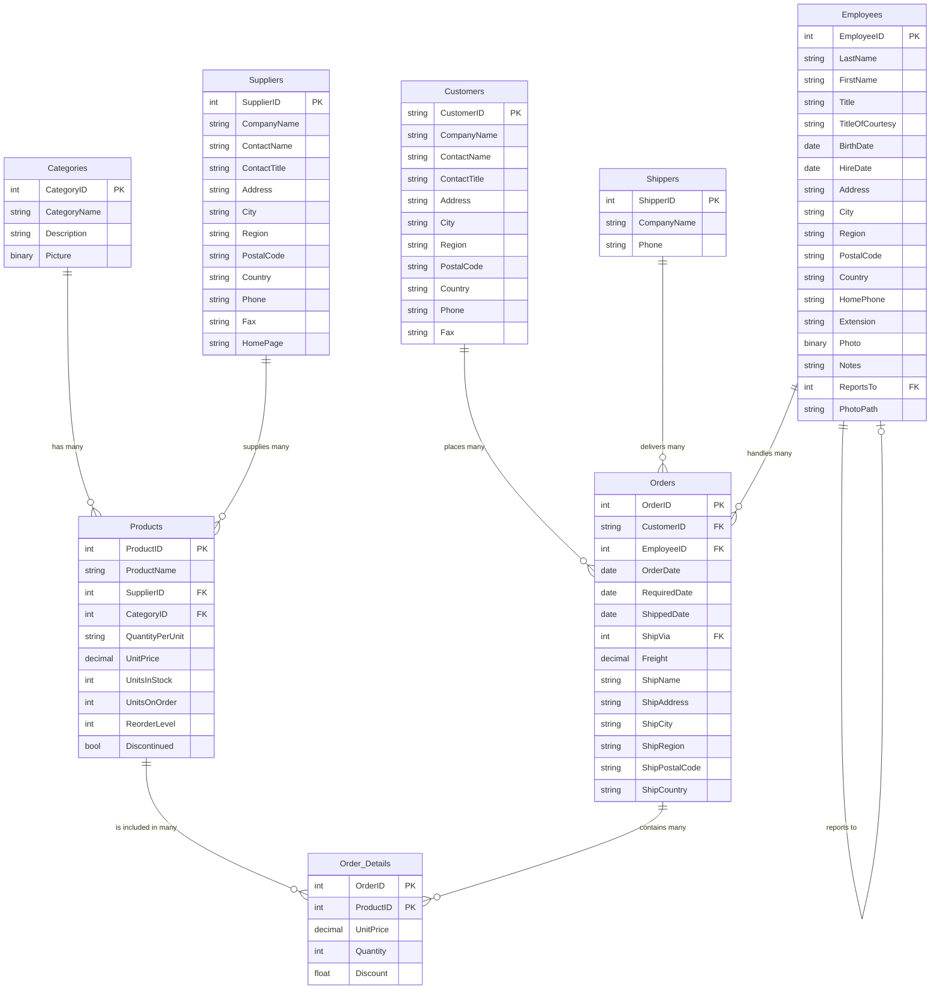

**Entity-Relationship Diagram for Northwind**

```mermaid
erDiagram
    Categories {
        int CategoryID PK
        string CategoryName
        string Description
        binary Picture
    }

    Suppliers {
        int SupplierID PK
        string CompanyName
        string ContactName
        string ContactTitle
        string Address
        string City
        string Region
        string PostalCode
        string Country
        string Phone
        string Fax
        string HomePage
    }

    Products {
        int ProductID PK
        string ProductName
        int SupplierID FK
        int CategoryID FK
        string QuantityPerUnit
        decimal UnitPrice
        int UnitsInStock
        int UnitsOnOrder
        int ReorderLevel
        bool Discontinued
    }

    Customers {
        string CustomerID PK
        string CompanyName
        string ContactName
        string ContactTitle
        string Address
        string City
        string Region
        string PostalCode
        string Country
        string Phone
        string Fax
    }

    Employees {
        int EmployeeID PK
        string LastName
        string FirstName
        string Title
        string TitleOfCourtesy
        date BirthDate
        date HireDate
        string Address
        string City
        string Region
        string PostalCode
        string Country
        string HomePhone
        string Extension
        binary Photo
        string Notes
        int ReportsTo FK
        string PhotoPath
    }

    Shippers {
        int ShipperID PK
        string CompanyName
        string Phone
    }

    Orders {
        int OrderID PK
        string CustomerID FK
        int EmployeeID FK
        date OrderDate
        date RequiredDate
        date ShippedDate
        int ShipVia FK
        decimal Freight
        string ShipName
        string ShipAddress
        string ShipCity
        string ShipRegion
        string ShipPostalCode
        string ShipCountry
    }

    Order_Details {
        int OrderID PK
        int ProductID PK
        decimal UnitPrice
        int Quantity
        float Discount
    }

    Categories ||--o{ Products : "has many"
    Suppliers ||--o{ Products : "supplies many"
    Products ||--o{ Order_Details : "is included in many"
    Orders ||--o{ Order_Details : "contains many"
    Customers ||--o{ Orders : "places many"
    Employees ||--o{ Orders : "handles many"
    Shippers ||--o{ Orders : "delivers many"
    Employees ||--o| Employees : "reports to"
```