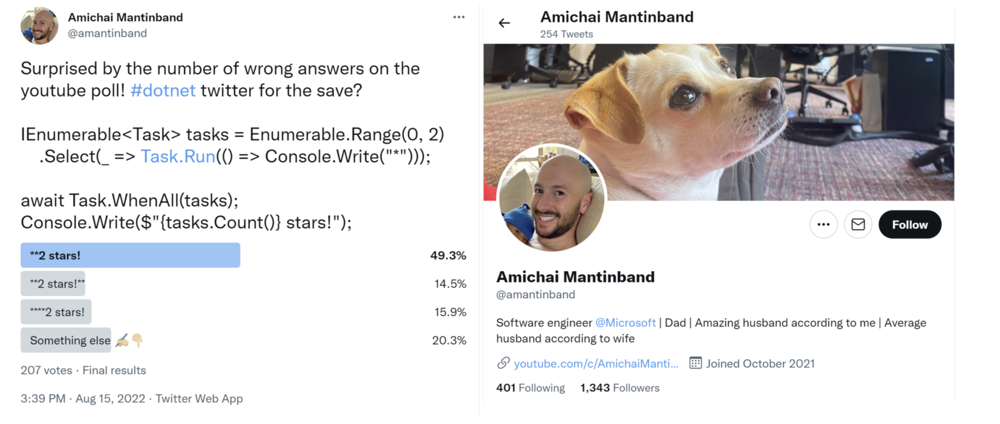

**Aggregating and paging sequences**

- [Checking for an empty sequence](#checking-for-an-empty-sequence)
- [Be careful with Count!](#be-careful-with-count)
- [Paging with LINQ](#paging-with-linq)
- [Sweetening LINQ syntax with syntactic sugar](#sweetening-linq-syntax-with-syntactic-sugar)


There are LINQ extension methods to perform aggregation functions, such as `Average` and `Sum`. Let's write some code to see some of these methods in action, aggregating information from the `Products` table:
1.	In `Program.Functions.cs`, add a method to show the use of the aggregation extension methods, as shown in the following code:
```cs
private static void AggregateProducts()
{
  SectionTitle("Aggregate products");

  using NorthwindDb db = new();

  // Triggers the OnConfiguring method without loading entities.
  // If we don't do this, then the OnConfiguring method would 
  // not execute until we need to access the database, e.g.
  // when calling ToList. TryGetNonEnumeratedCount does not
  // need to access the database.
  db.Database.CanConnect();

  // Try to get an efficient count from EF Core DbSet<T>.
  if (db.Products.TryGetNonEnumeratedCount(out int countDbSet))
  {
    WriteLine($"{"Product count from DbSet:",-25} {countDbSet,10}");
  }
  else
  {
    WriteLine("Products DbSet does not have a Count property.");
  }

  // Try to get an efficient count from a List<T>.
  List<Product> products = db.Products.ToList();

  if (products.TryGetNonEnumeratedCount(out int countList))
  {
    WriteLine($"{"Product count from list:",-25} {countList,10}");
  }
  else
  {
    WriteLine("Products list does not have a Count property.");
  }

  WriteLine($"{"Product count:",-25} {db.Products.Count(),10}");

  WriteLine($"{"Discontinued product count:",-27} {db.Products
    .Count(product => product.Discontinued),8}");

  WriteLine($"{"Highest product price:",-25} {db.Products
    .Max(p => p.UnitPrice),10:$#,##0.00}");

  WriteLine($"{"Sum of units in stock:",-25} {db.Products
    .Sum(p => p.UnitsInStock),10:N0}");

  WriteLine($"{"Sum of units on order:",-25} {db.Products
    .Sum(p => p.UnitsOnOrder),10:N0}");

  WriteLine($"{"Average unit price:",-25} {db.Products
    .Average(p => p.UnitPrice),10:$#,##0.00}");

  WriteLine($"{"Value of units in stock:",-25} {db.Products
    .Sum(p => p.UnitPrice * p.UnitsInStock),10:$#,##0.00}");
}
```

> **Good Practice**: Getting a count can seem like a simple operation but counting can be costly. A `DbSet<T>` like `Products` does not have a `Count` property so `TryGetNonEnumeratedCount` returns `false`. A `List<T>` like products does have a `Count` property because it implements `ICollection` so `TryGetNonEnumeratedCount` returns `true`. (In this case, we had to instantiate a list, which is itself a costly operation, but if you already have a list and need to know the number of items, then this would be efficient.) You can always call `Count()` on a `DbSet<T>`, but it can be slow because it might have to enumerate the sequence depending on the data provider implementation. For any array, use the `Length` property to get a count. You can pass a lambda expression to `Count()` to filter which items in the sequence should be counted, which you cannot do with either the `Count` or `Length` properties.

2.	In `Program.cs`, call the `AggregateProducts` method.
3.	Run the code and view the result, as shown in the following output:
```cs
Products DbSet does not have a Count property.
Product count from list:          77
Product count:                    77
Discontinued product count:        8
Highest product price:       $263.50
Sum of units in stock:         3,119
Sum of units on order:           780
Average unit price:           $28.87
Value of units in stock:  $74,050.85
```

# Checking for an empty sequence

There are multiple ways to check if a sequence is empty or it contains any items:
- Call the LINQ `Count()` method and see if it is greater than zero. This is sometimes the worst way if it must enumerate the whole sequence to count the items. You will see more about this in the next section. But as we saw when we used ILSpy to decompile the `Count()` method implementation, it is smart enough to check if the sequence implements `ICollection` or `ICollection<T>` and therefore has a more efficient `Count` property that it can use.
- Call the LINQ `Any()` method and see if it returns `true`. This is better than `Count()` but not as good as either of the next two options.
- Get the sequence's `Count` property (if it has one) and see if it is greater than zero. Any sequence that implements `ICollection` or `ICollection<T>` will have a `Count` property.
- Get the sequence's `Length` property (if it has one) and see if it is greater than zero. Any array will have a `Length` property.

# Be careful with Count!

Amichai Mantinband is a software engineer at Microsoft, and he does a great job of highlighting interesting parts of the C# and .NET developer stack.

In 2022, he posted a code teaser on Twitter, LinkedIn, and YouTube, with a poll to find out what developers thought the code would do.
Here's the code:
```cs
IEnumerable<Task> tasks = Enumerable.Range(0, 2)
  .Select(_ => Task.Run(() => Console.Write("*")));

await Task.WhenAll(tasks);

Console.Write($"{tasks.Count()} stars!");
```

Which of the following four will the output be?
```
**2 stars!
**2 stars!**
****2 stars!
Something else
```

Most got it wrong, as shown in *Figure 11.6*:

 
*Figure 11.6: A tricky LINQ and Task code teaser from Amichai Mantinband*

By this point in this chapter, I would hope that you understand the LINQ parts of this tricky question. Don't worry! I would not expect you to understand the subtleties of multi-threading with tasks. It is still worth breaking down the code to make sure you understand the LINQ parts, as shown in *Table 11.5*:

Code|Description
---|---
`Enumerable.Range(0, 2)`|Returns a sequence of two integers, `0` and `1`. In production code, you should add named parameters to make this clearer, as shown in the following code: `Enumerable.Range(start: 0, count: 2)`.
`Select(_ => Task.Run(...)`|Creates a task with its own thread for each of the two numbers. The `_` parameter discards the number value. Each task outputs a star `*` to the console.
`await Task.WhenAll(tasks);`|Blocks the main thread until both of the two tasks have completed. So, at this point, we know that two stars `**` have been output to the console.
`tasks.Count()`|For the LINQ `Count()` extension method to work in this scenario, it must enumerate the sequence. This triggers the two tasks to execute again! But we do not know when those two tasks will execute. The value `2` is returned from the method call.
`Console.WriteLine(<br/>$"... stars!");`|`2 stars!` is output to the console.

*Table 11.5: Code teaser steps explanation*

So, we know that `**` is output to the console first, then one or both tasks might output their star, then `2 stars!` is output, and finally one or both tasks might output their star if they did not have time to do so before, or the main thread might end, terminating the console app before either task can output their star:
```
**[each task could output * here]2 stars![each task could output * here]
```

So, the best answer to Amichai's teaser is "Something else."

> **Good Practice**: Be careful when calling LINQ extension methods like `Count()` that need to enumerate over the sequence to calculate their return value. Even if you are not working with a sequence of executable objects like tasks, re-enumerating the sequence is likely to be inefficient.

# Paging with LINQ

Let's see how we could implement paging using the Skip and Take extension methods:
1.	In `Program.Functions.cs`, add a method to output to the console a table of products passed as an array, as shown in the following code:
```cs
private static void OutputTableOfProducts(Product[] products,
  int currentPage, int totalPages)
{
  string line = new('-', count: 73);
  string lineHalf = new('-', count: 30);

  WriteLine(line);
  WriteLine("{0,4} {1,-40} {2,12} {3,-15}",
    "ID", "Product Name", "Unit Price", "Discontinued");
  WriteLine(line);

  foreach (Product p in products)
  {
    WriteLine("{0,4} {1,-40} {2,12:C} {3,-15}",
      p.ProductId, p.ProductName, p.UnitPrice, p.Discontinued);
  }
  WriteLine("{0} Page {1} of {2} {3}",
    lineHalf, currentPage + 1, totalPages + 1, lineHalf);
}
```

As usual in computing, our code will start counting from `0`, so we need to add `1` to both the `currentPage` count and `totalPages` count before showing these values in a user interface.

2.	In `Program.Functions.cs`, add a method to create a LINQ query that creates a page of products, outputs the SQL generated from it, and then passes the results as an array of products to the method that outputs a table of products, as shown in the following code:
```cs
private static void OutputPageOfProducts(IQueryable<Product> products,
  int pageSize, int currentPage, int totalPages)
{
  // We must order data before skipping and taking to ensure
  // the data is not randomly sorted in each page.
  var pagingQuery = products.OrderBy(p => p.ProductId)
    .Skip(currentPage * pageSize).Take(pageSize);

  Clear(); // Clear the console/screen.

  SectionTitle(pagingQuery.ToQueryString());

  OutputTableOfProducts(pagingQuery.ToArray(),
    currentPage, totalPages);
}
```

> Why order when paging? The EF Core team gave a good example at the following link: https://devblogs.microsoft.com/dotnet/announcing-ef7-preview7-entity-framework/#linq-expression-tree-interception. I also cover ordering when paging in the companion book Apps and Services with .NET 8.

3.	In `Program.Functions.cs`, add a method to loop while the user presses either the left or right arrow to page through the products in the database, showing one page at a time, as shown in the following code:
```cs
private static void PagingProducts()
{
  SectionTitle("Paging products");

  using NorthwindDb db = new();

  int pageSize = 10;
  int currentPage = 0;
  int productCount = db.Products.Count();
  int totalPages = productCount / pageSize;

  while (true) // Use break to escape this infinite loop.
  {
    OutputPageOfProducts(db.Products, pageSize, currentPage, totalPages);

    Write("Press <- to page back, press -> to page forward, any key to exit.");
    ConsoleKey key = ReadKey().Key;

    if (key == ConsoleKey.LeftArrow)
      currentPage = currentPage == 0 ? totalPages : currentPage - 1;
    else if (key == ConsoleKey.RightArrow)
      currentPage = currentPage == totalPages ? 0 : currentPage + 1;
    else
      break; // Break out of the while loop.

    WriteLine();
  }
}
```

4.	In `Program.cs`, comment out any other methods and then call the `PagingProducts` method.
5.	Run the code and view the result, as shown in the following output:
```
-------------------------------------------------------------------------
  ID Product Name                               Unit Price Discontinued
-------------------------------------------------------------------------
   1 Chai                                           £18.00 False
   2 Chang                                          £19.00 False
   3 Aniseed Syrup                                  £10.00 False
   4 Chef Anton's Cajun Seasoning                   £22.00 False
   5 Chef Anton's Gumbo Mix                         £21.35 True
   6 Grandma's Boysenberry Spread                   £25.00 False
   7 Uncle Bob's Organic Dried Pears                £30.00 False
   8 Northwoods Cranberry Sauce                     £40.00 False
   9 Mishi Kobe Niku                                £97.00 True
  10 Ikura                                          £31.00 False
------------------------------ Page 1 of 8 ------------------------------
Press <- to page back, press -> to page forward.
```

The preceding output excludes the SQL statement used to efficiently get the page of products by using `ORDER BY`, `LIMIT`, and `OFFSET`, as shown in the following code:
```sql
.param set @__p_1 10
.param set @__p_0 0

SELECT "p"."ProductId", "p"."CategoryId", "p"."Discontinued", "p"."ProductName", "p"."QuantityPerUnit", "p"."ReorderLevel", "p"."SupplierId", "p"."UnitPrice", "p"."UnitsInStock", "p"."UnitsOnOrder"
FROM "Products" AS "p"
ORDER BY "p"."ProductId"
LIMIT @__p_1 OFFSET @__p_0
```

> Make sure the command prompt or terminal window has the focus when you press keys.

6.	Press the right arrow and note the second page of results, as shown in the following output:
```
-------------------------------------------------------------------------
  ID Product Name                               Unit Price Discontinued
-------------------------------------------------------------------------
  11 Queso Cabrales                                 £21.00 False
  12 Queso Manchego La Pastora                      £38.00 False
  13 Konbu                                           £6.00 False
  14 Tofu                                           £23.25 False
  15 Genen Shouyu                                   £15.50 False
  16 Pavlova                                        £17.45 False
  17 Alice Mutton                                   £39.00 True
  18 Carnarvon Tigers                               £62.50 False
  19 Teatime Chocolate Biscuits                      £9.20 False
  20 Sir Rodney's Marmalade                         £81.00 False
------------------------------ Page 2 of 8 ------------------------------
Press <- to page back, press -> to page forward.
```

7.	Press the left arrow twice and note it loops around to the last page of results, as shown in the following output:
```
-------------------------------------------------------------------------
  ID Product Name                               Unit Price Discontinued
-------------------------------------------------------------------------
  71 Flotemysost                                    £21.50 False
  72 Mozzarella di Giovanni                         £34.80 False
  73 Röd Kaviar                                     £15.00 False
  74 Longlife Tofu                                  £10.00 False
  75 Rhönbräu Klosterbier                            £7.75 False
  76 Lakkalikööri                                   £18.00 False
  77 Original Frankfurter grüne Soße                £13.00 False
------------------------------ Page 8 of 8 ------------------------------
Press <- to page back, press -> to page forward.
```

8.	Press any other key to end the loop.
9.	Optionally, in `Program.Functions.cs`, in the `OutputPageOfProducts` method, comment out the statement to output the SQL used, as shown in the following code:
```cs
// SectionTitle(pagingQuery.ToQueryString());
```

As an optional task, explore how you might use the `Chunk` method to output pages of products. You can read more about partitioning items in a sequence using `Skip`, `Take`, and `Chunk` at the following link: https://learn.microsoft.com/en-us/dotnet/csharp/programming-guide/concepts/linq/partitioning-data.

> **Good Practice**: You should always order data before calling `Skip` and `Take` if you want to implement paging. This is because each time you execute a query, the LINQ provider does not have to guarantee to return the data in the same order unless you have specified it. Therefore, if the SQLite provider wanted to, the first time you request a page of products, they might be in `ProductId` order, but the next time you request a page of products, they might be in `UnitPrice` order, or a random order, and that would confuse the users! In practice, at least for relational databases, the default order is usually by its index on the primary key.
 
# Sweetening LINQ syntax with syntactic sugar

C# 3 introduced some new language keywords in 2008 to make it easier for programmers with experience with SQL to write LINQ queries. This syntactic sugar is sometimes called the LINQ *query comprehension syntax*.

Consider the following array of string values:
```cs
string[] names = new[] { "Michael", "Pam", "Jim", "Dwight",
  "Angela", "Kevin", "Toby", "Creed" };
```

To filter and sort the names, you could use extension methods and lambda expressions, as shown in the following code:
```cs
var query = names
  .Where(name => name.Length > 4)
  .OrderBy(name => name.Length)
  .ThenBy(name => name);
```

Or you could achieve the same results by using query comprehension syntax, as shown in the following code:
```cs
var query = from name in names
  where name.Length > 4
  orderby name.Length, name
  select name;
```

The compiler changes the query comprehension syntax to the equivalent extension methods and lambda expressions for you.

The `select` keyword is always required for LINQ query comprehension syntax. The `Select` extension method is optional when using extension methods and lambda expressions because if you do not call `Select`, then the whole item is implicitly selected.

Not all extension methods have a C# keyword equivalent, for example, the `Skip` and `Take` extension methods, which are commonly used to implement paging for lots of data.

A query that skips and takes cannot be written using only the query comprehension syntax, so we could write the query using all extension methods, as shown in the following code:
```cs
var query = names
  .Where(name => name.Length > 4)
  .Skip(80)
  .Take(10);
```

Or, we could wrap query comprehension syntax in parentheses and then switch to using extension methods, as shown in the following code:
```cs
var query = (from name in names
  where name.Length > 4
  select name)
  .Skip(80)
  .Take(10);
```

> **Good Practice**: Learn both extension methods with lambda expressions and the query comprehension syntax ways of writing LINQ queries, because you are likely to have to maintain code that uses both.
