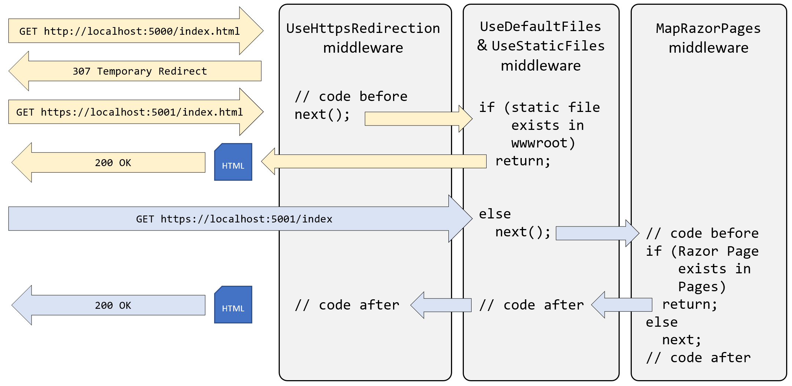

**Configuring services and the HTTP request pipeline**

- [Understanding endpoint routing](#understanding-endpoint-routing)
- [Configuring endpoint routing](#configuring-endpoint-routing)
- [Reviewing the endpoint routing configuration in our project](#reviewing-the-endpoint-routing-configuration-in-our-project)
- [Setting up the HTTP pipeline](#setting-up-the-http-pipeline)
- [Summarizing key middleware extension methods](#summarizing-key-middleware-extension-methods)
- [Visualizing the HTTP pipeline](#visualizing-the-http-pipeline)
- [Implementing an anonymous inline delegate as middleware](#implementing-an-anonymous-inline-delegate-as-middleware)


Now that we have built a website that reads and writes to a database, we will return to the website configuration and review how services and the HTTP request pipeline work in more detail.

# Understanding endpoint routing

Endpoint routing is designed to enable better interoperability between frameworks that need routing, such as Razor Pages, MVC, or Web APIs, and middleware that needs to understand how routing affects them, such as localization, authorization, and so on.

Endpoint routing gets its name because it represents the route table as a compiled tree of endpoints that can be walked efficiently by the routing system. One of the biggest improvements is the performance of routing and action method selection.

# Configuring endpoint routing

For more complex scenarios than we have seen so far, endpoint routing can use a pair of calls to the `UseRouting` and `UseEndpoints` methods:
- `UseRouting` marks the pipeline position where a routing decision is made.
- `UseEndpoints` marks the pipeline position where the selected endpoint is executed.

Middleware such as the localization that runs in between these methods can see the selected endpoint and switch to a different endpoint if necessary.

Endpoint routing uses the same route template syntax that has been used in ASP.NET MVC since 2010 and the `[Route]` attribute introduced with ASP.NET MVC 5 in 2013.

# Reviewing the endpoint routing configuration in our project

Review the statements in `Program.cs`, as shown in the following code:
```cs
using Northwind.EntityModels; // To use AddNorthwindContext method.
using Northwind.Web.Components; // To use App.

#region Configure the web server host and services

var builder = WebApplication.CreateBuilder(args);

builder.Services.AddRazorComponents();
builder.Services.AddNorthwindContext();

var app = builder.Build();

#endregion

#region Configure the HTTP pipeline and routes

if (!app.Environment.IsDevelopment())
{
  app.UseHsts();
}

app.UseHttpsRedirection();

app.UseAntiforgery();

app.UseDefaultFiles(); // index.html, default.html, and so on.
app.MapStaticAssets(); // .NET 9 or later.
//app.UseStaticFiles(); // .NET 8 or earlier.

app.MapRazorComponents<App>();

app.MapGet("/env", () =>
  $"Environment is {app.Environment.EnvironmentName}");

#endregion

// Start the web server, host the website, and wait for requests.
app.Run(); // This is a thread-blocking call.
WriteLine("This executes after the web server has stopped!");
```

The web application builder registers services that can then be retrieved when the functionality they provide is needed using dependency injection. The naming convention for a method that registers a service is `AddService` where `Service` is the service name. For example, `AddRazorComponents` or `AddNorthwindContext`. Our code registers two services: Razor Components (for Blazor SSR) and an EF Core database context.

Common methods that register dependency services, including services that combine other method calls that register services, are shown in *Table 13.2*:

Method|Services that it registers
---|---
`AddMvcCore`|Minimum set of services necessary to route requests and invoke controllers. Most websites will need more configuration than this.
`AddAuthorization`|Authentication and authorization services.
`AddDataAnnotations`|MVC data annotations service.
`AddCacheTagHelper`|MVC cache tag helper service.
`AddRazorComponents`|Razor Components service for Blazor support.
`AddRazorPages`|Razor Pages service, including the Razor view engine. Commonly used in simple website projects. It calls the following additional methods: `AddMvcCore`, `AddAuthorization`, `AddDataAnnotations`, `AddCacheTagHelper`.
`AddApiExplorer`|Web API explorer service.
`AddCors`|Cross-origin resource sharing (CORS) support for enhanced security.
`AddFormatterMappings`|Mappings between a URL format and its corresponding media type.
`AddControllers`|Controller services but not services for views or pages. Commonly used in ASP.NET Core Web API projects. It calls the following additional methods: AddMvcCore, AddAuthorization, AddDataAnnotations, AddCacheTagHelper, AddApiExplorer, AddCors, AddFormatterMappings
`AddViews`|Support for .cshtml views including default conventions.
`AddRazorViewEngine`|Support for the Razor view engine including processing the `@` symbol.
`AddControllersWithViews`|Controller, view, and page services. Commonly used in ASP.NET Core MVC website projects. It calls the following additional methods: `AddMvcCore`, `AddAuthorization`, `AddDataAnnotations`, `AddCacheTagHelper`, `AddApiExplorer`, `AddCors`, `AddFormatterMappings`, `AddViews`, `AddRazorViewEngine`.
`AddMvc`|Similar to `AddControllersWithViews`, but you should only use it for backward compatibility.
`AddDbContext<T>`|Your `DbContext` type and its optional `DbContextOptions<TContext>`.
`AddNorthwindContext`|A custom extension method we created to make it easier to register the `NorthwindContext` class for either SQLite or SQL Server based on the project referenced.

*Table 13.2: Common methods that register dependency services*

You will see more examples of using these extension methods to register services in the next few chapters when working with ASP.NET Core Blazor and ASP.NET Core Web API services.

# Setting up the HTTP pipeline

After building the web application and its services, the next statements configure the HTTP pipeline through which HTTP requests and responses flow in and out. The pipeline is made up of a connected sequence of delegates that can perform processing and then decide to either return a response themselves or pass processing on to the next delegate in the pipeline. Responses that come back can also be manipulated.

Remember that delegates define a method signature that a delegate implementation can plug into. You might want to refer to *Chapter 6, Implementing Interfaces and Inheriting Classes*, to refresh your understanding of delegates.

The delegate for the HTTP request pipeline is simple, as shown in the following code:
```cs
public delegate Task RequestDelegate(HttpContext context);
```

You can see that the input parameter is an `HttpContext`. This provides access to everything you might need to process the incoming HTTP request, including the URL path, query string parameters, cookies, and user agent.

These delegates are often called **middleware** because they sit in between the browser client and the website or web service.

Middleware delegates are configured using one of the following methods or a custom method that calls them itself:
- `Run`: Adds a middleware delegate that terminates the pipeline by immediately returning a response instead of calling the next middleware delegate.
- `Map`: Adds a middleware delegate that creates a branch in the pipeline when there is a matching request usually based on a URL path like `/hello`.
- `Use`: Adds a middleware delegate that forms part of the pipeline so it can decide if it wants to pass the request to the next delegate in the pipeline. It can modify the request and response before and after the next delegate.

For convenience, there are many extension methods that make it easier to build the pipeline, for example, `UseMiddleware<T>`, where `T` is a class that has:
- A constructor with a `RequestDelegate` parameter that will be passed to the next pipeline component.
- An `Invoke` method with an `HttpContext` parameter and returns a `Task`.

# Summarizing key middleware extension methods

Key middleware extension methods used in our code include the following:
- `UseHsts`: Adds middleware for using HSTS, which adds the `Strict-Transport-Security` header.
- `UseHttpsRedirection`: Adds middleware for redirecting HTTP requests to HTTPS, so in our code a request for http://localhost:5130 would receive a `307` response telling the browser to request https://localhost:5131.
- `UseDefaultFiles`: Adds middleware that enables default file mapping on the current path, so in our code it would identify files such as `index.html` or `default.html`.
- `MapStaticAssets`: Adds middleware that looks in `wwwroot` for static files to return in the HTTP response. Also compresses those files during the build process.
- `MapRazorComponents`: Adds middleware that will map URL paths such as `/suppliers` to a Razor file in the `/Components/Pages` folder named `suppliers.razor` and return the results as the HTTP response.
- `MapGet`: Adds middleware that will map URL paths such as `/env` to an inline delegate that writes plain text directly to the HTTP response.

# Visualizing the HTTP pipeline

The HTTP request and response pipeline can be visualized as a sequence of request delegates, called one after the other in a chain or pipeline, as shown in the simplified diagram shown in *Figure 13.11*, which excludes some middleware delegates, such as UseHsts and MapGet:


*Figure 13.11: The HTTP request and response pipeline*

The diagram shows two HTTP requests, as described in the following list:
- First, in yellow, an HTTP request is made for the static file `index.html`. The first middleware to process this request is HTTPS redirection, which detects that the request is not for HTTPS and responds with a `307` status code and the URL for the secure version of the resource. The browser then makes another request using HTTPS, which gets past the HTTPS redirection middleware and is passed on to the `UseDefaultFiles` and `MapStaticAssets` middleware. This finds a matching static file in the `wwwroot` folder and returns it.
- Second, in blue, an HTTPS request is made for the relative path `/index`. The request uses HTTPS, so the HTTPS redirection middleware passes it through to the next middleware component. No matching static file is found in the `wwwroot` folder, so the static file's middleware passes the request through to the next middleware in the pipeline. A match is found in the `Components/Pages` folder for the Razor Component file `Index.razor`. The Razor Component is executed to generate an HTML page that is returned as the HTTP response. Any code in the middleware that is part of the pipeline could make changes to this HTTP response as it flows back through them if needed, although in this scenario none of them do.

# Implementing an anonymous inline delegate as middleware

A delegate can be specified as an inline anonymous method. We will register one that plugs into the pipeline after routing decisions for endpoints have been made.

It will output which endpoint was chosen, as well as handling one specific route: `/bonjour`. If that route is matched, it will respond with plain text, without calling any further into the pipeline to find a match:
1.	In `Program.cs`, add statements before the call to `UseHttpsRedirection` to use an anonymous method as a middleware delegate, as shown in the following code:
```cs
// Implementing an anonymous inline delegate as middleware
// to intercept HTTP requests and responses.
app.Use(async (HttpContext context, Func<Task> next) =>
{
  RouteEndpoint? rep = context.GetEndpoint() as RouteEndpoint;

  if (rep is not null)
  {
    WriteLine($"Endpoint name: {rep.DisplayName}");
    WriteLine($"Endpoint route pattern: {rep.RoutePattern.RawText}");
  }

  if (context.Request.Path == "/bonjour")
  {
    // In the case of a match on URL path, this becomes a terminating
    // delegate that returns so does not call the next delegate.
    await context.Response.WriteAsync("Bonjour Monde!");
    return;
  }

  // We could modify the request before calling the next delegate.
  await next();

  // We could modify the response after calling the next delegate.
});
```

2.	Start the website using the `https` launch profile.
3.	Arrange the command prompt or terminal and the browser window so that you can see both.
4.	In Chrome, navigate to https://localhost:5131/, look at the console output, and note that there was a match on an endpoint route `/`; it was processed as `/index`, and the `Index.razor` Razor Component was executed to return the response, as shown in the following output:
```
Endpoint name: /index
Endpoint route pattern:
```

5.	Navigate to https://localhost:5131/suppliers and note that you can see that there was a match on an endpoint route `/Suppliers`, and the `Suppliers.razor` Razor Component was executed to return the response, as shown in the following output:
```
Endpoint name: /Suppliers
Endpoint route pattern: Suppliers
```

6.	Navigate to https://localhost:5131/index and note that there was a match on an endpoint route `/index`, and the `Index.razor` Razor Component was executed to return the response, as shown in the following output:
```
Endpoint name: /index
Endpoint route pattern: index
```

7.	Navigate to https://localhost:5131/index.html and note that there is no output written to the console because there was no match on an endpoint route, but there was a match for a static file, so it was returned as the response.
8.	Navigate to https://localhost:5131/bonjour and note that there is no output written to the console because there was no match on an endpoint route. Instead, our delegate matched on `/bonjour`, wrote directly to the response stream, and returned with no further processing.
9.	Close Chrome and shut down the web server.

> **More Information**: You can learn more about the HTTP pipeline and middleware order at the following link: https://learn.microsoft.com/en-us/aspnet/core/fundamentals/middleware/#middleware-order.
