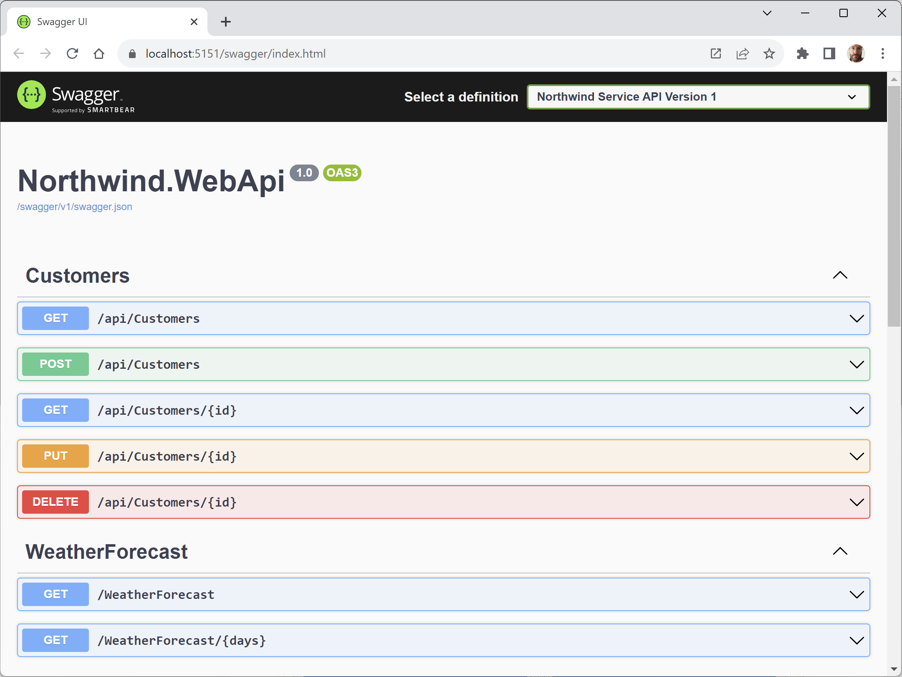
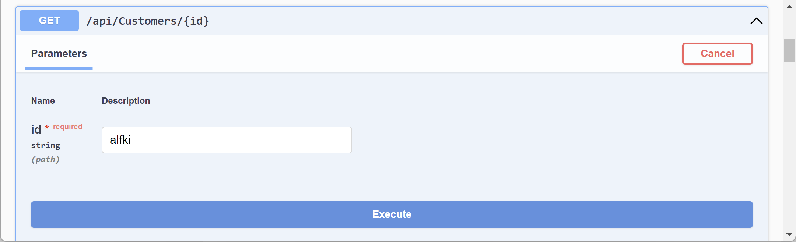
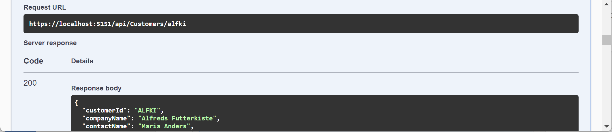
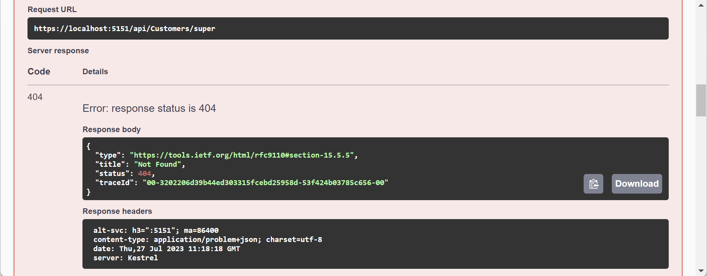
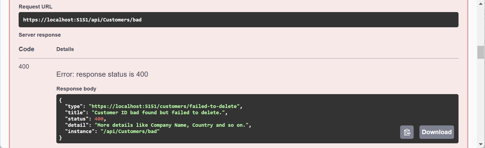

**Testing requests with Swagger UI**

You are now ready to test an HTTP request using Swagger UI:
1.	Start the `Northwind.WebApi` web service project using the `https` launch profile.
2.	In Chrome, navigate to https://localhost:5151/swagger and note that both the `Customers` and `WeatherForecast` web services have been discovered and documented, as shown in *Figure 15.6*:
 

*Figure 15.6: Swagger documentation for the Northwind web service endpoints*

3.	Click **GET /api/Customers/{id}** to expand that endpoint and note the required parameter for the `id` of a customer.
4.	Click **Try it out**, enter an **id** of `alfki`, and then click the wide blue **Execute** button, as shown in *Figure 15.7*:


*Figure 15.7: Inputting a customer ID before clicking the Execute button*

5.	Scroll down and note the **Request URL**, **Server response** with **Code**, and **Details**, including **Response body** and **Response headers**, as shown in *Figure 15.8*:


*Figure 15.8: Information on ALFKI in a successful Swagger request*

6.	Scroll back up to the top of the page, click **POST /api/Customers** to expand that section, and then click **Try it out**.
7.	Click inside the **Request body** box and modify the JSON to define a new customer, as shown in the following JSON:
```json
{
  "customerID": "SUPER",
  "companyName": "Super Company",
  "contactName": "Rasmus Ibensen",
  "contactTitle": "Sales Leader",
  "address": "Rotterslef 23",
  "city": "Billund",
  "region": null,
  "postalCode": "4371",
  "country": "Denmark",
  "phone": "31 21 43 21",
  "fax": "31 21 43 22"
}
```

8.	Click **Execute**, and note the **Request URL**, **Server response** with **Code**, and **Details**, including **Response body** and **Response headers**, noting that a response code of `201` means the customer was successfully created.
9.	Scroll back up to the top of the page, click **GET /api/Customers**, click **Try it out**, enter `Denmark` for the country parameter, and click **Execute** and then confirm that the new customer was added to the database.
10.	Click **DELETE /api/Customers/{id}**, click **Try it out**, enter `super` for the id, click **Execute**, and note that the **Server response Code** is `204`, indicating that it was successfully deleted.
11.	Click **Execute** again and note that the **Server response Code** is `404`, indicating that the customer does not exist anymore, and that the **Response body** contains a problem details JSON document, as shown in *Figure 15.9*:


*Figure 15.9: The deleted customer does not exist anymore*

12.	Enter `bad` for the **id**, click **Execute** again, and note that the **Server response** with **Code** is `400`, indicating that the customer did exist but failed to be deleted (in this case, because the web service is simulating this error) and the **Response body** contains a custom problem details JSON document, as shown in *Figure 15.10*:


*Figure 15.10: The customer did exist but failed to be deleted*

> You added the code to implement this in the section titled *Specifying problem details*, where you checked for an id of `bad` and then returned a bad request with problem details.

13.	Use the **GET** methods to confirm that the new customer has been deleted from the database (there were originally only two customers in Denmark).

I will leave testing updates to an existing customer by using `PUT` to the reader.

14.	Close Chrome and shut down the web server.
