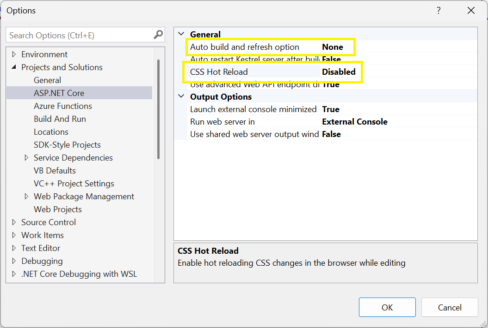
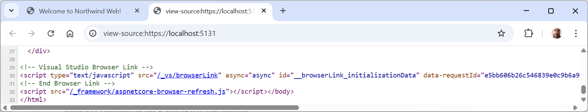
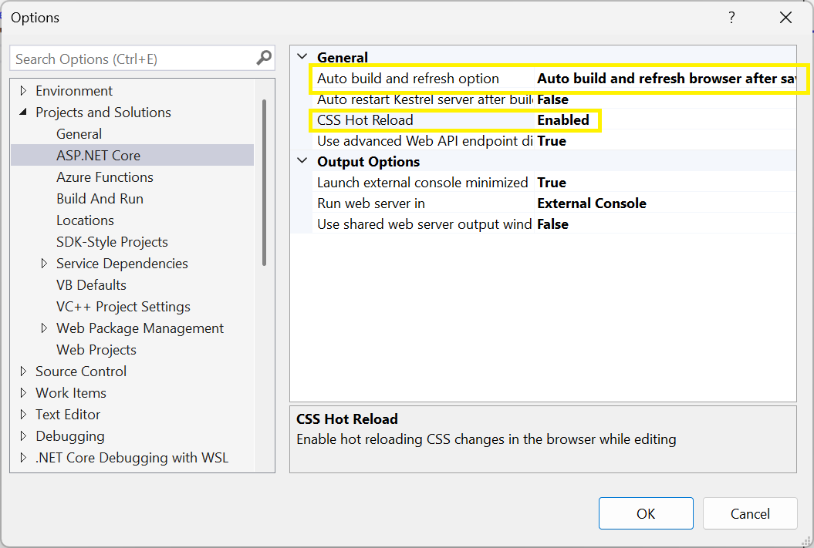

**Errata** (64 items)

If you find any mistakes, then please [raise an issue in this repository](https://github.com/markjprice/cs13net9/issues) or email me at markjprice (at) gmail.com.

> **Warning!** Avoid copying and pasting links that break over multiple lines and include hyphens or dashes because your PDF reader might remove a hyphen thinking that it being helpful but break the link! Just click on the links and they will work. Or carefully check that your PDF reader has not removed a hyphen after pasting into your web browser address bar. [See an example of this issue here](https://github.com/markjprice/cs13net9/issues/77).

- [Page 13 - Understanding .NET support](#page-13---understanding-net-support)
- [Page 24 - Revealing the namespace for the Program class](#page-24---revealing-the-namespace-for-the-program-class)
- [Page 29 - Writing code using VS Code](#page-29---writing-code-using-vs-code)
- [Page 42 - Configuring inline aka inlay hints](#page-42---configuring-inline-aka-inlay-hints)
- [Page 91 - Comparing double and decimal types](#page-91---comparing-double-and-decimal-types)
- [Page 97 - Storing dynamic types](#page-97---storing-dynamic-types)
- [Page 106 - Rider and its warnings about boxing](#page-106---rider-and-its-warnings-about-boxing)
- [Page 109 - Custom number formatting](#page-109---custom-number-formatting)
- [Page 111 - Custom number formatting](#page-111---custom-number-formatting)
- [Page 112 - Custom number formatting](#page-112---custom-number-formatting)
- [Page 147 - Understanding how foreach works internally](#page-147---understanding-how-foreach-works-internally)
- [Page 175 - Throwing overflow exceptions with the checked statement](#page-175---throwing-overflow-exceptions-with-the-checked-statement)
- [Page 179 - Test your knowledge of operators](#page-179---test-your-knowledge-of-operators)
- [Page 208 - Using the Visual Studio Code integrated terminal during debugging](#page-208---using-the-visual-studio-code-integrated-terminal-during-debugging)
- [Page 252 - Changing an enum base type for performance](#page-252---changing-an-enum-base-type-for-performance)
- [Page 267 - Controlling how parameters are passed](#page-267---controlling-how-parameters-are-passed)
- [Page 274 - Deconstructing other types using tuples](#page-274---deconstructing-other-types-using-tuples)
- [Page 298 - Defining a primary constructor for a class](#page-298---defining-a-primary-constructor-for-a-class)
- [Page 383 - Creating a .NET Standard class library](#page-383---creating-a-net-standard-class-library)
- [Page 392 - Publishing a self-contained app](#page-392---publishing-a-self-contained-app)
- [Page 392 - Publishing a self-contained app](#page-392---publishing-a-self-contained-app-1)
- [Page 393 - Publishing a single-file app](#page-393---publishing-a-single-file-app)
- [Page 400 - Publishing a native AOT project](#page-400---publishing-a-native-aot-project)
- [Page 430 - Comparing string values](#page-430---comparing-string-values)
- [Page 435 - Searching in strings](#page-435---searching-in-strings)
- [Page 437 - Understanding the syntax of a regular expression](#page-437---understanding-the-syntax-of-a-regular-expression)
- [Page 444 - Improving regular expression performance with source generators](#page-444---improving-regular-expression-performance-with-source-generators)
- [Page 446 - Storing multiple objects in collections](#page-446---storing-multiple-objects-in-collections)
- [Page 461 - Read-only, immutable, and frozen collections](#page-461---read-only-immutable-and-frozen-collections)
- [Page 469 - Returning collections from members](#page-469---returning-collections-from-members)
- [Page 483, 485 - Managing directories, Managing files](#page-483-485---managing-directories-managing-files)
- [Page 497 - Writing to XML streams](#page-497---writing-to-xml-streams)
- [Page 532 - Setting up SQLite CLI tools for Windows](#page-532---setting-up-sqlite-cli-tools-for-windows)
- [Page 538 - Defining the Northwind database context class](#page-538---defining-the-northwind-database-context-class)
- [Page 563 - Getting the generated SQL](#page-563---getting-the-generated-sql)
- [Page 570 - Getting a single entity](#page-570---getting-a-single-entity)
- [Page 572 - Generating a random number in queries](#page-572---generating-a-random-number-in-queries)
- [Page 640 - Customizing the model and defining an extension method](#page-640---customizing-the-model-and-defining-an-extension-method)
- [Page 644 - Improving the class-to-table mapping](#page-644---improving-the-class-to-table-mapping)
- [Page 646 - Improving the class-to-table mapping](#page-646---improving-the-class-to-table-mapping)
- [Page 650 - Testing the class libraries, Page 693 - Build a data-driven web page, Page 694 - Build web pages for functions](#page-650---testing-the-class-libraries-page-693---build-a-data-driven-web-page-page-694---build-web-pages-for-functions)
- [Page 660 - Creating an empty ASP.NET Core project, Page 701 - Creating an ASP.NET Core Web API project](#page-660---creating-an-empty-aspnet-core-project-page-701---creating-an-aspnet-core-web-api-project)
- [Page 673 - Enabling static and default files](#page-673---enabling-static-and-default-files)
  - [Issue 1: Browsers failing to decode compressed files due to corruption because other features modify the response stream](#issue-1-browsers-failing-to-decode-compressed-files-due-to-corruption-because-other-features-modify-the-response-stream)
  - [Issue 2: Simulating a "Production" environment cannot find the correct compressed files](#issue-2-simulating-a-production-environment-cannot-find-the-correct-compressed-files)
  - [Visual Studio features that dynamically inject into HTML files](#visual-studio-features-that-dynamically-inject-into-html-files)
- [Page 680 - Enabling Blazor static SSR](#page-680---enabling-blazor-static-ssr)
- [Page 683 - Adding code to a Blazor static SSR page](#page-683---adding-code-to-a-blazor-static-ssr-page)
- [Page 688 - Creating a suppliers page](#page-688---creating-a-suppliers-page)
- [Page 688 - Creating a suppliers page](#page-688---creating-a-suppliers-page-1)
- [Page 692 - Configuring Entity Framework Core as a service](#page-692---configuring-entity-framework-core-as-a-service)
- [Page 692 - Configuring Entity Framework Core as a service](#page-692---configuring-entity-framework-core-as-a-service-1)
- [Page 698 - Creating a Blazor Web App project](#page-698---creating-a-blazor-web-app-project)
- [Page 711 - Running the Blazor Web App project template](#page-711---running-the-blazor-web-app-project-template)
- [Page 717 - Getting entities into a Blazor component](#page-717---getting-entities-into-a-blazor-component)
- [Page 737 - ASP.NET Core Minimal APIs projects](#page-737---aspnet-core-minimal-apis-projects)
- [Page 748 - Distributed caching](#page-748---distributed-caching)
- [Page 750 - Creating data repositories with caching for entities](#page-750---creating-data-repositories-with-caching-for-entities)
- [Page 754 - Configuring the customer repository](#page-754---configuring-the-customer-repository)
- [Page 756 - Configuring the customer repository](#page-756---configuring-the-customer-repository)
- [Page 756 - Configuring the customer repository](#page-756---configuring-the-customer-repository-1)
- [Page 757 - Configuring the customer repository](#page-757---configuring-the-customer-repository)
- [Page 760 - Making GET requests using HTTP/REST tools](#page-760---making-get-requests-using-httprest-tools)
- [Page 763 - Understanding the OpenAPI Specification](#page-763---understanding-the-openapi-specification)
- [Page 769 - Configuring HTTP clients](#page-769---configuring-http-clients)
- [Page 780 - Companion books to continue your learning journey](#page-780---companion-books-to-continue-your-learning-journey)
- [Exercise 13.2 – practice exercises - Build web pages for functions](#exercise-132--practice-exercises---build-web-pages-for-functions)
- [Appendix - Page 3](#appendix---page-3)
- [Appendix - Page 5](#appendix---page-5)

# Page 13 - Understanding .NET support

> This "errata" is due to a change in Microsoft policy, announced on September 16, 2025. Microsoft has extended the support period for STS releases to 24 months, including for .NET 9, as you can read about in the following link: https://devblogs.microsoft.com/dotnet/dotnet-sts-releases-supported-for-24-months/

In the second bullet, I wrote, "STS releases are supported by Microsoft for 18 months after GA, or 6 months after the next STS or LTS release ships, whichever is longer." This should now say, "STS releases are supported by Microsoft for 24 months after GA, or 12 months after the next STS or LTS release ships, whichever is longer."

In *Figure 1.3*, the gray bars for STS releases should be six months longer, and the lead-in sentence should say, "2-year-long gray bars for STS releases".

I wrote, "This is because .NET 9 is an STS release, and therefore, it will lose support in May 2026, before .NET 8 does in November 2026." This should now be, "This is because .NET 9 is an STS release, and therefore, it will lose support on the same day that .NET 8 does in November 2026."

The first bullet says, ".NET 9 will reach EOL in May 2026." It should now say, ".NET 9 will reach EOL in November 2026."

In the section, *Understanding .NET support phases*, the last three bullets should now say:
- **Active**: .NET 9 will be in this support phase from November 2024 to May 2026.
- **Maintenance**: Supported only with security fixes for the last 6 months of its lifetime. .NET 9
will be in this support phase from May 2026 to November 2026.
- **EOL**: Not supported. .NET 9 will reach its EOL in November 2026.

# Page 24 - Revealing the namespace for the Program class

> Thanks to **John Tempest** in an email for raising this issue on December 21, 2024.

In the **Good Practice** box, I wrote, "Code editors have a feature named code snippets. These allow you to insert pieces of code that you commonly use, by typing a shortcut and pressing *Tab* twice." But you only need to press *Tab* once.

# Page 29 - Writing code using VS Code

> Thanks to **Andriko** in the book's Discord channel for asking a question about this issue.

I wrote, "In the preceding steps, I showed you how to use the dotnet CLI to create solutions and projects. Finally, with the August 2024 or later releases of the C# Dev Kit, VS Code has an improved project creation experience that provides you access to the same options you can use when creating a new project through the `dotnet` CLI. To enable this ability, you must change a setting, as shown in the following configuration:"
```
"csharp.experimental.dotnetNewIntegration": true
```

This feature is no longer in preview so you do not need to enable it. In the next edition, I will remove the sentence about enabling it and the setting.

# Page 42 - Configuring inline aka inlay hints

> Thanks to [Daniel Grounin](https://github.com/Daniel-Grounin) for raising [this issue on August 15, 2025](https://github.com/markjprice/cs13net9/issues/65).

In *Figure 1.13* and in the bullet steps to enable inlay hinys below, I wrote, "In VS Code, navigate to **File** | **Preferences** | **Settings**, search for `inlay`, select the **C#** filter, and then select the **Display inline parameter name hints** checkbox."

In the next edition, I will also say to enable the other **inlay** checkboxes: **Show hints for literals**, **Show hints for `new` expressions**, and **Show hints for everything else**, and I will include those in *Figure 1.13*.

# Page 91 - Comparing double and decimal types

> Thanks to [Anass Sabiri](https://github.com/lambdacore12) for raising [this issue on February 19, 2025](https://github.com/markjprice/cs13net9/issues/24).

In the **Good Practice** box, the first link has moved to https://www-users.cse.umn.edu/~arnold/disasters/patriot.html.

# Page 97 - Storing dynamic types

> Thanks to [iheartdotnet](https://github.com/iheartdotnet) for raising [this issue on August 2, 2025](https://github.com/markjprice/cs13net9/issues/61).

In the last paragraph of this section, I wrote, "Dynamic types are most useful when interoperating with non-.NET systems. For example, you might need to work with a class library written in F#, Python, or some JavaScript. You might also need to interop with technologies like the Component Object Model (COM), for example, when automating Excel or Word."

I included F# in the list of languages after giving the example of `dynamic` being useful when interoperating with non-.NET systems. This accidently implies that F# is not a .NET language when it is. In the next edition, I will change "non-.NET systems" to "other .NET languages and non-.NET systems". Or I might change the second sentence to, "For example, you might need to work with a library written in Python or some JavaScript (or even a .NET language like F#)."

# Page 106 - Rider and its warnings about boxing

> Thanks to [Anass Sabiri](https://github.com/lambdacore12) for raising [this issue on February 20, 2025](https://github.com/markjprice/cs13net9/issues/25).

The link for best practices has moved to this link: https://docs.unity3d.com/Manual/performance-reference-types.html, and you need to scroll down to one of the last sections, titled *Avoid converting value types to reference types*.

# Page 109 - Custom number formatting

> Thanks to [s3ba-b](https://github.com/s3ba-b) for raising [this issue on October 9, 2025](https://github.com/markjprice/cs12dotnet8/issues/105).

I wrote, "You can apply standard number formatting using simpler format codes, like `C` and `N`. They support a precision number to indicate how many digits of precision you want. The default is two."

Although the default precision for the `C` and `N` format codes is two decimal places, other codes are different. In the 10th edition, I will write, "You can apply standard number formatting using simpler format codes, like `C` and `N`. They support a precision number to indicate how many digits of precision you want, for example, `C0` and `N4`. The default is 2 for `C` and `N` but are different for other format codes. For example, `D`, the default precision is the minimum number of digits required, and for `E` the default precision is 6."

# Page 111 - Custom number formatting

> Thanks to [Sacriflces](https://github.com/Sacriflces) for raising [this issue on April 28, 2025](https://github.com/markjprice/cs13net9/issues/50).

In *Table 2.10*, in the second row, the `D` entry says, "Long date pattern. Varies by culture; for example, `en-US` uses `mmmm, MMMM d, yyyy` and `fr-FR` uses `mmmm, dd MMMM yyyy`." The `mmmm`s should be `dddd`s because they represent the full name of the day of the week, not the month name. So it should say, "Long date pattern. Varies by culture; for example, `en-US` uses `dddd, MMMM d, yyyy` and `fr-FR` uses `dddd, dd MMMM yyyy`."

# Page 112 - Custom number formatting

> Thanks to [Donald Maisey](https://github.com/donaldmaisey) for raising [this issue on February 5, 2025](https://github.com/markjprice/cs13net9/issues/13).

In Step 1, I tell the reader to enter some code that calls the `WriteLine` method without the `Console.` prefix. I do not introduce simplifying the statement like that for another two pages. In the next edition, I will add the prefix, as shown in the following code:
```cs
decimal value = 0.325M;
Console.WriteLine("Currency: {0:C}, Percentage: {0:0.0%}", value);
```

# Page 147 - Understanding how foreach works internally

> Thanks to [Justin Treher](https://github.com/jtreher) for raising [this issue on January 3, 2025](https://github.com/markjprice/cs13net9/issues/6).

In Step 1, I wrote, "Type statements to create an array of string variables and then output the length of each one, as shown in the following code:"
```cs
string[] names = { "Adam", "Barry", "Charlie" };

foreach (string name in names)
{
  WriteLine($"{name} has {name.Length} characters.");
}
```

I then wrote, "The compiler turns the `foreach` statement in the preceding example into something like the following pseudocode:"
```cs
IEnumerator e = names.GetEnumerator();

while (e.MoveNext())
{
  string name = (string)e.Current; // Current is read-only!
  WriteLine($"{name} has {name.Length} characters.");
}
```

But the `names` variable is an array, and although arrays implement the `IEnumerable<T>` interface as described in this section, the compiler is smart enough to ignore that and instead write a `for` loop that uses the `Length` property of the array since that is more efficient than using the `IEnumerable` interface. 

In the next edition, I will use a `List<string>` instead of an array for the `names` variable, and add a note that arrays are treated as a special case by the compiler. 

# Page 175 - Throwing overflow exceptions with the checked statement

> Thanks to [Justin Treher](https://github.com/jtreher) for raising [this issue on January 3, 2025](https://github.com/markjprice/cs13net9/issues/7).

In Step 3, I wrote, "let’s get the compiler to warn us about the overflow by wrapping the statements using a `checked` statement block", but it is not the compiler that warns us, it is the runtime that detects the overflow and throws the exception. In the next edition I will replace "compiler" with "runtime".

# Page 179 - Test your knowledge of operators

> Thanks to [Donald Maisey](https://github.com/donaldmaisey) for raising [this issue on February 15, 2025](https://github.com/markjprice/cs13net9/issues/17).

For the name of the exercise project I wrote `Ch03Ex03Operators` when I should have written `Exercise_Operators`.

# Page 208 - Using the Visual Studio Code integrated terminal during debugging

> Thanks to **kingace9371** for asking a question about this, and to **rene** for providing the answer in the book's Discord channel.

In Step 7, I wrote, "In the `launch.json` file editor, click the **Add Configuration...** button, and then select **.NET: Launch .NET Core Console App**"

The name of this option is now called **.NET: Launch Executable file (Console)**, as shown in the following figure:


# Page 252 - Changing an enum base type for performance

> Thanks to [Donald Maisey](https://github.com/donaldmaisey) for raising [this issue on February 22, 2025](https://github.com/markjprice/cs13net9/issues/29) and [Bart Hofland](https://github.com/Bart76) for encouraging me to look again at [this issue on April 21, 2025](https://github.com/markjprice/cs13net9/issues/29#issuecomment-2818016903).

At the end of this section, I wrote, "Let’s see some real-life examples of when you would need to change an `enum` from deriving from `int` to deriving from another integer type:
- You want to increase the size of the integer to store more than 16 options in a flag `enum`. The default `int` only allows 16 options: 0, 1, 2, 4, 8, 16, 32, 64, 128, 256, 512, 1024, 2048, 4096, 8192, and 16384. Changing to `uint` would double the number of choices to 32 without using any more space in memory. Changing to `ulong` would give 64 options. Changing to `ushort` would allow the same 16 options in half the bytes."

But as Donald and Bart point out, only the first bit sets the number negative. The other 31 bits can be used for `enum` values. I should have written:
- You want to increase the size of the integer to store more than 31 options in a flag `enum`. The default `int` only allows 31 options because one bit is needed to indicate a negative number. Changing to `uint` would an extra 32nd value without using any more space in memory. The following table summarizes the number of options available for each integer type when used as the base type for a `enum`:

Base Type|Maximum Values
---|---
`sbyte`|7
`byte`|8
`short`|15
`ushort`|16
`int`|31
`uint`|32
`long`|63
`ulong`|64

So if a `uint` would give one extra option, why does C# default to using an `int` as the base type for enums?

C# enums default to `int` as their underlying type primarily because it's the most common and efficient integer type in .NET, not because it's the optimal choice in terms of bit range. It's a trade-off based on performance, interoperability, and historical convention rather than capacity.

`uint` gives one more positive value but signed `int` is the default integer type in C# and .NET. It’s used in for-loops, array indexing, and almost every system API. That means an `enum` based on `int` is easier to work with by default, avoiding implicit cast warnings or needing explicit conversions.

`int` is also CLS-compliant, `uint` is not. The **Common Language Specification (CLS)** defines a set of rules for .NET language interoperability and it doesn’t include `uint`. So if you define an `enum` with `uint`, it can’t be used as-is from some .NET languages like Visual Basic .NET. `int` enums are just safer across the .NET ecosystem.

# Page 267 - Controlling how parameters are passed

> Thanks to [Donald Maisey](https://github.com/donaldmaisey) for raising [this issue on February 26, 2025](https://github.com/markjprice/cs13net9/issues/35).

In Step 1, I wrote, "In `Person.cs`, add statements to define a method with three parameters, one `in` parameter,
one `ref` parameter, and one `out` parameter, as shown in the following method:"
```cs
public void PassingParameters(int w, in int x, ref int y, out int z)
{
```

I should have written, "In `Person.cs`, add statements to define a method with four `int` parameters: one parameter without any modifier, and three parameters decorated with the modifiers `in`, `ref`, and `out`, as shown in the following method:"

I will also change the order of the bullet descriptions to match the order of the parameters in the method.

# Page 274 - Deconstructing other types using tuples

> Thanks to [calupca](https://github.com/calupca) for raising [this issue on May 6, 2025](https://github.com/markjprice/cs13net9/issues/53).

In the first paragraph, I wrote, "You can have as many `Deconstruct` methods as you like as long as they have different signatures."

I should have written, "You can have as many `Deconstruct` methods as you like as long as they have different numbers of parameters. It is not enough to have different types with the same number of parameters as you can do with method overloading because `Deconstruct` methods with the same number of parameters can't be distinguished during deconstruction overload resolution."

# Page 298 - Defining a primary constructor for a class

> Thanks to [P9avel](https://github.com/P9avel) for raising [this issue on February 16, 2025](https://github.com/markjprice/cs13net9/issues/19).

In Step 6, I wrote, "In `Headset.cs`, add a default parameterless constructor, as highlighted in the following code:"
```cs
namespace Packt.Shared;

public class Headset(string manufacturer, string productName)
{
  public string Manufacturer { get; set; } = manufacturer;
  public string ProductName { get; set; } = productName;
  
  // Default parameterless constructor calls the primary constructor.
  public Headset() : this("Microsoft", "HoloLens") { }
}
```

But the note box underneath the code says, "Note the use of `this()` to call the constructor of the base class and pass two parameters to it when the default constructor of `Headset` is called." The note box should say, "Note the use of `this()` to call the primary constructor and pass two parameters to it when the default constructor of `Headset` is called."

# Page 383 - Creating a .NET Standard class library

> Thanks to [P9avel](https://github.com/P9avel) for raising [this issue on February 18, 2025](https://github.com/markjprice/cs13net9/issues/21).

In the **Good Practice** box, the final version number was written as `0`. It should be `9.0`.

# Page 392 - Publishing a self-contained app

> Thanks to [P9avel](https://github.com/P9avel) for raising [this issue on February 18, 2025](https://github.com/markjprice/cs13net9/issues/22).

In Step 5, I wrote, "note the output folders for the five OSes." There were five folders in earlier editions but in the 9th edition I reduced this. In the next edition, I will remove the word "five".

# Page 392 - Publishing a self-contained app

> Thanks to [P9avel](https://github.com/P9avel) for raising [this issue on February 18, 2025](https://github.com/markjprice/cs13net9/issues/23).

In Step 7, *Figure 7.3*, the screenshot shows `net8.0` in the address bar. It should be `net9.0`.

# Page 393 - Publishing a single-file app

> Thanks to [Vlad Alexandru Meici](https://github.com/vladmeici) for raising [this issue on December 8, 2024](https://github.com/markjprice/cs12dotnet8/issues/77).

In the two command lines, I used `/p` to set a project property when I should have used `-p`. The complete command is:
```
dotnet publish -r win10-x64 -c Release --no-self-contained -p:PublishSingleFile=true
```

# Page 400 - Publishing a native AOT project

> Thanks to [Nathan Wolfe](https://github.com/scotswolfie) for raising [this issue on January 14, 2025](https://github.com/markjprice/cs12dotnet8/issues/83).

I wrote, "A console app that functions correctly during development when the code is untrimmed and JIT-compiled could still fail once you publish it using native AOT because then the code is trimmed and JIT-compiled and, therefore, it is a different code with different behavior."

But I mistakenly repeated "JIT-compiled" when I meant "AOT-compiled". 

I should have written, "A console app that functions correctly during development when the code is untrimmed and JIT-compiled could still fail once you publish it using native AOT because then the code is trimmed and AOT-compiled and, therefore, it is a different code with different behavior."

# Page 430 - Comparing string values

> Thanks to `Quest o()xx[{:::::::::::::::>` for raising this issue in the Discord channel for this book.

In Step 2, before comparing string values, we control the current culture by explicitly setting `CultureInfo.CurrentCulture`. First we set it to `en-US` (US English), then to `de-DE` (German). But at the end of the code, the current culture is left as German. This will affect all code examples after this point in `Program.cs`. It would be better to set the current culture to US English. In the next edition, I will add an extra statement at the end of the code block in Step 2 to reset the current culture:
```cs
CultureInfo.CurrentCulture = CultureInfo.GetCultureInfo("en-US");
```

# Page 435 - Searching in strings

> Thanks to [Donald Maisey](https://github.com/donaldmaisey) for raising [this issue on March 21, 2025](https://github.com/markjprice/cs13net9/issues/43).

In the second code block, in the last statement, I used a variable named `vowelsSearchValues`, as shown in the following code:
```cs
WriteLine($"sentence.IndexOfAny(vowelsSearchValues): {
  sentence.IndexOfAny(namesSearchValues)}");
```

I should have used `namesSearchValues`, as shown in the following code:
```cs
WriteLine($"sentence.IndexOfAny(namesSearchValues): {
  sentence.IndexOfAny(namesSearchValues)}");
```

# Page 437 - Understanding the syntax of a regular expression

> Thanks to **rene** in the book's Discord channel for raising this issue.

In *Table 8.7*, the entry for `{,3}` is wrong. That is not a valid range and so it actually matches the exact string `{,3}`! To match "Up to three", you should use `{0,3}` or `{1,3}` depending on whether you want to accept zero or one as the lowest value. I will fix this in the 10th edition.

# Page 444 - Improving regular expression performance with source generators

> Thanks to [P9avel](https://github.com/P9avel) for raising [this issue on February 21, 2025](https://github.com/markjprice/cs13net9/issues/27).

In Steps 2, 3, and 4, I wrote "`partial` method", when I should have written "`partial` property".

# Page 446 - Storing multiple objects in collections

> Thanks to [P9avel](https://github.com/P9avel) for raising [this issue on February 21, 2025](https://github.com/markjprice/cs13net9/issues/28).

In *Table 8.9*, I wrote `Dictionary<T>`. This should be `Dictionary<TKey, TValue>`. I will also change the order to put it last in the list of collection examples for that row, and add a sentence to the description to explain, "Dictionaries need two types to be specified: one for the key and one for the value."

# Page 461 - Read-only, immutable, and frozen collections

> Thanks to [P9avel](https://github.com/P9avel) for raising [this issue on February 22, 2025](https://github.com/markjprice/cs13net9/issues/30).

I wrote, "Although the `ReadOnlyCollection<T>` has to have an `Add` and a `Remove` method because it implements `ICollection<T>`, it throws a `NotImplementedException` to prevent changes." But it actually throws a `NotSupportedException`.

# Page 469 - Returning collections from members

> Thanks to [P9avel](https://github.com/P9avel) for raising [this issue on February 22, 2025](https://github.com/markjprice/cs13net9/issues/31).

In the last code block in this section, I wrote a statement of code that used a `,` instead of a `.`:
```cs
return Array,Empty<Person>();
```
It should be:
```cs
return Array.Empty<Person>();
```

# Page 483, 485 - Managing directories, Managing files

> Thanks to [Vlad Alexandru Meici](https://github.com/vladmeici) for raising [this issue on December 31, 2024](https://github.com/markjprice/cs12dotnet8/issues/80).

After prompting the user to press any key to delete the directory or file, the code should have an extra statement to output a new line otherwise the next text written to the console will appear immediately at the end of the "Press any key..." text.

This has been fixed in the code solutions here:
https://github.com/markjprice/cs13net9/commit/d75644ad74bf3ffbd9ff202e0bf6f2ad665ca5ea

# Page 497 - Writing to XML streams

> Thanks to `Quest o()xx[{:::::::::::::::>` for raising this issue in the Discord channel for this book on August 14, 2025.

In Step 4, I show the output:
```
**** File Info ****
The XML writer's unmanaged resources have been disposed.
The file stream's unmanaged resources have been disposed.
File: streams.xml
Path: C:\cs13net9\Chapter09\WorkingWithStreams\bin\Debug\net9.0
Size: 320 bytes.
/------------------
<?xml version="1.0" encoding="utf-8"?>
```

But the comments should be slightly different in the output:
```
*** Writing to XML streams ***
The XML writer's unmanaged resources have been disposed.
The file stream's unmanaged resources have been disposed.
**** File Info ****
File: streams.xml
Path: C:\cs13net9\Chapter09\WorkingWithStreams\bin\Debug\net9.0
Size: 320 bytes.
/------------------
<?xml version="1.0" encoding="utf-8"?>
```

# Page 532 - Setting up SQLite CLI tools for Windows

> Thanks to [P9avel](https://github.com/P9avel) for raising [this issue on February 28, 2025](https://github.com/markjprice/cs13net9/issues/36).

In Step 3, I wrote `sqlite-tools-win32-x86-3460100.zip` when I should have written `sqlite-tools-win-x64-3460100.zip`.

# Page 538 - Defining the Northwind database context class

> Thanks to [P9avel](https://github.com/P9avel) for raising [this issue on February 28, 2025](https://github.com/markjprice/cs13net9/issues/37).

In the first sentence of this section, I wrote "A class named `Northwind`" when I should have written "A class named `NorthwindDb`".

# Page 563 - Getting the generated SQL

> Thanks to **Mike_H**/`mike_h_16837` in the Discord channel for this book for raising this issue on March 16, 2025.

In Step 1, I wrote, "In the `QueryingProducts` method, before using the `foreach` statement to enumerate the query,
add a statement to output the generated SQL, as shown in the following code:"
```cs
// Calling ToQueryString does not execute against the database.
// LINQ to Entities just converts the LINQ query to an SQL statement.
Info($"ToQueryString: {products.ToQueryString()}");
```

In Step 2, I wrote, "Run the code, enter a minimum value for units in stock, like `95`, and view the result, as shown
in the following partial output:"
```
Enter a minimum for units in stock: 95
Connection: Data Source=C:\cs13net9\Chapter10\WorkingWithEFCore\bin\
Debug\net9.0\Northwind.db
Info > ToQueryString: .param set @__stock_0 95
SELECT "c"."CategoryId", "c"."CategoryName", "c"."Description",
"t"."ProductId", "t"."CategoryId", "t"."UnitPrice", "t"."Discontinued",
"t"."ProductName", "t"."UnitsInStock"
FROM "Categories" AS "c"
LEFT JOIN (
SELECT "p"."ProductId", "p"."CategoryId", "p"."UnitPrice",
"p"."Discontinued", "p"."ProductName", "p"."UnitsInStock"
FROM "Products" AS "p"
WHERE "p"."UnitsInStock" >= @__stock_0
) AS "t" ON "c"."CategoryId" = "t"."CategoryId"
ORDER BY "c"."CategoryId"
Beverages has 2 products with a minimum of 95 units in stock.
Sasquatch Ale has 111 units in stock.
Rhönbräu Klosterbier has 125 units in stock.
...
```

But I mixed up two methods. The output is from adding a statement to call the `ToQueryString` method in the `FilteredIncludes` method. The code solution adds the call to two methods:
- `FilteredIncludes`: https://github.com/markjprice/cs13net9/blob/main/code/Chapter10/WorkingWithEFCore/Program.Queries.cs#L90
- `QueryingProducts`: https://github.com/markjprice/cs13net9/blob/main/code/Chapter10/WorkingWithEFCore/Program.Queries.cs#L129

In the next edition, I will tell the reader to add the call the `ToQueryString` method in both the `FilteredIncludes` method and the `QueryingProducts` method, and show the results of running both.

# Page 570 - Getting a single entity

> Thanks to [es-moises](https://github.com/es-moises) for raising [this issue on January 22, 2025](https://github.com/markjprice/cs12dotnet8/issues/84).

In Step 3, the output in two places shows part of the `WHERE` clause as `"p"."ProductId" > @__id_0` but in both places it should be `"p"."ProductId" = @__id_0`.

# Page 572 - Generating a random number in queries

> Thanks to `Quest o()xx[{:::::::::::::::>` for raising this issue on August 24, 2025 in the Discord channel for this book.

In the two code examples, I used the `await` keyword without needing to. The correct statements are shown in the following code:
```cs
var randomQuestions = db.Questions
  .OrderBy(q => EF.Functions.Random())
  .Take(10); // Select 10 random questions.
```
And:
```cs
var randomDataSample = db.Products
  .Where(d => EF.Functions.Random() > 0.5);
```

# Page 640 - Customizing the model and defining an extension method

> Thanks to **Mike_H**/`mike_h_16837` for raising this issue on March 22, 2025 in the Discord channel for this book.

In Step 5, the following statement should not be there because the `dotnet-ef` reverse-engineering does not add it:
```cs
entity.Property(e => e.Discontinued)
  .HasDefaultValue((short)0);
```

# Page 644 - Improving the class-to-table mapping

> Thanks to **Mike_H**/`mike_h_16837` for raising this issue on March 22, 2025 in the Discord channel for this book.

In Step 4, I wrote, "Set Find and Replace to search files in the Current project." But the last project you were actively working on is the `Northwind.DataContext.Sqlite` project, not the `Northwind.EntityModels.Sqlite` project. 

In the next edition, I will add a preceding step to tell the reader to make the `Northwind.EntityModels.Sqlite` project the current project.

# Page 646 - Improving the class-to-table mapping

In Step 9, we can improve the text, as shown in [this errata from *Tools and Skills for .NET 8*](https://github.com/markjprice/tools-skills-net8/blob/main/docs/errata/improvements.md#page-29---creating-a-class-library-for-entity-models-using-sql-server).

# Page 650 - Testing the class libraries, Page 693 - Build a data-driven web page, Page 694 - Build web pages for functions

I end the **Testing the class libraries** section by writing, "Finally, in this chapter, let’s review some key concepts about web development, enabling us to be better prepared to dive into ASP.NET Core Razor Pages in the next chapter."

In the **Build a data-driven web page** exercise, I wrote, "Add a Razor Page to the `Northwind.Web` website..."

In the **Build web pages for functions** exercise, I wrote, "Reimplement some of the console apps from earlier chapters as Razor Pages;"

In these instances, "Razor Pages" or "Razor Page" should be "Blazor" or "Blazor page component".

# Page 660 - Creating an empty ASP.NET Core project, Page 701 - Creating an ASP.NET Core Web API project

> Thanks to **rene** in the Discord channel for this book for raising this issue on February 6, 2025.

In Step 1, I describe the options when creating a new ASP.NET Core project. The option that used to be labelled **Enable Docker** is now labelled **Enable container support**. And the new option labelled **Enlist in .NET Aspire orchestration** should be cleared.

# Page 673 - Enabling static and default files

> Thanks to [Donald Maisey](https://github.com/donaldmaisey) for raising [this issue on April 18, 2025](https://github.com/markjprice/cs13net9/issues/47).

In Step 1, I wrote, "add statements after enabling HTTPS redirection to enable static files and default files" with the following code:
```cs
app.UseDefaultFiles(); // index.html, default.html, and so on.
app.MapStaticAssets(); // .NET 9 or later.
// app.UseStaticFiles(); // .NET 8 or earlier.

app.MapGet("/env", () =>
  $"Environment is {app.Environment.EnvironmentName}");
```

Preceding this, the reader is asked to create the `wwwroot` folder and create four static files within it:
1. `index.html`: This will be the default page for the website.
2. `site.css`: A simple stylesheet that sets `H1` elements to a dark blue color.
3. `categories.jpeg`: An image of different categories of products.
4. `about.html`: This webpage references the stylesheet and image.

## Issue 1: Browsers failing to decode compressed files due to corruption because other features modify the response stream

When running the website, the `index.html` file never downloads so a blank page is shown in Chrome. Developer Tools console shows `Failed to load resource: net::ERR_CONTENT_DECODING_FAILED`.

If you manually request any of the `MapGet` endpoints, they work, e.g. `/env` or `/data`. If you manually request the stylesheet or image, they display correctly.

But `MapStaticAssets` has an issue with working with HTML files. Some have [speculated in a GitHub issue](https://github.com/dotnet/aspnetcore/issues/58940) that this could be caused by:
1. Hot Reload. 
2. Visual Studio Browser Link.
3. `<body>` tag. (Possibly because Browser Link looks for the end of the `</body>` to determine where to inject its script!)

`MapStaticAssets` compresses files during the build process. This is why you must rebuild your project if you add, modify, or remove files from `wwwroot`. If you do not rebuild, the compression process does not happen, and there will be a mismatch between the files in `wwwroot` and what is expected by the previously built project. In the output window, ASP.NET Core will write warnings about which files are mismatched but it will allow your project to run and you will experience unexpected behavior.

My best guess is that any system attempting to dynamically inject some script or other elements into the compressed file at runtime will cause problems during decompression because it has literally "corrupted" the response stream! To fix the issue, you would need to do one of the following (each has pros and cons so there is no good fix--just choices with trade-offs):
1. Disable the Visual Studio browser refresh and Hot Reload/Browser Link features (and anything else that dynamically modifies the response stream). I show how to do this in the *Visual Studio features that dynamically inject into HTML files* section below.
2. Not use static HTML files. You can map an endpoint and return raw HTML instead, as I show in the book and below. But this means your HTML files are not compressed.
3. Switch back to the non-compressed static file process by replacing `MapStaticAssets` with `UseStaticFiles`. But this means all your static files are not compressed.

> **Note**: Since the most common issue is caused by Visual Studio features, if you do not use Visual Studio then you can use `MapStaticAssets` without worrying. And Visual Studio only injects its scripts during development, NOT production. So in production you can use `MapStaticAssets` without worrying at all. But you may have a scenario where some other system dynamically injects into HTML pages in production, and in those scenarios, you will need to consider disabling `MapStaticAssets` for HTML files.

## Issue 2: Simulating a "Production" environment cannot find the correct compressed files

A second issue is related to setting the environment to `Production` instead of `Development`. If the reader leaves the environment set to `Production`, then requests for the stylesheet will fail because the reader is still running the "development" project. To make sure the paths are matched properly, we need to manually tell the static asset system to use the current environment to find the correct files.

I am currently working on the .NET 10 edition of this book, and .NET 10 Preview 4 still has this issue with `.html` files because its not really a "bug" with `MapStaticAssets` itself. Based on the issue (other systems modifying the compressed files), I don't think the issue can be easily fixed. I'm guessing that the team is trying to find a way to allow both compression of HTML files and dynamic injection into them, but it's a tricky problem to fix reliably. I suspect that for .NET 10 all they can do is document the issue and leave it to developers to decide which trade-off to make. So I will do the same in the .NET 10 editions of my books.

I therefore plan the following changes in my book instructions:

1. Create the `about.html`, `site.css`, and `categories.jpeg` files (but not `index.html` since it would immediately fail and confuse the reader).
2. Show how `UseStaticFiles` works with all those static file types (but highlight that they are not compressed).
3. Switch to `MapStaticAssets` and show in **Developer Tools** | **Network** tab how stylesheets and images continue to work and now use GZ compression.
4. Show how HTML files like `about.html` fail with the decoding error so readers will understand what to look for in their own projects to detect this issue.
5. Add some statements to the `MapGet` for `/welcome`, and move it to a separate file as an extension method, as shown in the following code:
```cs
app.MapGet("/", () => Results.Content(
  content: $"""
<!doctype html>
<html lang="en">
<head>
  <!-- Required meta tags -->
  <meta charset="utf-8" />
  <meta name="viewport" content="width=device-width, initial-scale=1, shrink-to-fit=no" />
  <!-- Bootstrap CSS -->
  <link href="https://cdn.jsdelivr.net/npm/bootstrap@5.3.3/dist/css/bootstrap.min.css" rel="stylesheet" integrity="sha384-QWTKZyjpPEjISv5WaRU9OFeRpok6YctnYmDr5pNlyT2bRjXh0JMhjY6hW+ALEwIH" crossorigin="anonymous">
  <link href="site.css" rel="stylesheet" />
  <title>Welcome to Northwind Web!</title>
</head>
<body>
  <div class="container">
    <div class="jumbotron">
      <h1 class="display-3">Welcome to Northwind B2B</h1>
      <p class="lead">We supply products to our customers.</p>
      <hr />
      <h2>This is a static HTML page.</h2>
      <p>Our customers include restaurants, hotels, and cruise lines.</p>
      
      <p>
        <a class="btn btn-primary" href="https://www.asp.net/">
          Learn more
        </a>
      </p>
    </div>
  </div>
</body>
</html>
""",
  contentType: "text/html"));
```
6. Show that the endpoint for the root `/` that returns a web page using code instead of a static file works because the static asset system doesn't know to compress it, and note the dynamically injected `<script>` blocks.
7. Disable Browser Link and browser refresh and show that the `about.html` now works. (But warn that other systems that dynamically inject would need to be disabled too.)
    - Navigate to **Tools** | **Options**.
    - In the **Options** dialog box, navigate to **Projects and Solutions** | **ASP.NET Core**.
    - Set the **Auto build and refresh option** dropdown listbox to **None** and the **CSS Hot Reload** dropdown listbox to **Disabled**, as shown in the following figure:

8. Import the `Microsoft.AspNetCore.Hosting.StaticWebAssets` namespace and then add a statement to manually switch static assets system to the appropriate environment, as shown in the following code:
```cs
// To use StaticWebAssetsLoader.
using Microsoft.AspNetCore.Hosting.StaticWebAssets;

var builder = WebApplication.CreateBuilder(args);

// Enable switching environments (Development, Production) during development.
StaticWebAssetsLoader.UseStaticWebAssets(
  builder.Environment, builder.Configuration);

var app = builder.Build();
```

## Visual Studio features that dynamically inject into HTML files

When **Auto build and refresh option** is set to **Auto build and refresh browser after saving changes**, a `<script>` element for `aspnetcore-browser-refresh.js` is dynamically added to every HTML page. When **CSS Hot Reload** is set to **Enabled**, a `<script>` element for `/_vs/browserLink.js` is dynamically added to every HTML page.




# Page 680 - Enabling Blazor static SSR

> Thanks to [Donald Maisey](https://github.com/donaldmaisey) for raising [this issue on April 24, 2025](https://github.com/markjprice/cs13net9/issues/49).

In Step 9, I wrote, "In `_Imports.razor`, add statements to import the namespaces for Blazor components routing,
and for your `Northwind.Web` project and its components, as shown in the following markup:"
```cs
@using Microsoft.AspNetCore.Components.Routing
@using Northwind.Web
@using Northwind.Web.Components
```

I missed out a fourth import (needed to use components like `<HeadOutlet />`), as shown in the following markup:
```cs
@using Microsoft.AspNetCore.Components.Web
```

# Page 683 - Adding code to a Blazor static SSR page

> Thanks to [Taylor Fore](https://github.com/trfore) for raising [this issue on January 8, 2025](https://github.com/markjprice/cs13net9/issues/8).

In Step 1, I wrote, `Index.cshtml` when I should have written `Index.razor`.

# Page 688 - Creating a suppliers page

> Thanks to `Quest o()xx[{:::::::::::::::>` for raising this issue on September 13, 2025 in the Discord channel for this book.

In the note bullets after Step 3, I wrote, "The page uses Razor syntax `@if` and `@for` statements to embed C# code in HTML." I should have written `@foreach` instead of `@for`.

# Page 688 - Creating a suppliers page

> Thanks to `Quest o()xx[{:::::::::::::::>` for raising this issue on September 13, 2025 in the Discord channel for this book.

In Step 4, I wrote, "Click on the button to learn more about suppliers", when I should have written, "In the top navigation bar, click **Suppliers**".

# Page 692 - Configuring Entity Framework Core as a service

> Thanks to `Quest o()xx[{:::::::::::::::>` for raising this issue on September 13, 2025 in the Discord channel for this book.

In Step 11, I wrote, "Click **Learn more about our suppliers**", when I should have written, "In the top navigation bar, click **Suppliers**".

# Page 692 - Configuring Entity Framework Core as a service

> Thanks to **Mike_H**/`mike_h_16837` for raising this issue on March 25, 2025 in the Discord channel for this book.

In Step 9, the `if` statement, as shown in the following code:
```cs
@if (Model.Suppliers is not null)
```

Should be:
```cs
@if (Companies is not null)
```

# Page 698 - Creating a Blazor Web App project

> Thanks to `Quest o()xx[{:::::::::::::::>` for raising this issue on September 18, 2025 in the Discord channel for this book.

In Step 3, I wrote, "in `Directory.Packages.props`, add an `<ItemGroup>` to set version numbers for server-side hosting and defining Blazor WebAssembly packages". But this was already done earlier, so in the next edition I will delete this step.

# Page 711 - Running the Blazor Web App project template

> Thanks to **Mike_H**/`mike_h_16837` for raising this issue on March 26, 2025 in the Discord channel for this book.

In Step 4, "click **Weather**" should be "click **Counter**".

# Page 717 - Getting entities into a Blazor component

> Thanks to [Donald Maisey](https://github.com/donaldmaisey) for raising [this issue on May 6, 2025](https://github.com/markjprice/cs13net9/issues/54).

In Step 3, the code shown is only for SQLite. It is different for SQL Server. The code should be as follows:
```cs
// If you are using SQLite that uses a database file.
builder.Services.AddNorthwindContext(
  relativePath: @"..\..");

// If you are using SQL Server.
// builder.Services.AddNorthwindContext();
```

And the note is only for SQLite:

> If you are using SQLite then we need to explicitly set the `relativePath` because the `Northwind.db` file is in the `ModernWeb` folder and the project runs in the `ModernWeb\Northwind.Blazor\Northwind.Blazor` folder that is two levels deeper.

# Page 737 - ASP.NET Core Minimal APIs projects

> Thanks to [P9avel](https://github.com/P9avel) for raising [this issue on March 10, 2025](https://github.com/markjprice/cs13net9/issues/39).

In the **Good Practice** box, I wrote, "A major benefit of Minimal APIs over a controller-based Web API is that each Minimal API endpoint only needs to instantiate the dependency injection (DI) services that it needs. With controllers, to execute any action method within that controller, all DI services used in any of the action methods must be instantiated for every call. This is a waste of time and resources!"

This is only true if the controller follows the common pattern of getting dependency services in the constructor of the class and storing them in private fields, as shown in the following code:
```cs
// Base address: api/customers
[Route("api/[controller]")]
[ApiController]
public class CustomersController : ControllerBase
{
  private readonly ICustomerRepository _repo;
  private readonly ILogger<CustomersController> _logger;

  // Constructor injects repository registered in Program.cs.
  public CustomersController(ICustomerRepository repo,
    ILogger<CustomersController> logger)
  {
    _repo = repo;
    _logger = logger;
  }

  // GET: api/customers
  // GET: api/customers/?country=[country]
  // this will always return a list of customers (but it might be empty)
  [HttpGet]
  [ProducesResponseType(200, Type = typeof(IEnumerable<Customer>))]
  public async Task<IEnumerable<Customer>> GetCustomers(string? country)
  {
    if (string.IsNullOrWhiteSpace(country))
    {
      _logger.LogInformation("GetCustomers called for all countries.");
      return await _repo.RetrieveAllAsync();
    }
    else
    {
      _logger.LogInformation("GetCustomers called with country={country}", country);
      return (await _repo.RetrieveAllAsync())
        .Where(customer => customer.Country == country);
    }
  }
  ...
}
```

A better practice is to use method injection, as shown in the following code:
```cs
// Base address: api/customers
[Route("api/[controller]")]
[ApiController]
public class CustomersController : ControllerBase
{
  // GET: api/customers
  // GET: api/customers/?country=[country]
  // this will always return a list of customers (but it might be empty)
  [HttpGet]
  [ProducesResponseType(200, Type = typeof(IEnumerable<Customer>))]
  public async Task<IEnumerable<Customer>> GetCustomers(string? country,
    ICustomerRepository _repo,
    ILogger<CustomersController> _logger)
  {
    if (string.IsNullOrWhiteSpace(country))
    {
      _logger.LogInformation("GetCustomers called for all countries.");
      return await _repo.RetrieveAllAsync();
    }
    else
    {
      _logger.LogInformation("GetCustomers called with country={country}", country);
      return (await _repo.RetrieveAllAsync())
        .Where(customer => customer.Country == country);
    }
  }
  ...
}
```

> **Note**: You can decorate the parameters with `[FromServices]` to explicitly indicate where those parameters will be set from, as shown in the following code: `[FromServices] ICustomerRepository _repo`, but this is optional.

In the next edition, I will change the **Good Practice** box text to explain that the inefficiency can be avoided but that it is a common pattern because the project template uses it to define a logger and many developers follow that convention for their own dependency services. I will also show more detailed code for using both the constructor and methods to set dependency services in my *Real-World Web Development with .NET 10* book which teaches controller-based ASP.NET Core Web API projects. 

# Page 748 - Distributed caching

> Thanks to [P9avel](https://github.com/P9avel) for raising [this issue on March 10, 2025](https://github.com/markjprice/cs13net9/issues/40).

After the four bullets, I wrote, "To implement in-memory caching, add it to the services collection in `Program.cs`, as shown in the
following code:"
```cs
services.AddStackExchangeRedisCache(options =>
  options.Configuration = "localhost:6379";
  options.InstanceName = "SampleInstance";
});
```

Instead of "in-memory", I should have written "distributed". In the next edition, I will change the sentence to be, "To implement distributed caching, add a distributed caching implementation, like Redis, to the services collection in `Program.cs`, as shown in the following code:"

# Page 750 - Creating data repositories with caching for entities

> Thanks to Jeroen for asking a question about this issue.

In Step 3, I wrote, "In `Program.cs`, before the call to `Build`, in the section for configuring services, register the hybrid cache service..."

Unfortunately, even after the release of .NET 9 on November 12, 2024, the `Microsoft.Extensions.Caching.Hybrid` package was still in preview, and the `AddHybridCache` method call caused a compiler warning. Until the package was [released as GA on March 11, 2025](https://www.nuget.org/packages/Microsoft.Extensions.Caching.Hybrid/9.3.0), you had to surround the call with a temporary warning suppression, as shown in the following code:
```cs
#pragma warning disable EXTEXP0018 // Type is for evaluation purposes only and is subject to change or removal in future updates. Suppress this diagnostic to proceed.
builder.Services.AddHybridCache(options =>
{
  options.DefaultEntryOptions = new HybridCacheEntryOptions
  {
    Expiration = TimeSpan.FromSeconds(60),
    LocalCacheExpiration = TimeSpan.FromSeconds(30)
  };
});
#pragma warning restore EXTEXP0018 // Type is for evaluation purposes only and is subject to change or removal in future updates. Suppress this diagnostic to proceed.
```

If you reference package version `9.3.0` or later then you do no longer need these `#pragma` statements in `Program.cs`.

# Page 754 - Configuring the customer repository

> Thanks to [P9avel](https://github.com/P9avel) for raising [this issue on March 10, 2025](https://github.com/markjprice/cs13net9/issues/42).

In the **Good Practice** box, I wrote, "Our repository uses a database context that is registered as a scoped dependency. You can only use scoped dependencies inside other scoped dependencies, so we cannot register the repository as a singleton."

I should have written, "By default, a database context is registered as a scoped dependency. Our repository uses a database context that is registered as a transient dependency. This is only necessary if you want to use the database context in a Blazor Server project otherwise we could leave it as a scoped dependency. You can only use scoped or transient dependencies inside other scoped or transient dependencies, so we cannot register the repository as a singleton. In this case, we can register it as a scoped dependency so during a single HTTP request, it can be reused by multiple scoped or transient dependency services."

# Page 756 - Configuring the customer repository

> Thanks to [Donald Maisey](https://github.com/donaldmaisey) for raising [this issue on May 22, 2025](https://github.com/markjprice/cs13net9/issues/55).

In Step 6, the statement that returns a successful result should use the `Created` method, as shown in the following code:
```cs
return TypedResults.Created( // 201 Created.
  uri: $"/customers/{addedCustomer.CustomerId}",
  value: addedCustomer);
```

The code was already correct in the GitHub repository:
https://github.com/markjprice/cs13net9/blob/main/code/ModernWeb/Northwind.WebApi/Program.Customers.cs#L54

# Page 756 - Configuring the customer repository

> Thanks to [Andrea](https://github.com/Doriasamp) for raising [this issue on February 12, 2025](https://github.com/markjprice/cs13net9/issues/15).

In Step 7, the statement that returns a `204 No content` response mistakenly included the `new` keyword, as shown in the following code:
```cs
return new TypedResults.NoContent(); // 204 No content.
```

That statement should be:
```cs
return TypedResults.NoContent(); // 204 No content.
```

It was already correct in the code solution repo:
https://github.com/markjprice/cs13net9/blob/main/code/ModernWeb/Northwind.WebApi/Program.Customers.cs#L79

# Page 757 - Configuring the customer repository

> Thanks to [P9avel](https://github.com/P9avel) for raising [this issue on March 10, 2025](https://github.com/markjprice/cs13net9/issues/41).

In the paragraph after Step 10, I wrote, "When an HTTP request is received by the service, it will create an instance of the Controller class, call the appropriate action method, return the response in the format preferred by the client, and release the resources used by the controller, including the repository and its data context."

I should have written, "When an HTTP request is received by the service, it will use the mapped routes to call the appropriate endpoint lambda statement handler, get the registered dependency service(s) and use them, and then at the end of the scope, release those resources, including the repository and its data context."

# Page 760 - Making GET requests using HTTP/REST tools

> Thanks to `Quest o()xx[{:::::::::::::::>` for raising this issue on September 22, 2025 in the Discord channel for this book.

In Step 7, I wrote "click the **Raw** tab" but it would be better to say "click the **Formatted** tab" even though both show the JSON.

# Page 763 - Understanding the OpenAPI Specification

> Thanks to [Donald Maisey](https://github.com/donaldmaisey) for raising [this issue on May 22, 2025](https://github.com/markjprice/cs13net9/issues/56).

At the end of the previous section, I wrote a paragraph to introduce the *Understanding the OpenAPI Specification* section:

"Now that we’ve seen a quick and easy way to test our service, which also happens to be a great way to learn HTTP, what about external developers? We want it to be as easy as possible for them to learn about and then call our service. For that purpose, we will use Swagger." 

I should have written "OpenAPI" instead of "Swagger".

# Page 769 - Configuring HTTP clients

> Thanks to `Quest o()xx[{:::::::::::::::>` for raising this issue on September 22, 2025 in the Discord channel for this book.

In Step 5, I wrote, "add a statement to enable HttpClientFactory with a named client to make calls to the Northwind Web API service using HTTPS on port 5151 and request JSON as the default response format". 

I should have written, "add a statement to change the URL to make calls to the Northwind Minimal API web service using HTTPS on port 5151".

# Page 780 - Companion books to continue your learning journey

> Thanks to [Jort Rodenburg](https://github.com/jjrodenburg) for raising [this issue on January 31, 2025](https://github.com/markjprice/cs13net9/issues/12).

The order of the four books in *Figure 16.1* does not match the order of the numbered descriptions. Numbers 3. and 4. should be swapped.

# Exercise 13.2 – practice exercises - Build web pages for functions

This exercise should have been in *Chapter 14 Building Interactive Web Components Using Blazor*, because it is much easier to implement using interactive Blazor features rather than the limited Blazor static server-side rendering (SSR).

Updated functions page to use server-side interactivity:
https://github.com/markjprice/cs13net9/blob/main/code/ModernWeb/Northwind.Blazor/Northwind.Blazor/Components/Pages/Functions.razor

Updated navmenu to include link to functions page:
https://github.com/markjprice/cs13net9/blob/main/code/ModernWeb/Northwind.Blazor/Northwind.Blazor/Components/Layout/NavMenu.razor

# Appendix - Page 3

> Thanks to [Donald Maisey](https://github.com/donaldmaisey) for raising [this issue on February 5, 2025](https://github.com/markjprice/cs13net9/issues/14).

I re-arranged the practices and exercises at the end of Chapter 2 but forgot to also update the order in the appendix:
- **Exercise 2.1 – Test your knowledge** should be **Exercise 2.3 – Test your knowledge**.
- **Exercise 2.2 – Test your knowledge of number types** is a second part to **Exercise 2.3**.
- **Exercise 2.3 – Practice number sizes and ranges** should be **Exercise 2.2**.

# Appendix - Page 5

> Thanks to [Donald Maisey](https://github.com/donaldmaisey) for raising [this issue on February 15, 2025](https://github.com/markjprice/cs13net9/issues/17).

I re-arranged the practices and exercises at the end of Chapter 2 but forgot to also update the order in the appendix:
- **Exercise 3.1 – Test your knowledge** should be **Exercise 3.3 – Test your knowledge**.
- **Exercise 3.2 – Explore loops and overflow** should be **Exercise 3.2 - Practice exercises** with sub-sections **Loops and overflow**, **Practice loops and operators**, and **Practice exception handling**.
- **Exercise 3.3 – Test your knowledge of operators** should be a subsection of **Exercise 3.3 – Test your knowledge**.

It looks like I forgot to update all chapters in the appendix but it should be obvious enough for readers to understand. I will fix them all in the next edition. 
