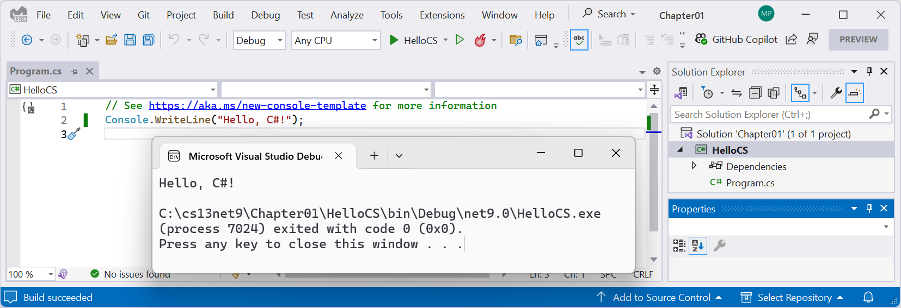
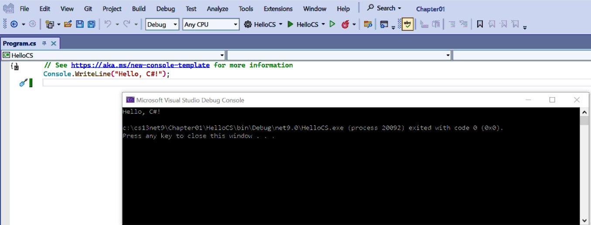
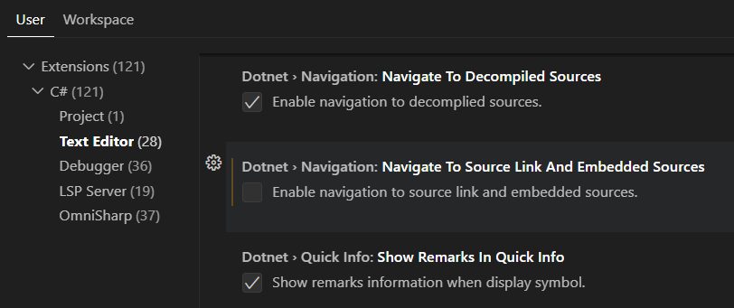

**Improvements** (30 items)

If you have suggestions for improvements, then please [raise an issue in this repository](https://github.com/markjprice/cs13net9/issues) or email me at markjprice (at) gmail.com.

- [Introducing C# and .NET](#introducing-c-and-net)
- [Page 15 - Listing and removing versions of .NET](#page-15---listing-and-removing-versions-of-net)
- [Page 20 - Compiling and running code using Visual Studio](#page-20---compiling-and-running-code-using-visual-studio)
- [Page 21 - Understanding the compiler-generated folders and files](#page-21---understanding-the-compiler-generated-folders-and-files)
- [Page 38 - Getting definitions of types and their members](#page-38---getting-definitions-of-types-and-their-members)
- [Page 82 - Verbatim strings](#page-82---verbatim-strings)
- [Page 102 - What does new do?](#page-102---what-does-new-do)
- [Page 205 - Navigating with the debugging toolbar](#page-205---navigating-with-the-debugging-toolbar)
- [Page 223 - Understanding the call stack](#page-223---understanding-the-call-stack)
- [Page 246 - Member access modifiers](#page-246---member-access-modifiers)
- [Page 403 - Fixing dependencies](#page-403---fixing-dependencies)
- [Page 438 - Examples of regular expressions](#page-438---examples-of-regular-expressions)
- [Page 439 - Splitting a complex comma-separated string](#page-439---splitting-a-complex-comma-separated-string)
- [Page 467 - Good practice with collections](#page-467---good-practice-with-collections)
- [Page 469 - Working with spans, indexes, and ranges](#page-469---working-with-spans-indexes-and-ranges)
- [Page 484 - Managing directories](#page-484---managing-directories)
- [Page 485 - Managing files](#page-485---managing-files)
- [Page 488 - Controlling how you work with files](#page-488---controlling-how-you-work-with-files)
- [Chapter 10 - Working with Data Using Entity Framework Core](#chapter-10---working-with-data-using-entity-framework-core)
- [Page 533 - Creating the Northwind sample database for SQLite](#page-533---creating-the-northwind-sample-database-for-sqlite)
- [Page 540 - Using EF Core conventions to define the model](#page-540---using-ef-core-conventions-to-define-the-model)
- [Page 620 - History of ASP.NET Core](#page-620---history-of-aspnet-core)
- [Page 628 - Structuring projects](#page-628---structuring-projects)
  - [1. Logical Architectural Layer Diagram](#1-logical-architectural-layer-diagram)
  - [2. Project Source Code Structure](#2-project-source-code-structure)
  - [3. Deployed Artifacts Diagram](#3-deployed-artifacts-diagram)
  - [Comparison of the Three Perspectives](#comparison-of-the-three-perspectives)
  - [Where do DTOs fit?](#where-do-dtos-fit)
- [Page 733 - Building web services using ASP.NET Core](#page-733---building-web-services-using-aspnet-core)
  - [What are Swagger, OpenAPI, and Swashbuckle?](#what-are-swagger-openapi-and-swashbuckle)
  - [Recent editions of this book and documenting web services](#recent-editions-of-this-book-and-documenting-web-services)
- [Page 737 - ASP.NET Core Minimal APIs projects, Page 770 - Getting customers as JSON in a Blazor component](#page-737---aspnet-core-minimal-apis-projects-page-770---getting-customers-as-json-in-a-blazor-component)
- [Page 752 - Creating data repositories with caching for entities](#page-752---creating-data-repositories-with-caching-for-entities)
- [Page 749 - Creating data repositories with caching for entities](#page-749---creating-data-repositories-with-caching-for-entities)
  - [When to Call `await` Inside a Method](#when-to-call-await-inside-a-method)
  - [When to Return a Task Without `await`](#when-to-return-a-task-without-await)
  - [When to Decorate a Method with `async`](#when-to-decorate-a-method-with-async)
  - [Examples](#examples)
  - [Key Takeaways](#key-takeaways)
- [Page 770 - Configuring HTTP clients](#page-770---configuring-http-clients)
- [Appendix - Exercise 3.1 – Test your knowledge](#appendix---exercise-31--test-your-knowledge)

# Introducing C# and .NET

> Thanks to **eddyyxxyy** in the book's Discord channel for asking a question that prompted this improvement item.

Throughout the book I introduce C# and .NET and how they are related, but this information is spread over multiple chapters. Readers who are completely new to the technologies might still have some questions like "if theres ways of building C# programs without .NET". In the next edition, I will start *Chapter 1* with a brief introduction of C# and .NET and how they are related, as shown in the following text and figure:

C# and .NET are closely related technologies. C# is a programming language that compiles to **Common Intermediate Language (CIL)** aka IL code. IL code can then be loaded by the **Common Language Runtime (CLR)** that is part of the .NET Runtime and **Just In Time (JIT)** compiled to native CPU instructions aka machine code that are executed by your computer. There are other languages like **Visual Basic .NET** and **F#** that can also be compiled to IL code, so they are alternatives to C# that can create .NET projects. 


You can build .NET projects without C#, but C# can only build projects for .NET. In theory, since C# is an open standard, someone could create a C# compiler that builds projects for other platforms, but in practice, no one has done this. 

If you are a C# programmer then you always build .NET projects. If you are a .NET programmer, then you most likely use C#, or you could use F# or Visual Basic. Despite Microsoft's support for multiple languages within the .NET ecosystem, including C#, F#, and Visual Basic, C# has maintained a dominant position. According to JetBrains' 2023 Developer Ecosystem survey, 99% of .NET developers use C#, while 7% use Visual Basic, and 3% use F#. While F# and Visual Basic have their dedicated user bases and specific use cases, C# remains the overwhelmingly preferred language among .NET developers.

# Page 15 - Listing and removing versions of .NET

> Thanks to [s3ba-b](https://github.com/s3ba-b) who raised this [issue on November 5, 2024](https://github.com/markjprice/cs12dotnet8/issues/75).

In the first paragraph I wrote, ".NET runtime updates are compatible with a major version such as 8.x, and updated releases of the .NET SDK maintain the ability to build applications that target previous versions of the runtime, which enables the safe removal of older versions."

This could be clearer, so in the 10th edition*, I will write soemthing like: 

"All future versions of the .NET 10 runtime are compatible with its major version. For example, if a project targets `net10.0`, then you can upgrade the .NET runtime to future versions like `10.0.1`, `10.0.2`, and so on. In fact, you *must* upgrade the .NET runtime every month to maintain support."

"All future versions of the .NET SDK maintain the ability to build projects that target previous versions of the runtime. For example, if a project targets `net10.0` and you initially build it using .NET SDK `10.0.100`, then you can upgrade the .NET SDK to future bug fix versions like `10.0.101` or a major version like `11.0.100`, and that SDK can still build the project for the older targetted version. This means that you can safely remove all older versions of any .NET SDKs like `8.0.100`, `9.0.100`, or `10.0.100`, after you've installed a .NET SDK 11 or later. You will still be able to build all your old projects that target those older versions."

*It was too late to make this improvement in the 9th edition. 

# Page 20 - Compiling and running code using Visual Studio

> Thanks to Phil who sent an email on November 11, 2024, asking a question that prompted this improvement.

*Figure 1.5* shows the result of running the console app in Visual Studio, as shown in the following screenshot:

*Figure 1.5*

A reader completed this section but their command window looked different, as shown in the following screenshot:


Note that it would look more similar if the window was resized and the window was configured with different colors: black text on a white background instead of the opposite. 

> To change colors with this old command prompt app, click the top-left icon, and then in the menu, click **Properties**. You will see tabs to change **Colors**, **Font**, and so on.

You can also install and use alternative command prompts or terminals. For example, I installed **Windows Terminal** several years ago because it has several benefits:
- It makes it extra easy to change color schemes. For example, instead of the default white text on a black background, my publisher prefers black text on white background (at least in screenshots!) because they look better when printed in a book.
- It supports tabs so you can easily manage multiple active consoles simultaneously.
- It still uses the builtin `cmd.exe` so the output is the same as the default.

Since October 2022, Windows Terminal is the default in Windows 11 so you should not need to install it. But if you use an older version of Windows, then you can install Windows Terminal from the Microsoft Store. 

> **More Information**: You can learn more about Windows Terminal at the following link: https://devblogs.microsoft.com/commandline/windows-terminal-is-now-the-default-in-windows-11/.

In the next edition, I might add notes about this.

# Page 21 - Understanding the compiler-generated folders and files

In the next edition, I will add a paragraph highlighting that files that use `.g.` indicate that they are "generated" by the build process. You should never edit these files because they will just get recreated the next time you build. 

# Page 38 - Getting definitions of types and their members

> Thanks to **not_a_pigeon1277** in the book's Discord channel for documenting this improvement.

If you try to use the **Go To Definition** feature in VS Code and you get a `Request textDocument/definition failed.` error then disable the **Navigate to Source Link and And Embedded Sources** feature, as described in the following steps:

1. Navigate to **Settings** | **C#** | **Text Editor**.
2. Clear the **Navigate to Source Link and And Embedded Sources** check box, as shown in the following screenshot:


*Clearing the **Navigate to Source Link and And Embedded Sources** setting*

# Page 82 - Verbatim strings

> Thanks to **John Leitch** `johnleitch` in the book's Discord channel for suggesting this improvement on February 3, 2025.

In this section, I explain escape characters and how they are used in C# `string` values.

I wrote, "But what if you are storing the path to a file on Windows, and one of the folder names starts with a `T`, as shown in the following code?"
```cs
string filePath = "C:\televisions\sony\bravia.txt";
```

"The compiler will convert the `\t` into a tab character and you will get errors!"

I failed to point out that:
1. The `\s` is an invalid escape sequence so the compiler rejects it and you cannot build the project.
2. The `\b` is interpreted as an escape sequence meaning a Backspace. 

In the next edition, I will add a note explaining that any character after a slash `\` that is not recognized as a valid escape sequence will prevent the code from compiling, and I will add a table of escape sequences, similar to the following: https://learn.microsoft.com/en-us/dotnet/csharp/programming-guide/strings/#string-escape-sequences. 

I will also mention the useful `""` sequence and that it is enabled with both `@`-prefixed and normal `string` literals. 

# Page 102 - What does new do?

> Thanks to **John Leitch** `johnleitch` in the book's Discord channel for suggesting this improvement on February 3, 2025.

In the last bullet I wrote, "bob has a value of `null` and 4 bytes of memory have been allocated in stack memory. No heap memory has been allocated for the object."

In the next edition, I will change this to say that the size of the reference is typically 4 bytes on a 32-bit system and 8 bytes on a 64-bit system, corresponding to the size of a memory pointer. I cover this in more detail in an online-only section here: https://github.com/markjprice/cs13net9/blob/main/docs/ch06-memory.md.

# Page 205 - Navigating with the debugging toolbar

> Thanks to [Donald Maisey](https://github.com/donaldmaisey) who raised an [issue on February 21, 2025](https://github.com/markjprice/cs13net9/issues/26) that prompted this improvement.

In *Figure 4.7*, the Visual Studio 2022 **Show Next Statement** button has an icon of a down-pointing arrow. In more recent versions, this icon was changed to a right-pointing arrow. In the next edition, I will update the screenshot.

# Page 223 - Understanding the call stack

In Step 5, I wrote, "In the `CallStackExceptionHandling` console app project, add a reference to the `CallStackExceptionHandlingLib` class library project, as shown in the following markup:
```xml
<ItemGroup>
  <ProjectReference Include="..\CallStackExceptionHandlingLib\CallStackExceptionHandlingLib.csproj" />
</ItemGroup>
```

You can also see this in the solution project here:
https://github.com/markjprice/cs13net9/blob/main/code/Chapter04/CallStackExceptionHandling/CallStackExceptionHandling.csproj

But some readers do the opposite, i.e. try to reference the console app in the class library project, or they try to edit a "generated" file instead of the proper project file. In the next edition, I will change the text to say, "In the `CallStackExceptionHandling.csproj` console app project file," and I will add a warning box below Step 5:

> **Warning!** Make sure that you add the project reference in the `CallStackExceptionHandling.csproj` file. Do not edit the `CallStackExceptionHandling.csproj.nuget.g.props` file because this is a file that is "generated" (that's what the ".g." in its name means). Every time you build the project this and other ".g." files are recreated so any changes will be lost. Also, do not add a project reference to the `CallStackExceptionHandling` console app project in the `CallStackExceptionHandlingLib.csproj` file. You can only reference class library projects. You cannot reference console app projects.

# Page 246 - Member access modifiers

> Thanks to [P9avel](https://github.com/P9avel) who raised an [issue on February 16, 2025](https://github.com/markjprice/cs13net9/issues/18) that prompted this improvement.

In this section, I wrote, "There are four member access modifier keywords, and two combinations of access modifier keywords that you can apply to a class member, like a field or method. Member access modifiers apply to an individual member. They are similar to but separate from type access modifiers that apply to the whole
type. The six possible combinations are shown in Table 5.1:"

Previously, on page 238, in the *Understanding type access modifiers* section, I wrote, "Introduced with .NET 7, the `file` access modifier applied to a type means that type can only be used within its code file. This would only be useful if you define multiple classes in the same code file, which is rarely good practice but is used with source generators."

On page 299, in *Exercise 5.3 - test your knowledge*, question 1. asks, "What are the seven access modifier keywords and combinations of keywords, and what do
they do?"

In the next edition, I will add more text to all these places to try to make it clearer that there are seven access modifiers (or combinations of access modifiers) that apply to types and members but only six access modifiers (or combinations of access modifiers) that apply only to members. Or perhaps I will change the question to only ask about member access modifiers.

# Page 403 - Fixing dependencies

> Thanks to [P9avel](https://github.com/P9avel) who raised an issue in an email that prompted this improvement.

At the end of this section, I will add a new sub-section titled, *Version ranges*. This will cover the notation for version numbers and how to control version ranges. 

For example, if you specify a version number like `version="9.0.0"` it does not mean `9.0.0` only, it actually means `9.0.0` *or higher*, because NuGet assumes that future package versions will be backwards-compatible. 

When defining the end of a version range, `[` or `]` means inclusive, a `(` or `)` means exclusive. as shown in the following table:

Notation|Applied rule|Description
---|---|---
`1.0` or `[1.0,)`|x >= 1.0|Minimum version, inclusive
`[1.0]`|x == 1.0|Exact version match
`(,1.0]`|x <= 1.0|Maximum version, inclusive
`[1.0,2.0]`|1.0 <= x <= 2.0|Exact range, inclusive

For example, to limit the package version of `FluentAssertions` to a minimum of `7.0.0` and less than `8.0.0` so that you do not reference that paid version, you should use the following:
```xml
<PackageReference Include="FluentAssertions" Version="[7.0.0,8.0.0)" />
```

> **More Information**: A complete table of notations is available at the following link: https://learn.microsoft.com/en-us/nuget/concepts/package-versioning?tabs=semver20sort#version-ranges

# Page 438 - Examples of regular expressions

> Thanks to **rene** in the book's Discord channel for suggesting this improvement.

*Table 8.8* shows some examples of regular expressions with descriptions of their meaning. The last two entries are:

Expression|Meaning
---|---
`^d.g$`|The letter `d`, then any character, and then the letter `g`, so it would match both `dig` and `dog` or any single character between the `d` and `g`
`^d\.g$`|The letter `d`, then a dot `.`, and then the letter `g`, so it would match `d.g` only

**rene** suggested "adding `^d.+g$` and/or `^d.*g$` ... so it would match `dingdong`." 

I like that idea, so in the 10th edition I will add that example to the table.

# Page 439 - Splitting a complex comma-separated string

> Thanks to **Chip** who sent an email about this issue on December 13, 2024.

In Step 1, I wrote, "Add statements to store a complex comma-separated string variable", and in the code there is a statement to sets that variable to a CSV string, as shown in the following code:
```cs
string films = """
"Monsters, Inc.","I, Tonya","Lock, Stock and Two Smoking Barrels"
""";
```

But at least one reader added extra spaces after the commas between the double-quoted movie titles, as shown in the following code:
```cs
string films = """
"Monsters, Inc.", "I, Tonya", "Lock, Stock and Two Smoking Barrels"
extra spaces ----^ ----------^
```
Doing this means the variable contains comma-and-space-separated values instead of purely comma-separated values. The regular expression was written to process only literally CSV values with no whitespace. (There is no formal standard for CSV so different systems will have different ways of handling it. Many CSV processors reject data with extra whitespace as malformed input.)

In the next edition, I will add a warning note about this:

> **Warning!** Do not add extra spaces between the comma-separated values. The regular expression is written to handle generally-accepted valid CSV, not comma-and-space-separated values.

Alternatively, you could change the regular expression to handle comma-and-space-separated values, as shown in the following code:
```cs
[StringSyntax(StringSyntaxAttribute.Regex)]
private const string CommaSeparatorText =
  @"(?:^|,)\s*(?=[^\"]|(\")?)\"?\s*((?(1)(?:[^""]|\\"")*|[^,\"]*))\s*\"?(?=,|$)");
```

> **Warning!** The preceding regular expression was provided by a reader so treat it with caution.

# Page 467 - Good practice with collections

> Thanks to **rene** in the book's Discord channel for suggesting this improvement.

Before this final section in the *Storing multiple objects in collections* topic, I will add a summary table for collection types based on **rene**'s [initial document](../ch08-collections.md)

# Page 469 - Working with spans, indexes, and ranges

> Thanks to [P9avel](https://github.com/P9avel) for raising [this issue on February 22, 2025](https://github.com/markjprice/cs13net9/issues/33).

In the next edition, I will add more explanation about when the end index is included. For example, `"1234".AsSpan()[1..3]` returns: `23`.

# Page 484 - Managing directories

> Thanks to a reader who raised this issue with Packt who then forwarded it on to me to answer.

"In the code for this section which creates a new folder, checks to see if it has been created, and then deletes the new folder I have encountered an:"
```
System.UnauthorizedAccessException: Access to the path 'C:\Users\john_\OneDrive\Documents\NewFolder' is denied.
```

"The program creates a new folder "NewFolder" in `C:\Users\john_\OneDrive\Documents` successfully but then fails to delete the `NewFolder` when a key is pressed and the exception then occurs due to access being denied. I've tried replacing `{Directory.Exists(newFolder)}` with `{Path.Exists(newFolder)}` with no difference in the resulting `IOException`.
 
My system is a Windows 11 PC kept up-to-date with recommended updates. I cannot understand why if the path is ok to create a new folder, why access is denied when trying to remove the new folder from the valid path. It may possible be a quirk with OneDrive taking over the management of the `Documents` folder in the `Users` directory, but I don't know enough about how it works. It's just a default system setup for me.

I'd be grateful to know if anyone else is experiencing the same problem with this code, and what a workaround might be."

Your speculation that the problem is caused by OneDrive is likely to be correct. As soon as a new directory is created in OneDrive, it triggers a synchronization. This would prevent the directory from being deleted until OneDrive stops scanning the directory for changed subdirectories and files. 

To confirm that OneDrive is causing the exception by locking the directory while it scans it, simply try a path that is outside OneDrive.

A similar issue is caused by some anti-virus software. For example, Avast has a monitor that activates as soon as a new directory or file is created and scans it for viruses. This can temporarily lock a newly created directory or file.

In the next edition, I will add a warning box to explain these potential issues to the reader.

# Page 485 - Managing files

> Thanks to [P9avel](https://github.com/P9avel) for raising [this issue on February 23, 2025](https://github.com/markjprice/cs13net9/issues/34).

In Step 1, I tell the reader to write some code that creates a text file using the `File.CreateText` method and the `StreamWriter` that it returns and reads a backup of that file using the `File.OpenText` method and the `StreamReader` that it returns, as shown in the following code:
```cs
// Create a new text file and write a line to it.
StreamWriter textWriter = File.CreateText(textFile);
textWriter.WriteLine("Hello, C#!");
textWriter.Close(); // Close file and release resources.
```
And:
```cs
// Read from the text file backup.
WriteLine($"Reading contents of {backupFile}:");
StreamReader textReader = File.OpenText(backupFile);
WriteLine(textReader.ReadToEnd());
textReader.Close();
```

I explicitly call the writer's and reader's `Close` methods which internally disposes the resources immediately. 

Alternatively, if you add a simplified `using` statement, as shown in the following code, then `Dispose` is not called until the end of the scope of the `textWriter` variable, in this case, the `Main` method:
```cs
using StreamWriter textWriter = File.CreateText(textFile); // The object will have its Dispose method called at the end of the scope.
```

Or, if you add a full `using` block, as shown in the following code, then `Dispose` is called at the end of the local scope:
```cs
using (StreamWriter textWriter = File.CreateText(textFile)) // The object will have its Dispose method called at the end of the scope.
{
  textWriter.WriteLine("Hello, C#!");
} // Dispose called here.
```

In the next edition, I will add the preceding explanation so the reader knows why I do not use the `using` statement for this code, and I will tell the reader that they will see examples of using `using` to dispose a resource later in the chapter.

# Page 488 - Controlling how you work with files

> Thanks to [Vlad Alexandru Meici](https://github.com/vladmeici) who raised an [issue in the 8th edition's GitHub repository on December 31, 2024](https://github.com/markjprice/cs12dotnet8/issues/81) that prompted this improvement.

The `FileShare` enum type is described as:

- `FileShare`: This controls locks on a file to allow other processes the specified level of access, like `Read`.

In the 10th edition, I will improve the grammar of the sentence:

- `FileShare`: This controls locks on a file to allow other processes **to have** the specified level of access, like `Read`.

# Chapter 10 - Working with Data Using Entity Framework Core

> Thanks to [P9avel](https://github.com/P9avel) who raised an [issue in the book's GitHub repository on November 17, 2024](https://github.com/markjprice/cs13net9/issues/1) that prompted this improvement.

This chapter introduces EF Core and how to use it to query and manipulate data in a relational database like SQLite or SQL Server. All code examples are shown in a console app and use synchronous code. This is best for learning EF Core because it keeps the code as simple as possible and focussed on the topic covered, but once a reader needs to implement EF Core in a server-side project like an ASP.NET Core Web API project, it is important to use asynchronous code. 

In the next edition, I will add a new section at the end to highlight how to use tasks and the asynchronous methods to avoid thread exhaustion.

# Page 533 - Creating the Northwind sample database for SQLite

> Thanks to **kingace9371** in the Discord channel for asking about this which prompted this improvement.

In Step 4, I wrote, "Enter the command to execute the SQL script using SQLite to create the `Northwind.db` database, as shown here:"
```
sqlite3 Northwind.db -init Northwind4SQLite.sql
```

In Step 5, I show the successful output, "Be patient because this command might take a while to create the database structure. Eventually,
you will see the SQLite command prompt, as shown in the following output:"
```
-- Loading resources from Northwind4SQLite.sql
SQLite version 3.42.0 2023-05-16 12:36:15
Enter ".help" for usage hints.
sqlite>
```

Some readers either do not have the SQL script in the current directory, or enter the wrong filename, or otherwise use the wrong path, and get the following error message:
```
cannot open: "Northwind4SQLite.sql"
```

In the next edition, as well as showing the expected correct output, I will show the preceding error message so that reader's know that they need to fix the path to the SQL script.

# Page 540 - Using EF Core conventions to define the model

> Thanks to [P9avel](https://github.com/P9avel) who raised an [issue in the book's GitHub repository on February 28, 2025](https://github.com/markjprice/cs13net9/issues/38) that prompted this improvement.

This section contains a bulleted list with some of the conventions that EF Core uses to map database tables to C# classes. Most work the same for any database system. For example, "The names of the columns are assumed to match the names of properties in the entity model class, for example, ProductId." works the same for SQLite, SQL Server, and any other RDBMS. But some conventions will vary depending on the database provider. For example, "The `string` .NET type is assumed to be a `nvarchar` type in the database." Although this is most common, a particular RDBMS might not have the `nvarchar` datatype and so use a different type like `text`.

In the next edition, I will add a note so that the reader understands the preceding point. I will also add more clarification to some bullets. For example:
- The name of a table is assumed to match the name of a `DbSet<T>` property in the `DbContext` class, for example, `Products`. EF Core can match against singular or plural names.

# Page 620 - History of ASP.NET Core

> Thanks to [Paul Marangoni](https://github.com/pmarangoni) for raising [this issue on February 13, 2025](https://github.com/markjprice/web-dev-net9/issues/35).

In the second bullet, I describe ASP:
- **Active Server Pages (ASP)** was released in 1996 and was Microsoft’s first attempt at a platform for dynamic server-side execution of website code. ASP files contain a mix of HTML and code that executes on the server written in the VBScript language.

Readers do not need to know any details of this 30-year-old technology so I will remove the second sentence in the next edition and add a note to explain why I include the bullet for ASP:
- **Active Server Pages (ASP)** was released in 1996 and was Microsoft’s first attempt at a platform for dynamic server-side execution of website code. I include this bullet so that you understand where the **ASP** initialism comes from because it is still used today in modern ASP.NET Core.

# Page 628 - Structuring projects

A reader asked, "In Chapter 12, you discussed structuring projects within a solution. I'm a bit confused about where the service, repository, and DTO types should be placed. Specifically, where should I place the IProductRepository, ProductRepository, IProductService, ProductService, and the corresponding DTOs? In traditional N-Layer architecture, repository types are typically found in the Data Access Layer, while service types are located in the Business Layer. Additionally, I've seen some discussions about DTOs being placed in either the Presentation Layer or the Application Layer. Could you provide some guidance on this?"

In my book, in this section, I currently only discuss the structure of projects in a solution. Your question extends that to the structure or architecture of the deployed artifacts. In the next edition, I will add a sub-section to discuss the differences.

For example, you mention "DTOs being placed in either the Presentation Layer or the Application Layer". But they are usually required in BOTH. Imagine the Presentation Layer (perhaps a Blazor Wasm or MAUI app) makes a request to the Application Layer (maybe a Web API service) for products that match some search criteria. The Application Layer needs to create instances of `ProductDTO` and then serialize them and send them to the Presentation Layer. The Presentation Layer then needs to deserialize those instances of `ProductDTO`. So both the Presentation Layer project and the Application Layer projects must reference the shared class library that defines the `ProductDTO`. But there is only one shared class library in the solution. You would not try to structure the projects in the solution to match one-to-one with the structure of the deployed architecture. I suspect that's what is missing in your understanding. The other pieces you mention tend to only exist in one layer so those can match in the project structure and deployed architecture.

Let’s break this down step-by-step to understand the differences between:

1. Logical Architectural Layer Diagram
2. Project Source Code Structure
3. Deployed Artifacts Diagram

I’ll illustrate this with an example of a Products Management vertical slice, where a user can add, update, retrieve, and delete products. Each of these perspectives shows different aspects of the application.

## 1. Logical Architectural Layer Diagram

This diagram shows conceptual layers in the architecture, emphasizing separation of concerns. It’s independent of physical deployment and focuses on the logical responsibilities of the system.

For our "Products Management" example, a common logical layer diagram might include:
```
Presentation Layer
  ↳ Handles user interactions (e.g., ASP.NET MVC Controllers, Blazor Components)
Business Logic Layer
  ↳ Implements domain-specific rules (e.g., ProductService)
Data Access Layer
  ↳ Interacts with the database (e.g., ProductRepository)
Database Layer
  ↳ Physical data storage (e.g., SQL Server)
```
Each layer is logically distinct. For instance:
- The Presentation Layer calls the Business Logic Layer (not directly the database).
- The Business Logic Layer performs business rules (e.g., validate the product’s name or price).
- The Data Access Layer abstracts the database operations, such as querying or persisting data.

Example Flow: A user clicks "Add Product" in the UI → sends data to the Business Logic Layer for validation → passes it to the Data Access Layer to insert into the Database.

## 2. Project Source Code Structure

This shows how the source code is organized in the project. It’s focused on how developers structure the codebase to align with logical layers.

For the Products Management slice, a typical structure might look like this:
```
/ProductsSolution
  /Products.Web          → Presentation Layer (e.g., Controllers, Views, Blazor Components)
  /Products.Services     → Business Logic Layer (e.g., `ProductService.cs`)
  /Products.Data         → Data Access Layer (e.g., `ProductRepository.cs`, DbContext)
  /Products.Tests        → Unit/Integration Tests
```
Here, the code is divided into projects that reflect logical layers, helping developers work modularly. For instance:
- `Products.Web` contains ASP.NET MVC controllers (like `ProductsController.cs`) or Razor pages.
- `Products.Services` contains services implementing business logic (like `ProductService.cs`).
- `Products.Data` contains the database access code (like `ProductRepository.cs` or EF Core DbContext).

## 3. Deployed Artifacts Diagram

This diagram describes how and where the artifacts (compiled assemblies, services, or packages) are deployed in a runtime environment. It’s focused on the physical or logical deployment topology and runtime components.

For our Products Management example, let’s assume this is a web application with a backend API and a database. The deployment might look like this:
```markdown
- Frontend Web Server (e.g., IIS or Azure App Service)
    - Deployed: Presentation Layer artifacts (e.g., `Products.Web.dll` or a Blazor WASM app)
- Backend Application Server
    - Deployed: Business Logic and Data Access artifacts (e.g., `Products.Services.dll` and `Products.Data.dll`)
- Database Server (e.g., SQL Server or Azure SQL)
    - Deployed: The database (e.g., `ProductsDB`)
```
Here, we’re concerned about where the compiled code (DLLs, executables, etc.) and data reside during deployment:
- The frontend artifacts handle user interactions and API requests.
- The backend artifacts host business logic and database interactions.
- The database server stores data like product details.

## Comparison of the Three Perspectives

Perspective|Focus|Example for Products Management
---|---|---
**Logical Architectural Layers**|Conceptual layers (e.g., Presentation, Business Logic, Data Access)|Business Logic Layer validates the product; Data Access Layer interacts with DB
**Project Source Code Structure**|Organization of source code (e.g., folders/projects in a solution)|Separate projects: `Products.Web`, `Products.Services`, `Products.Data`
**Deployed Artifacts Diagram**|Deployment/runtime topology (e.g., physical servers, cloud services)|`Products.Web.dll` on web server, `Products.Data.dll` on backend, SQL DB

Here’s how a typical *Add Product* use case fits into these perspectives:

- **Logical Architectural Layers**:
   1. Presentation Layer: `ProductsController.AddProduct(ProductDto)` receives the HTTP POST request.
   2. Business Logic Layer: `ProductService.AddProduct()` validates the product (e.g., price > 0, name is unique).
   3. Data Access Layer: `ProductRepository.InsertProduct()` saves the product to the database.
- **Project Source Code Structure**:
   1. `/Products.Web`: Contains `ProductsController` and views or API endpoints.
   2. `/Products.Services`: Contains `ProductService` with validation logic.
   3. `/Products.Data`: Contains `ProductRepository` and EF Core DbContext.
- **Deployed Artifacts Diagram**:
   1. Frontend Web Server: Hosts the UI (Blazor app or ASP.NET MVC) and API endpoints.
   2. Backend App Server: Hosts `Products.Services.dll` and `Products.Data.dll`.
   3. Database Server: Hosts the SQL database storing product information.

By thinking in these layers and diagrams, you separate conceptual design (logical layers), runtime deployment (artifacts), and developer organization (source structure). It’s this separation that ensures clarity, maintainability, and scalability in software architecture.

## Where do DTOs fit?

**DTOs (Data Transfer Objects)** are a crucial part of many architectures, but their role can sometimes feel a little ambiguous because they don’t belong neatly to a single logical layer. Instead, they typically facilitate communication between layers, especially when crossing boundaries like between the Presentation Layer and Business Logic Layer.

DTOs are plain objects used to transfer data across application boundaries (e.g., from the frontend to the backend or between layers within the backend). They are simplified representations of data that:
- Contain no behavior (e.g., no business logic or methods).
- Avoid exposing implementation details of other layers (e.g., no direct database entities).
- Are tailored to specific use cases (e.g., a subset of fields for a particular API endpoint).

Business Logic Layer accepts DTOs as input or output from the Presentation Layer but operates on domain models internally. For example, the `ProductService.AddProduct(CreateProductDto dto)` method accepts a DTO and maps it to a domain entity (`Product`) for validation and business rules.

DTOs can be embedded in assemblies like `Products.Web.dll` (for client-server communication) or `Products.Services.dll` (for communication between the Presentation and Business Logic layers).

Alternatively, if multiple layers share DTOs, they might go into a separate shared project:
```markdown
ProductsSolution
  /Products.Shared
    /Dtos
      CreateProductDto.cs
      ProductDetailsDto.cs
  /Products.Web
    ProductsController.cs
  /Products.Services
    ProductService.cs
  /Products.Data
    ProductRepository.cs
```

This ensures clear separation of the DTOs and avoids coupling them too tightly to a specific layer.

# Page 733 - Building web services using ASP.NET Core

In the next edition, I will add a new section that explains some of the recent history with documenting web services in .NET projects. 

## What are Swagger, OpenAPI, and Swashbuckle?

Let's start by explaining some terminology:
- **Swagger**: Originally, Swagger was a framework for describing, documenting, and trying out REST APIs. It included tools like the Swagger UI and Swagger Editor. However, Swagger evolved into the **OpenAPI Specification (OAS)**, which is now the industry standard for defining RESTful APIs in a machine-readable format (YAML or JSON).
- **OpenAPI**: This is the formalized specification that defines how to describe and document REST APIs. The **OpenAPI Specification (OAS)** provides a standardized way to describe API endpoints, request/response models, authentication, and more. OpenAPI is maintained by the **OpenAPI Initiative (OAI)** under the Linux Foundation.
- **Swashbuckle**: This is a .NET library that automatically generates OpenAPI documentation for ASP.NET Core Web API web services. It implements a Swagger UI, allowing you to visualize and test API endpoints directly in the browser. 

It is easy to confuse *Swashbuckle* and *Swagger* because they start with similar letters: **Swa**. Try to remember that you shouldn't use either:
- When talking about the specification that defines how to describe and document REST APIs, replace *Swagger* with *OpenAPI*.
- When referencing a package to describe and document a web service project, replace `Swashbuckle` with a more modern package like `Scalar` or `NSwag`.

## Recent editions of this book and documenting web services

Recently, the ASP.NET Core team has changed how these technologies are used in ASP.NET Core projects:
- In **ASP.NET Core 8 and earlier**, the third-party `Swashbuckle.AspNetCore` package was used to generate an OpenAPI JSON document to formally describe the web service. Swashbuckle includes a Swagger UI that provides an interactive webpage to explore and try out API endpoints. But the Swashbuckle package is third-party so out of the control of Microsoft and it has not been maintained well-enough by its owner for Microsoft to want to use it.
- In **ASP.NET Core 9 and later**, the first-party `Microsoft.AspNetCore.OpenApi` package is used to generate an OpenAPI JSON document to formally describe the web service. But this package does not provide an interactive UI for trying out the web service.

Here's a summary table of recent versions of ASP.NET Core and how they document web services:

Version|Packages|Book
---|---|---
8|`Swashbuckle.AspNetCore`|The 8th edition describes (1) how to request a JSON document that documents a web service, (2) how to use the Swashbuckle package to try out a web service using a web user interface, and (3) how to try out a web service using REST Client in VS Code and HTTP Editor in Visual Studio.
9|`Microsoft.AspNetCore.OpenApi`|The 9th edition describes (1) how to request a JSON document that documents a web service and (2) how to try out a web service using REST Client in VS Code and HTTP Editor in Visual Studio.
10|`Microsoft.AspNetCore.OpenApi`, `Scalar.AspNetCore`|The 10th edition will describe (1) how to request a JSON document that documents a web service, (2) how to use the Scalar package to try out a web service using a web user interface, and (3) how to try out a web service using REST Client in VS Code and HTTP Editor in Visual Studio. 

> **More Information**: You can learn more about how to use OpenAPI documentation at the following link: https://learn.microsoft.com/en-us/aspnet/core/fundamentals/openapi/using-openapi-documents.

> **More Information**: You can learn more about Scalar at the following link: https://scalar.com/. Or wait for the .NET 10 editions of my books. ;)

# Page 737 - ASP.NET Core Minimal APIs projects, Page 770 - Getting customers as JSON in a Blazor component

A reader asked a question in the Discord channel.

Reader: This one's about the example in *Chapter 15*, where we implement the stand-alone WebAssembly project (pg. 768) and consume web services using HTTP clients.
There's a step I don't quite understand. In the project file for `Northwind.WebApi.WasmClient`, we are instructed to add a reference to the entity models project (`Northwind.EntityModels.Sqlite`). I thought the web app would just send requests to the web API, deserialize the JSON response, and render the content. Why would the WebAssembly project need to reference the entity models? I naively assumed that with this approach, the stand-alone web interface and the web API project would be completely decoupled—essentially two entirely separate solutions. Am I misunderstanding something here?

Author: You were already really close to answering your own question. You said: "deserialize the JSON response" and that's the short answer. The longer answer is, the client can only deserialize the JSON response into strongly-typed objects if it has a reference to an assembly that defines the models. The client project doesn't need the database context class, but in this simplified task the client project does need all the entity models like the `Customer` class. 

Instead of reusing the entity models in both the client and service, you might define **data transfer object (DTO)** classes and then that would be a shared assembly referenced by the client and the service. But then the service would have to convert entity models into DTO models, serialize them to JSON, and return them in a response to the client, and then the client would have to deserialize the DTO models, and display them. Any two client/server projects will always have some shared assemblies to define the "shape" of any data that needs to be transferred between them. In the simple example like in the book, we want all the data from the entity models so it'd be a waste to define DTOs that have the same "shape" as the entity models.

In the next edition, I will add a new section at the start of the chapter to explain all the above and the design decision to not define separate DTO classes. And I might add a new section after implementing the client using the `Customer` entity model class and define a DTO class to use instead so readers see what they could do if they need a different structure.

# Page 752 - Creating data repositories with caching for entities

In Step 10, I wrote, "Implement the `Create` method, as shown in the following code:"
```cs
public async Task<Customer?> CreateAsync(Customer c)
{
  c.CustomerId = c.CustomerId.ToUpper(); // Normalize to uppercase.

  // Add to database using EF Core.
  EntityEntry<Customer> added =
    await _db.Customers.AddAsync(c);
  
  int affected = await _db.SaveChangesAsync();
  if (affected == 1)
  {
    // If saved to database then store in cache.
    await _cache.SetAsync(c.CustomerId, c);
    return c;
  }
  return null;
}
```

The return value of the EF Core `DbSet<Customer>.AddAsync` method is an `EntityEntry<Customer>`. The code stores this in a local variable named `added` but we do not do anything with it. We could simplify the code by not defining and setting the `added` variable, as shown in the following code:
```cs
public async Task<Customer?> CreateAsync(Customer c)
{
  c.CustomerId = c.CustomerId.ToUpper(); // Normalize to uppercase.

  // Add to database using EF Core.
  await _db.Customers.AddAsync(c);
  
  int affected = await _db.SaveChangesAsync();
  if (affected == 1)
  {
    // If saved to database then store in cache.
    await _cache.SetAsync(c.CustomerId, c);
    return c;
  }
  return null;
}
```

A reason you might want the local variable is to discover database-assigned values like an identifier. But the `Customers` table uses a five-character text value for its primary key column that must be supplied by client code before adding to the database so it's not necessary in this scenario.

But instead of the `Customers` table, if we were adding a new entity to the `Shippers` table which has an auto-incrementing integer primary key column (or any other database-assigned value like a GUID or calculated value), then you could use the local `added` variable to read that assigned value, as shown in the following code:
```cs
public async Task<Shipper?> CreateAsync(Shipper s)
{
  // Add to database using EF Core.
  EntityEntry<Shipper> added = await _db.Shippers.AddAsync(s);

  int affected = await _db.SaveChangesAsync();
  if (affected == 1)
  {
    // If saved to database then store in cache.
    await _cache.SetAsync(s.ShipperId, s);

    // You can also read any database-assigned values.
    int assignedShipperId = added.Entity.ShipperId;

    return s;
  }
  return null;
}

```

In the next edition, I will add some information about this, similar to the preceding explanation. 

> **More Information**: You can learn more at the following link: https://learn.microsoft.com/en-us/ef/core/change-tracking/entity-entries.

# Page 749 - Creating data repositories with caching for entities

> Thanks to **rene**/`rene510` in the Discord channel for asking two questions about this on February 16, 2025.

In this section, the reader will implement a data repository service that can create, update, and delete customers. This works if the reader creates a new customer, then updates that customer, and then deletes that customer, because that customer does not have any related data. But if the reader runs the project and attempts to delete a customer that has related orders (for example, any of the customers that are in the original database), then an exception is thrown because of a referential integrity constraint defined by a foreign key in the table.

In the next edition, I will add some explanation of this and warn the reader not to try to delete a customer that has related orders. I will also note that they could implement cascading deletes by deleting related orders before deleting a customer (but you would also need to delete all the related order details rows too). So to simplify the example we just throw an exception and fail to delete the customer.

Also in this section, the reader will implement a data repository service with multiple methods, all of which return a `Task<T>`, but only some will call `await` within the method implementation and therefore need to be decorated with `async`. But I do not explain why.

In the next edition, I will add a new section that gives some guidance for use of `async`, `await`, and what to return from `Task<T>` methods, similar to the following.

## When to Call `await` Inside a Method

A method should call `await` inside its implementation if:
1. **You need to handle exceptions within the method.**  
   - `await` unwraps exceptions, meaning you can catch them using a `try-catch` inside the method.
   - Without `await`, the method would return a `Task<T>` that, when `await`-ed elsewhere, would throw an `AggregateException` wrapping the real exception.

2. **You need to perform additional logic after the awaited task completes.**  
   - If the method needs to do something after the asynchronous operation, it must `await` it. For example, after successfully creating a row in a table, you might need to store it in a cache, as show in the following code:
   ```csharp
   public async Task<Customer?> CreateAsync(Customer c)
   {
     c.CustomerId = c.CustomerId.ToUpper(); // Normalize to uppercase.

     // Add to database using EF Core.
     EntityEntry<Customer> added =
    
     await _db.Customers.AddAsync(c);
     int affected = await _db.SaveChangesAsync();
    
     if (affected == 1)
     {
       // If saved to database then store in cache.
       await _cache.SetAsync(c.CustomerId, c);
       return c;
     }
     return null;
   }
   ```

3. **You need to capture the execution context.**  
   - By default, `await` captures the current execution context (e.g., `SynchronizationContext` or `TaskScheduler`). If you need this behavior (e.g., when updating UI components in a desktop application), you should `await`.

## When to Return a Task Without `await`

A method should **not** use `await` and should return a `Task<T>` directly if:
1. **The method is a simple wrapper.**  
   - If you’re just returning the result of another asynchronous call, there’s no need for `await`. Instead, return the `Task<T>` directly.
   ```csharp
   public Task<List<Customer>> GetCustomersAsync()
   {
     return _db.Customers.ToListAsync();
   }
   ```

2. **You don’t need to handle exceptions inside the method.**  
   - If you’re fine with exceptions being handled by the caller, returning a `Task<T>` directly avoids the extra state machine that `async`/`await` introduces.

3. **The method doesn't need to resume execution after the awaited call.**  
   - If there’s nothing to do after the asynchronous operation, just return the `Task`.

## When to Decorate a Method with `async`

A method needs the `async` keyword if:
1. **It contains an `await` expression.**  
   - `await` can only be used inside `async` methods.

2. **You want to return a `Task<T>` without manually wrapping the result.**  
   - An `async` method automatically wraps return values in a `Task<T>`, whereas a non-async method must explicitly return `Task.FromResult(value)`.

## Examples

Calling `await` inside an `async` method because a method **handles exceptions** inside itself and the method **needs to do something after the await** (multiplying `value * 2`):
```csharp
public async Task<int> ComputeValueAsync()
{
  try
  {
    int value = await GetNumberAsync();
    return value * 2;
  }
  catch (Exception ex)
  {
    Console.WriteLine($"Error: {ex.Message}");
    return -1;
  }
}
```

Returning a `Task<T>` without `await`:
```csharp
public Task<int> ComputeValueAsync() => GetNumberAsync();
```
**Why?**  
- The method does **nothing after the awaited call**.
- The method **does not need to handle exceptions**.
- Avoids unnecessary state machine overhead.

---

## Key Takeaways
| Scenario | Use `async` & `await`? |
|----------|----------------------|
| Need to handle exceptions inside the method | ✅ Yes |
| Need to perform logic after the awaited task | ✅ Yes |
| Need to capture execution context (UI apps) | ✅ Yes |
| Just returning a `Task` from another method | ❌ No |
| No exception handling or additional logic | ❌ No |

In general, **only use `await` if necessary** to avoid unnecessary overhead from the async state machine. Otherwise, return the `Task` directly.

# Page 770 - Configuring HTTP clients

> Thanks to **Mike_H**/`mike_h_16837` for raising this issue on March 28, 2025 in the Discord channel for this book.

In Step 5, we are working on the newly-created `Northwind.WebApi.WasmClient` project.

In Step 6, we switch to work on the `Northwind.WebApi` project, but it is easy for the reader not to notice that.

In the next edition, I will add a new section between steps 5 and 6. It will have a brief explanation that we now need to modify the Web API service project and configure CORS.

# Appendix - Exercise 3.1 – Test your knowledge

> Thanks to **rene**/`rene510` in the Discord channel for asking a question about this.

In Question 2, "What happens when you divide a double variable by 0?", in my suggested answer I wrote, "The `double` type contains a special value of `Infinity`. Instances of floating-point numbers can have the special values of `NaN` (not a number) or, in the case of dividing by `0`, either `PositiveInfinity` or `NegativeInfinity`."

In the next edition, I will add that those special values output as `8` and `-8`.
